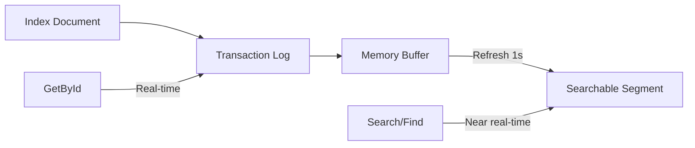

# Caching

Foundatio.Repositories provides built-in distributed caching with automatic invalidation. This guide covers cache configuration, behavior, and important gaps to be aware of.

## Overview

Caching in Foundatio.Repositories is built on Foundatio's `ICacheClient` abstraction, supporting:
- In-memory caching (development/testing)
- Redis (distributed)
- Hybrid (in-memory L1 + distributed L2 for reduced network round trips)
- Any custom `ICacheClient` implementation

## Configuration

### Enable Caching

Provide an `ICacheClient` to your Elasticsearch configuration:

```csharp
using Foundatio.Caching;

public class MyElasticConfiguration : ElasticConfiguration
{
    public MyElasticConfiguration(ICacheClient cache, ILoggerFactory loggerFactory) 
        : base(cache: cache, loggerFactory: loggerFactory)
    {
        AddIndex(Employees = new EmployeeIndex(this));
    }
    
    public EmployeeIndex Employees { get; }
}
```

### Cache Implementations

```csharp
// In-memory (for development/testing)
services.AddSingleton<ICacheClient>(new InMemoryCacheClient());

// Redis
services.AddSingleton<ICacheClient>(sp =>
    new RedisCacheClient(o => o.ConnectionMultiplexer(sp.GetRequiredService<ConnectionMultiplexer>())));

// Hybrid (in-memory L1 + distributed L2 - best for production, reduces network round trips)
services.AddSingleton<ICacheClient>(sp =>
    new RedisHybridCacheClient(o => o.ConnectionMultiplexer(sp.GetRequiredService<ConnectionMultiplexer>())));
```

### Repository Cache Settings

```csharp
public class EmployeeRepository : ElasticRepositoryBase<Employee>
{
    public EmployeeRepository(EmployeeIndex index) : base(index)
    {
        // Default cache expiration (default: 5 minutes)
        DefaultCacheExpiration = TimeSpan.FromMinutes(10);
    }
}
```

## Using the Cache

### Cache on Read

```csharp
// Cache by document ID
var employee = await repository.GetByIdAsync(id, o => o.Cache());

// Cache with custom key
var hit = await repository.FindOneAsync(
    q => q.FieldEquals(e => e.Email, email),
    o => o.Cache($"employee:email:{email}"));
var employee = hit?.Document;

// Cache with custom expiration
var employee = await repository.GetByIdAsync(id, 
    o => o.Cache().CacheExpiresIn(TimeSpan.FromMinutes(30)));
```

### Cache Options

```csharp
// Enable caching
o.Cache()

// Enable with specific key
o.Cache("my-cache-key")

// Enable with key and expiration
o.Cache("my-key", TimeSpan.FromMinutes(5))

// Set cache key separately
o.CacheKey("my-key")

// Set expiration
o.CacheExpiresIn(TimeSpan.FromMinutes(10))
o.CacheExpiresAt(DateTime.UtcNow.AddHours(1))

// Read from cache only (don't write)
o.ReadCache()

// Disable caching for this operation
o.Cache(false)
```

## Automatic Cache Invalidation

The repository automatically invalidates cache in most scenarios.

### When Cache IS Automatically Invalidated

| Operation | Behavior |
|-----------|----------|
| `AddAsync` | Documents added to cache after successful add |
| `SaveAsync` | Cache invalidated by ID, then documents re-added |
| `RemoveAsync` | Cache invalidated by document ID |
| `PatchAsync` (single ID) | Cache invalidated by ID |
| `PatchAsync` (multiple IDs) | Cache invalidated for all IDs |

### Code Flow for Save

```csharp
// When you call SaveAsync:
await repository.SaveAsync(employee);

// Internally:
// 1. Document is indexed to Elasticsearch
// 2. Cache is invalidated for the document ID
// 3. Document is added back to cache with updated values
// 4. EntityChanged notification is published
```

## Cache Invalidation Gaps

::: warning Important
There are scenarios where cache is NOT automatically invalidated. Understanding these gaps is critical for maintaining cache consistency.
:::

### PatchAllAsync - Partial Gap

When using `PatchAllAsync`, only document IDs are invalidated. **Custom cache keys are NOT invalidated.**

```csharp
// This will invalidate cache by document IDs
await repository.PatchAllAsync(
    q => q.FieldEquals(e => e.Department, "Engineering"),
    new ScriptPatch("ctx._source.salary += 1000"));

// But if you cached by a custom key like "dept:engineering:employees",
// that cache key is NOT invalidated
```

**Solution:** Override `InvalidateCacheByQueryAsync` or manually invalidate:

```csharp
// After PatchAllAsync, manually invalidate custom keys
await repository.InvalidateCacheAsync("dept:engineering:employees");
```

### RemoveAllAsync (Query) - Conditional Gap

When `RemoveAllAsync` uses `DeleteByQuery` (no event listeners and cache disabled), only query IDs are invalidated:

```csharp
// If no event listeners are registered and cache is disabled,
// this uses DeleteByQuery which only invalidates query IDs
await repository.RemoveAllAsync(q => q.FieldEquals(e => e.Status, "inactive"));
```

**Solution:** Ensure cache is enabled or add event listeners:

```csharp
// Enable cache for the operation
await repository.RemoveAllAsync(query, o => o.Cache());
```

### Direct Elasticsearch Operations

Any operations performed directly via the Elasticsearch client bypass the repository entirely:

```csharp
// This bypasses the repository - NO cache invalidation
await _elasticClient.IndexAsync(document, i => i.Index("employees"));
```

**Solution:** Always use repository methods for data operations.

## Manual Cache Invalidation

### Invalidate by Document

```csharp
// Single document
await repository.InvalidateCacheAsync(employee);

// Multiple documents
await repository.InvalidateCacheAsync(employees);
```

### Invalidate by Cache Key

```csharp
// Single key
await repository.InvalidateCacheAsync("my-cache-key");

// Multiple keys
await repository.InvalidateCacheAsync(new[] { "key1", "key2", "key3" });
```

### Custom Cache Key Invalidation Pattern

Override `InvalidateCacheAsync` to handle custom cache keys:

```csharp
public class EmployeeRepository : ElasticRepositoryBase<Employee>
{
    // Override to invalidate email cache when documents change
    protected override async Task InvalidateCacheAsync(
        IReadOnlyCollection<ModifiedDocument<Employee>> documents, 
        ChangeType? changeType = null)
    {
        // Call base implementation for ID-based invalidation
        await base.InvalidateCacheAsync(documents, changeType);
        
        // Invalidate custom cache keys for current email addresses
        var emailKeys = documents
            .Where(d => !string.IsNullOrEmpty(d.Value.Email))
            .Select(d => $"employee:email:{d.Value.Email.ToLowerInvariant()}")
            .ToList();
        
        if (emailKeys.Count > 0)
            await Cache.RemoveAllAsync(emailKeys);
        
        // Also invalidate original email if it changed
        var originalEmailKeys = documents
            .Where(d => d.Original != null && !string.IsNullOrEmpty(d.Original.Email))
            .Where(d => d.Original.Email != d.Value.Email)
            .Select(d => $"employee:email:{d.Original.Email.ToLowerInvariant()}")
            .ToList();
        
        if (originalEmailKeys.Count > 0)
            await Cache.RemoveAllAsync(originalEmailKeys);
    }
}
```

## Soft Delete Cache Behavior

For entities implementing `ISupportSoftDeletes`, the repository maintains a special cache list to handle eventual consistency.

### How It Works

When a document is soft-deleted:

```csharp
employee.IsDeleted = true;
await repository.SaveAsync(employee);

// Internally:
// 1. Document ID is added to "deleted" list in cache
// 2. List has 30-second TTL
// 3. Queries automatically exclude IDs in the "deleted" list
```

### Query Filtering

Before queries execute, soft-deleted IDs are excluded:

```csharp
// When you query:
var results = await repository.FindAsync(query);

// Internally (if SoftDeleteQueryMode.ActiveOnly):
// 1. Check cache for "deleted" list
// 2. Add excluded IDs to query
// 3. Execute query
```

### Purpose

This handles the eventual consistency window where:
1. Document is soft-deleted
2. Elasticsearch hasn't indexed the change yet
3. Cache knows about the deletion
4. Queries correctly exclude the document

After 30 seconds, Elasticsearch should have indexed the change, and the cache entry expires.

## Distributed Cache Consistency

### Message Bus Integration

For distributed scenarios, subscribe to `EntityChanged` messages:

```csharp
await messageBus.SubscribeAsync<EntityChanged>(async (msg, ct) =>
{
    if (msg.Type == nameof(Employee))
    {
        // Invalidate local cache when other instances make changes
        await repository.InvalidateCacheAsync(msg.Id);
    }
});
```

### NotificationDeliveryDelay

Use `NotificationDeliveryDelay` to allow Elasticsearch indexing to complete before consumers read:

```csharp
public class EmployeeRepository : ElasticRepositoryBase<Employee>
{
    public EmployeeRepository(EmployeeIndex index) : base(index)
    {
        NotificationDeliveryDelay = TimeSpan.FromSeconds(1);
    }
}
```

## Cache Best Practices

### 1. Use Consistent Cache Keys

```csharp
// Good: Consistent key format
o.Cache($"employee:email:{email.ToLowerInvariant()}")

// Bad: Inconsistent casing
o.Cache($"employee:email:{email}")  // May not match invalidation
```

### 2. Override InvalidateCacheAsync for Custom Keys

```csharp
protected override async Task InvalidateCacheAsync(
    IReadOnlyCollection<ModifiedDocument<Employee>> documents, 
    ChangeType? changeType = null)
{
    await base.InvalidateCacheAsync(documents, changeType);
    
    // Add custom key invalidation
    var customKeys = documents.Select(d => $"custom:{d.Value.CustomField}");
    await Cache.RemoveAllAsync(customKeys);
}
```

### 3. Be Aware of PatchAllAsync Gaps

```csharp
// After bulk operations, manually invalidate if needed
await repository.PatchAllAsync(query, patch);
await repository.InvalidateCacheAsync("affected-cache-key");
```

### 4. Use Repository Methods

```csharp
// Good: Uses repository, cache is managed
await repository.SaveAsync(employee);

// Bad: Bypasses repository, cache not invalidated
await _elasticClient.IndexAsync(employee);
```

### 5. Test Cache Behavior

```csharp
// Use InMemoryCacheClient for testing
var cache = new InMemoryCacheClient();
// ... perform operations ...

// Check cache statistics
var stats = cache.GetStats();
Console.WriteLine($"Hits: {stats.Hits}, Misses: {stats.Misses}");
```

## Summary: Cache Invalidation Matrix

| Operation | Auto-Invalidated | Custom Keys | Notes |
|-----------|------------------|-------------|-------|
| `AddAsync` | Yes (adds to cache) | No | Override `InvalidateCacheAsync` |
| `SaveAsync` | Yes | No | Override `InvalidateCacheAsync` |
| `RemoveAsync` | Yes | No | Override `InvalidateCacheAsync` |
| `PatchAsync` (ID) | Yes | No | Override `InvalidateCacheAsync` |
| `PatchAllAsync` | Partial (IDs only) | No | Manual invalidation needed |
| `RemoveAllAsync` | Partial | No | Use `o.Cache()` or add listeners |
| Direct ES | No | No | Always use repository |

## Advanced: Real-Time Reads vs Eventual Consistency

### Understanding Elasticsearch Segments

Elasticsearch uses a **near real-time** search model. When you index a document, it's not immediately searchable—it must first be written to a segment and refreshed (default: every 1 second).

However, **Get by ID operations are real-time**. They read directly from the transaction log, bypassing the segment refresh cycle.



### Operations That Are Real-Time

| Operation | Real-Time? | Notes |
|-----------|------------|-------|
| `GetByIdAsync` | ✅ Yes | Uses Multi-Get API, reads from transaction log |
| `GetByIdsAsync` | ✅ Yes | Uses Multi-Get API |
| `ExistsAsync(id)` | ✅ Yes | Uses Document Exists API (unless soft deletes) |
| `FindAsync` | ❌ No | Uses Search API, subject to refresh interval |
| `FindOneAsync` | ❌ No | Uses Search API |
| `CountAsync` | ❌ No | Uses Count/Search API |

### The Dirty Read Problem

When using `FindAsync` or `FindOneAsync`, you may get stale results during the refresh window:

```csharp
// Add a new employee
var employee = await repository.AddAsync(new Employee { Email = "john@example.com" });

// This might NOT find the employee (dirty read)
var found = await repository.FindOneAsync(q => q.FieldEquals(e => e.Email, "john@example.com"));
// found could be null!

// But this WILL find it (real-time)
var byId = await repository.GetByIdAsync(employee.Id);
// byId is guaranteed to exist
```

### Solving Dirty Reads with Caching

The repository handles this by **not caching dirty reads by ID**:

```csharp
// Internal behavior in AddDocumentsToCacheAsync:
protected virtual async Task AddDocumentsToCacheAsync(
    ICollection<FindHit<T>> findHits, 
    ICommandOptions options, 
    bool isDirtyRead)
{
    // Custom cache keys are always cached (you explicitly requested it)
    if (options.HasCacheKey())
    {
        await Cache.SetAsync(options.GetCacheKey(), findHits, options.GetExpiresIn());
        // ...
    }

    // Don't add dirty read documents by ID - they may be out of sync
    if (isDirtyRead)
        return;

    // Only cache by ID for real-time reads
    // ...
}
```

### Pattern: Custom Cache Keys for Eventual Consistency

You can use custom cache keys to make `FindOneAsync` work reliably without requiring immediate consistency:

```csharp
public class UserRepository : ElasticRepositoryBase<User>
{
    public async Task<User?> GetByEmailAddressAsync(string emailAddress)
    {
        if (String.IsNullOrWhiteSpace(emailAddress))
            return null;

        emailAddress = emailAddress.Trim().ToLowerInvariant();
        
        // Use a custom cache key - this caches the result even for dirty reads
        var hit = await FindOneAsync(
            q => q.FieldEquals(u => u.EmailAddress, emailAddress),
            o => o.Cache(EmailCacheKey(emailAddress)));
        
        return hit?.Document;
    }

    // Override to add documents to cache by email
    protected override async Task AddDocumentsToCacheAsync(
        ICollection<FindHit<User>> findHits, 
        ICommandOptions options, 
        bool isDirtyRead)
    {
        await base.AddDocumentsToCacheAsync(findHits, options, isDirtyRead);

        // Cache by email address for future lookups
        var cacheEntries = new Dictionary<string, FindHit<User>>();
        foreach (var hit in findHits.Where(d => !String.IsNullOrEmpty(d.Document?.EmailAddress)))
            cacheEntries.Add(EmailCacheKey(hit.Document.EmailAddress), hit);

        if (cacheEntries.Count > 0)
            await AddDocumentsToCacheWithKeyAsync(cacheEntries, options.GetExpiresIn());
    }

    // Override to invalidate email cache when documents change
    protected override Task InvalidateCacheAsync(
        IReadOnlyCollection<ModifiedDocument<User>> documents, 
        ChangeType? changeType = null)
    {
        // Union originals and modified values to handle field renames
        var keysToRemove = documents.UnionOriginalAndModified()
            .Where(u => !string.IsNullOrEmpty(u.EmailAddress))
            .Select(u => EmailCacheKey(u.EmailAddress))
            .Distinct();
        
        return Task.WhenAll(
            Cache.RemoveAllAsync(keysToRemove), 
            base.InvalidateCacheAsync(documents, changeType));
    }

    private static string EmailCacheKey(string emailAddress) 
        => String.Concat("Email:", emailAddress.Trim().ToLowerInvariant());
}
```

**How this works:**

1. **First call**: `FindOneAsync` searches Elasticsearch (may be a dirty read), caches result by email key
2. **Subsequent calls**: Returns cached result immediately, no Elasticsearch query needed
3. **On save/update**: `InvalidateCacheAsync` clears the email cache key
4. **Next lookup**: Fresh search, re-cached

This pattern provides **eventual consistency with caching** - you don't need `Consistency.Immediate` because:
- The cache is populated on first successful lookup
- The cache is invalidated when the document changes
- Subsequent lookups hit the cache, not Elasticsearch

## Advanced: Originals for Change Detection

### What Are Originals?

When `OriginalsEnabled = true`, the repository fetches the current document from the database before saving. This allows you to:

- Detect what fields changed
- Access the previous values in event handlers
- Properly invalidate cache for changed values (like email addresses)

### Enabling Originals

```csharp
public class UserRepository : ElasticRepositoryBase<User>
{
    public UserRepository(UserIndex index) : base(index)
    {
        OriginalsEnabled = true;  // Fetch original before save
    }
}
```

### Using Originals in Event Handlers

```csharp
DocumentsChanging.AddHandler(async (sender, args) =>
{
    foreach (var doc in args.Documents)
    {
        if (doc.Original != null)
        {
            // Compare old and new values
            if (doc.Original.Email != doc.Value.Email)
            {
                _logger.LogInformation(
                    "Email changed from {Old} to {New}", 
                    doc.Original.Email, 
                    doc.Value.Email);
            }
        }
    }
});
```

### UnionOriginalAndModified Pattern

A common pattern for cache invalidation is to collect keys from both the original and modified documents (to handle field changes like email address renames). The built-in `UnionOriginalAndModified` extension method (in `Foundatio.Repositories.Extensions`) combines both the current and previous versions of each document:

```csharp
protected override Task InvalidateCacheAsync(
    IReadOnlyCollection<ModifiedDocument<User>> documents, 
    ChangeType? changeType = null)
{
    var keysToRemove = documents.UnionOriginalAndModified()
        .Where(u => !string.IsNullOrEmpty(u.EmailAddress))
        .Select(u => EmailCacheKey(u.EmailAddress))
        .Distinct();
    
    return Task.WhenAll(
        Cache.RemoveAllAsync(keysToRemove),
        base.InvalidateCacheAsync(documents, changeType));
}
```

### Per-Operation Control

```csharp
// Enable originals for a specific operation
await repository.SaveAsync(user, o => o.Originals(true));

// Disable originals for a specific operation (performance optimization)
await repository.SaveAsync(user, o => o.Originals(false));

// Pass known originals to avoid extra database fetch
await repository.SaveAsync(user, o => o.AddOriginals(originalUser));
```

### Performance Consideration

Enabling `OriginalsEnabled` adds an extra database read before each save. Use it when you need:
- Change detection in event handlers
- Proper cache invalidation for non-ID fields
- Soft delete notifications (to know the document was active before deletion)

## Advanced: Properties Required for Remove

### The Problem

When using `RemoveAllAsync` with a query, the repository may use Elasticsearch's `DeleteByQuery` for efficiency. However, event handlers and cache invalidation need certain document properties to function correctly.

### AddPropertyRequiredForRemove

This method ensures specific fields are included when fetching documents for removal:

```csharp
public class UserRepository : ElasticRepositoryBase<User>
{
    public UserRepository(UserIndex index) : base(index)
    {
        // Ensure these fields are fetched for remove operations
        AddPropertyRequiredForRemove(u => u.EmailAddress);
        AddPropertyRequiredForRemove(u => u.OrganizationIds);
    }
}
```

### Why It's Needed

```csharp
// When you call:
await repository.RemoveAllAsync(q => q.FieldEquals(u => u.Status, "inactive"));

// Internally, if event handlers exist:
// 1. Repository fetches documents matching the query
// 2. Only includes fields in _propertiesRequiredForRemove
// 3. Fires DocumentsRemoving/DocumentsRemoved events
// 4. Calls InvalidateCacheAsync with the documents

// Without AddPropertyRequiredForRemove:
// - EmailAddress would be null in event handlers
// - Cache invalidation by email would fail
```

### Default Properties

The repository automatically adds these properties:
- `Id` (always required)
- `CreatedUtc` (if entity implements `IHaveCreatedDate`)

### Multiple Properties

```csharp
// Add multiple properties at once
AddPropertyRequiredForRemove(
    u => u.EmailAddress, 
    u => u.OrganizationIds,
    u => u.TenantId);
```

### Use Cases

1. **Cache invalidation by non-ID fields**: Need the email to invalidate email cache
2. **Event handlers that need specific data**: Audit logging, notifications
3. **Cascade operations**: Need organization IDs to update related entities

## Next Steps

- [Message Bus](/guide/message-bus) - Distributed cache invalidation
- [Configuration](/guide/configuration) - Cache configuration options
- [Soft Deletes](/guide/soft-deletes) - Soft delete cache behavior
