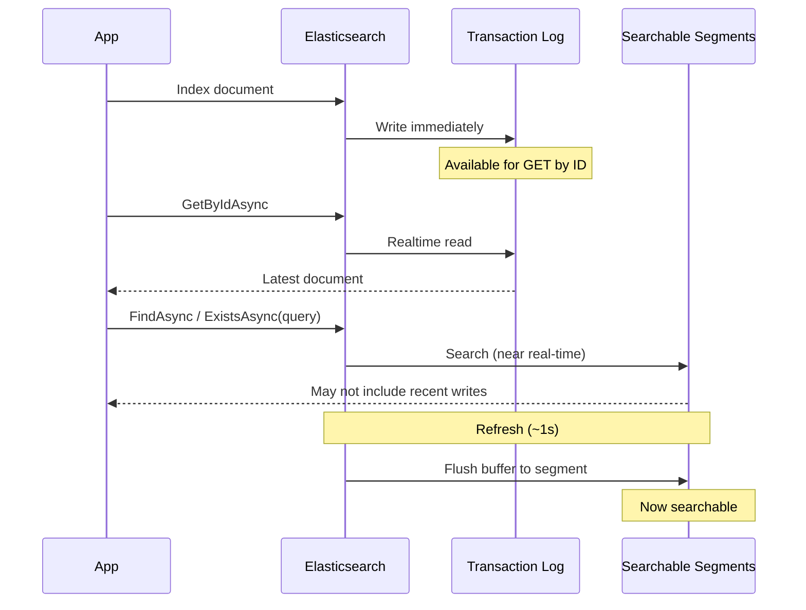

# Consistency and Dirty Reads

Elasticsearch uses a **near real-time** search model. Understanding when your reads are real-time vs. eventually consistent is critical to avoiding subtle concurrency bugs.

## How Elasticsearch Segments Work

When you index (write) a document, Elasticsearch immediately writes it to the **transaction log** (translog) and an in-memory buffer. The document is retrievable by ID at this point through the realtime GET path. However, it is not *searchable* until the next **refresh**, which flushes the buffer into a searchable **segment** (default: every 1 second).



This creates two fundamentally different read paths:

- **GET path** (real-time): Reads directly from the transaction log. Returns the latest version of a document immediately after a write, even before a refresh.
- **Search path** (near real-time): Queries the searchable segments, which lag behind writes by up to the refresh interval. Writes that haven't been refreshed yet are invisible -- this is a **dirty read**.

## Repository Operations by Consistency

| Operation | Real-Time? | ES API Used | Notes |
|-----------|------------|-------------|-------|
| `GetByIdAsync` | ✅ Yes | GET API | Falls back to Search when model has a parent and no routing is provided |
| `GetByIdsAsync` | ✅ Yes | Multi-GET API | Falls back to Search for unrouted parent documents or multi-index |
| `ExistsAsync(id)` | ⚠️ Depends | Document Exists API | Real-time only without soft deletes and without unrouted parents. Otherwise falls back to Search |
| `ExistsAsync(query)` | ❌ No | Search API (`size: 0`) | Always Search, even with `.Id(id)` combined with field filters |
| `FindAsync` | ❌ No | Search API | Subject to refresh interval |
| `FindOneAsync` | ❌ No | Search API (`size: 1`) | Subject to refresh interval |
| `CountAsync` | ❌ No | Search API (`size: 0`) | Uses Search (not the Count API) to support aggregations |
| `GetAllAsync` | ❌ No | Search API | Delegates to `FindAsync` with an empty query |
| `BatchProcessAsync` | ❌ No | Search API | Iterates with search-after paging via `FindAsAsync` |

## The Dirty Read Problem

Any method using the search path can return stale results during the refresh window:

```csharp
var employee = await repository.AddAsync(new Employee
{
    CompanyId = "company-123",
    Name = "Jane Doe"
});

// Search path -- might NOT find the employee yet (dirty read)
var hit = await repository.FindOneAsync(q => q.FieldEquals(e => e.CompanyId, employee.CompanyId));
// hit.Document could be null!

// GET path -- WILL find it immediately (real-time)
var byId = await repository.GetByIdAsync(employee.Id);
// byId is guaranteed to be the latest version
```

## Common Pitfalls

### ExistsAsync with Field Filters

`ExistsAsync(id)` uses the real-time Document Exists API, but `ExistsAsync(query)` always uses the search path -- even when the query targets a specific ID. Adding any field filter forces the query overload:

```csharp
employee.EmploymentType = EmploymentType.Contract;
await repository.SaveAsync(employee);

// Search path -- the index hasn't refreshed yet
bool isContract = await repository.ExistsAsync(q => q
    .Id(employee.Id)
    .FieldEquals(e => e.EmploymentType, EmploymentType.Contract));
// isContract could be false!

// GET path -- real-time, always accurate
var fresh = await repository.GetByIdAsync(employee.Id, o => o.Include(e => e.EmploymentType));
bool freshIsContract = fresh is not null && fresh.EmploymentType == EmploymentType.Contract;
```

### ExistsAsync(id) with Soft Deletes

When a model implements `ISupportSoftDeletes`, even `ExistsAsync(id)` falls back to the search path. The `IsDeleted` filter requires a query -- the Document Exists API has no filtering capability:

```csharp
// Employee implements ISupportSoftDeletes
employee.IsDeleted = true;
await repository.SaveAsync(employee);

// Search path (not real-time) because Employee supports soft deletes
bool exists = await repository.ExistsAsync(employee.Id);
// exists might still be true (stale -- hasn't refreshed yet)
```

## Solving Dirty Reads

### When You Have the Document ID

If you know the document ID and need to check a field's current state, use `GetByIdAsync` -- it reads from the transaction log and is always consistent. Use `Include` to fetch only the fields you need:

```csharp
var employee = await repository.GetByIdAsync(id, o => o.Include(e => e.EmploymentType));
bool isContract = employee is not null && employee.EmploymentType == EmploymentType.Contract;
```

This replaces patterns like `ExistsAsync(q => q.Id(id).FieldEquals(...))` and avoids the search path entirely. For simple existence checks without field filters, `ExistsAsync(id)` is already real-time.

### When You're Searching by Field

When you need to look up documents by a non-ID field (e.g., email, company, slug), the search path is unavoidable. Use custom cache keys to make these lookups reliable across the refresh window:

```csharp
public class UserRepository : ElasticRepositoryBase<User>
{
    public async Task<User?> GetByEmailAddressAsync(string emailAddress)
    {
        if (String.IsNullOrWhiteSpace(emailAddress))
            return null;

        emailAddress = emailAddress.Trim().ToLowerInvariant();

        var hit = await FindOneAsync(
            q => q.FieldEquals(u => u.EmailAddress, emailAddress),
            o => o.Cache($"email:{emailAddress}"));

        return hit?.Document;
    }
}
```

The first call searches Elasticsearch (may be a dirty read), but caches the result by the email key. Subsequent calls return the cached result. When the document is saved, the repository's cache invalidation clears the key, and the next lookup fetches fresh data. See [Caching - Custom Cache Keys for Eventual Consistency](caching.md#custom-cache-keys-for-eventual-consistency) for the full pattern with `InvalidateCacheAsync`.

### ImmediateConsistency (Tests Only)

`ImmediateConsistency()` forces an Elasticsearch index refresh, making the search path consistent. **Never use this in production** -- it degrades cluster performance. You can apply it to either the write or the read:

```csharp
// Force refresh on the write -- all subsequent searches see the update
await repository.SaveAsync(employee, o => o.ImmediateConsistency());

// Or force refresh on the read -- only this search is guaranteed consistent
bool exists = await repository.ExistsAsync(q => q
    .Id(employee.Id)
    .FieldEquals(e => e.EmploymentType, EmploymentType.Contract),
    o => o.ImmediateConsistency());
```

## Next Steps

- [Caching](caching.md) - How the cache layer handles dirty reads
- [Querying](querying.md) - Query syntax for search-based operations
- [CRUD Operations](crud-operations.md) - Complete operations reference
- [Troubleshooting](troubleshooting.md) - Common issues and solutions
