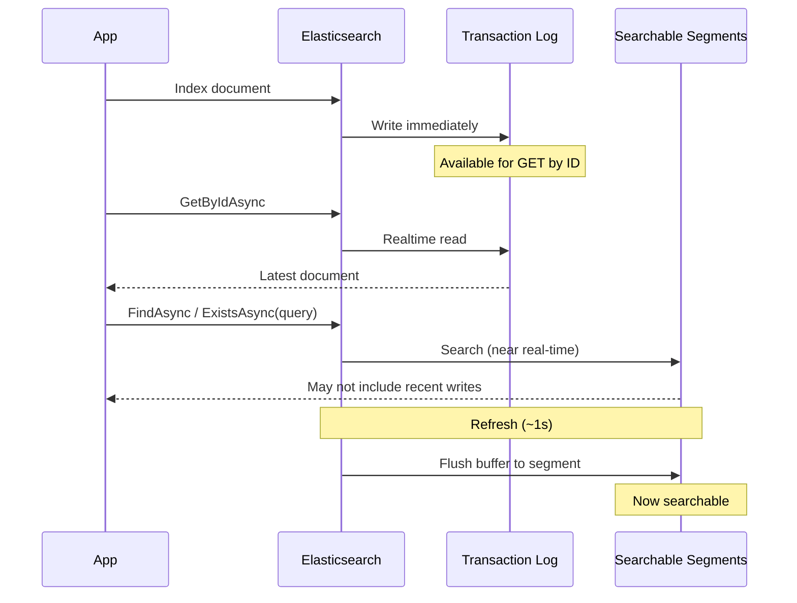

# Consistency and Dirty Reads

Elasticsearch uses a **near real-time** search model. Understanding when your reads are real-time vs. eventually consistent is critical to avoiding subtle concurrency bugs.

## How Elasticsearch Segments Work

When you index (write) a document, Elasticsearch immediately writes it to the **transaction log** (translog) and an in-memory buffer. The document is retrievable by ID at this point through the realtime GET path. However, it is not *searchable* until the next **refresh**, which flushes the buffer into a searchable **segment** (default: every 1 second).



This creates two fundamentally different read paths:

- **GET path** (real-time): Reads directly from the transaction log. Returns the latest version of a document immediately after a write, even before a refresh.
- **Search path** (near real-time): Queries the searchable segments, which lag behind writes by up to the refresh interval. Writes that haven't been refreshed yet are invisible -- this is a **dirty read**.

## Repository Operations by Consistency

| Operation | Real-Time? | ES API Used | Notes |
|-----------|------------|-------------|-------|
| `GetByIdAsync` | ✅ Yes | GET API | Falls back to Search when model has a parent and no routing is provided |
| `GetByIdsAsync` | ✅ Yes | Multi-GET API | Falls back to Search for unrouted parent documents or multi-index |
| `ExistsAsync(id)` | ✅ Yes | GET API / Document Exists API | Uses Document Exists API (no soft deletes) or GET API with source filter (soft deletes). Falls back to Search only for unrouted parent documents |
| `ExistsAsync(query)` | ❌ No | Search API (`size: 0`) | Always Search, even with `.Id(id)` combined with field filters |
| `FindAsync` | ❌ No | Search API | Subject to refresh interval |
| `FindOneAsync` | ❌ No | Search API (`size: 1`) | Subject to refresh interval |
| `CountAsync` | ❌ No | Search API (`size: 0`) | Uses Search (not the Count API) to support aggregations |
| `GetAllAsync` | ❌ No | Search API | Delegates to `FindAsync` with an empty query |
| `BatchProcessAsync` | ❌ No | Search API | Iterates with search-after paging via `FindAsAsync` |

## The Dirty Read Problem

Any method using the search path can return stale results during the refresh window:

```csharp
var employee = await repository.AddAsync(new Employee
{
    CompanyId = "company-123",
    Name = "Jane Doe"
});

// Search path -- might NOT find the employee yet (dirty read)
var hit = await repository.FindOneAsync(q => q.FieldEquals(e => e.CompanyId, employee.CompanyId));
// hit.Document could be null!

// GET path -- WILL find it immediately (real-time)
var byId = await repository.GetByIdAsync(employee.Id);
// byId is guaranteed to be the latest version
```

## Common Pitfalls

### ExistsAsync with Field Filters

`ExistsAsync(id)` uses the real-time Document Exists API, but `ExistsAsync(query)` always uses the search path -- even when the query targets a specific ID. Adding any field filter forces the query overload:

```csharp
employee.EmploymentType = EmploymentType.Contract;
await repository.SaveAsync(employee);

// Search path -- the index hasn't refreshed yet
bool isContract = await repository.ExistsAsync(q => q
    .Id(employee.Id)
    .FieldEquals(e => e.EmploymentType, EmploymentType.Contract));
// isContract could be false!

// GET path -- real-time, always accurate
var fresh = await repository.GetByIdAsync(employee.Id, o => o.Include(e => e.EmploymentType));
bool freshIsContract = fresh is not null && fresh.EmploymentType == EmploymentType.Contract;
```

### ExistsAsync(id) with Soft Deletes

When a model implements `ISupportSoftDeletes`, `ExistsAsync(id)` uses the real-time GET API with a source filter to fetch only the `IsDeleted` field, then checks it in code. This provides real-time accuracy with minimal payload:

```csharp
// Employee implements ISupportSoftDeletes
employee.IsDeleted = true;
await repository.SaveAsync(employee);

// Real-time: uses GET API with _source_includes=isDeleted, then checks IsDeleted in code
bool exists = await repository.ExistsAsync(employee.Id);
// exists is false -- the soft deletion is visible immediately via the GET path
```

## Solving Dirty Reads

### When You Have the Document ID

If you know the document ID and need to check a field's current state, use `GetByIdAsync` -- it reads from the transaction log and is always consistent. Use `Include` to fetch only the fields you need:

```csharp
var employee = await repository.GetByIdAsync(id, o => o.Include(e => e.EmploymentType));
bool isContract = employee is not null && employee.EmploymentType == EmploymentType.Contract;
```

This replaces patterns like `ExistsAsync(q => q.Id(id).FieldEquals(...))` and avoids the search path entirely. For simple existence checks without field filters, `ExistsAsync(id)` is already real-time.

### When You're Searching by Field

When you need to look up documents by a non-ID field (e.g., email, company, slug), the search path is unavoidable. Use custom cache keys to make these lookups reliable across the refresh window:

```csharp
public class UserRepository : ElasticRepositoryBase<User>
{
    public async Task<User?> GetByEmailAddressAsync(string emailAddress)
    {
        if (String.IsNullOrWhiteSpace(emailAddress))
            return null;

        emailAddress = emailAddress.Trim().ToLowerInvariant();

        var hit = await FindOneAsync(
            q => q.FieldEquals(u => u.EmailAddress, emailAddress),
            o => o.Cache($"email:{emailAddress}"));

        return hit?.Document;
    }
}
```

The first call searches Elasticsearch (may be a dirty read), but caches the result by the email key. Subsequent calls return the cached result. When the document is saved, the repository's cache invalidation clears the key, and the next lookup fetches fresh data. See [Caching - Custom Cache Keys for Eventual Consistency](caching.md#custom-cache-keys-for-eventual-consistency) for the full pattern with `InvalidateCacheAsync`.

### ImmediateConsistency (Tests Only)

`ImmediateConsistency()` forces an Elasticsearch index refresh, making the search path consistent. **Never use this in production** -- it degrades cluster performance. You can apply it to either the write or the read:

```csharp
// Force refresh on the write -- all subsequent searches see the update
await repository.SaveAsync(employee, o => o.ImmediateConsistency());

// Or force refresh on the read -- only this search is guaranteed consistent
bool exists = await repository.ExistsAsync(q => q
    .Id(employee.Id)
    .FieldEquals(e => e.EmploymentType, EmploymentType.Contract),
    o => o.ImmediateConsistency());
```

## Consistency Modes (Internal Mechanics)

The `Consistency` enum controls how the repository ensures write visibility:

| Mode | Write Behavior | Read Behavior | Use Case |
|------|---------------|---------------|----------|
| `Eventual` (default) | `Refresh.False` -- no forced refresh | No pre-query refresh | Normal production operations |
| `Immediate` | `Refresh.True` -- synchronous refresh before response | `Indices.RefreshAsync` before search | Tests, critical paths needing instant visibility |
| `Wait` | `Refresh.WaitFor` -- blocks until next scheduled refresh | `Indices.RefreshAsync` before search | Lower-overhead alternative to Immediate |

### Setting Consistency

```csharp
// On a specific operation
await repository.AddAsync(doc, o => o.ImmediateConsistency());

// Or wait for next scheduled refresh (gentler on the cluster)
await repository.AddAsync(doc, o => o.ImmediateConsistency(shouldWait: true));
```

### DefaultConsistency Property

Repositories can set `DefaultConsistency` in the constructor to apply a non-Eventual mode by default for all operations:

```csharp
public class MigrationStateRepository : ElasticRepositoryBase<MigrationState>
{
    public MigrationStateRepository(IIndex index) : base(index)
    {
        DefaultConsistency = Consistency.Immediate;
    }
}
```

This is appropriate for small, correctness-critical indices (migration state, field definitions). Avoid for large or high-write indices due to the refresh cost.

### How Read-Side Refresh Works

Search-based operations (`FindAsync`, `CountAsync`, `ExistsAsync(query)`, `FindOneAsync`) call `RefreshForConsistency` before executing the search. This is essential for:

1. **Cross-process consistency**: Process A writes with Eventual consistency, Process B reads with Immediate -- the read-side refresh ensures B sees A's write.
2. **Batch pagination correctness**: `RemoveAllAsync` and `PatchAllAsync` intentionally downgrade inner writes to Eventual for performance, then rely on the read-side refresh between pages to prevent reprocessing.

### Batch Processing and Consistency

`BatchProcessAsAsync` (used by `RemoveAllAsync` and `PatchAllAsync` when listeners/cache are active) uses this pattern:

1. Refresh (via `FindAsAsync`) → search for page 1
2. Process batch (inner writes use Eventual for performance)
3. Refresh (via next `FindAsAsync`) → search for page 2 (correctly skips processed docs)
4. Repeat until done
5. Final `RefreshForConsistency` for the last batch

The inner writes are downgraded to Eventual to avoid the cost of per-write refresh during bulk operations. The inter-page refresh makes the completed batch invisible to subsequent queries, preventing infinite loops or double-processing.

### Known Limitations

- **`UpdateByQuery` and `DeleteByQuery`**: These ES APIs only accept `bool?` for their refresh parameter (not the `Refresh` enum). `Consistency.Wait` is treated identically to `Immediate` for these operations.
- **Non-idempotent scripts**: If using `PatchAllAsync` with a non-idempotent script (e.g., counter increment) and Eventual consistency, a document could theoretically be processed twice between page refreshes. Use `ImmediateConsistency` for non-idempotent patches.
- **Exceptions bypass final refresh**: If an exception occurs during batch processing, the final refresh is skipped. Partially-processed writes may not be immediately visible.

## Next Steps

- [Caching](caching.md) - How the cache layer handles dirty reads
- [Querying](querying.md) - Query syntax for search-based operations
- [CRUD Operations](crud-operations.md) - Complete operations reference
- [Troubleshooting](troubleshooting.md) - Common issues and solutions
