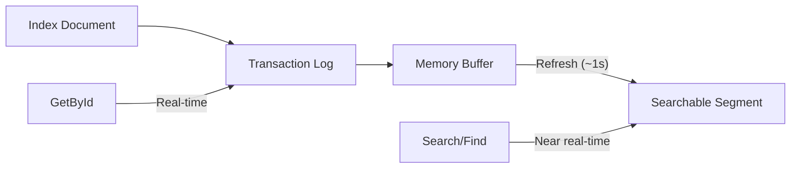

# Consistency and Dirty Reads

Elasticsearch uses a **near real-time** search model. Understanding when your reads are real-time vs. eventually consistent is critical to avoiding subtle concurrency bugs.

## How Elasticsearch Segments Work

When you index (write) a document, it is written to the **transaction log** (translog) immediately. However, it is not searchable until the next **refresh**, which flushes the in-memory buffer into a searchable **segment**. By default, Elasticsearch refreshes every 1 second.



This creates two fundamentally different read paths:

- **GET path** (real-time): Reads directly from the transaction log. Returns the latest version of a document immediately after a write, even before a refresh occurs.
- **Search path** (near real-time): Queries the searchable segments, which are only updated after a refresh. Writes that haven't been refreshed yet are invisible to the search path -- this is a **dirty read**.

## Repository Operations by Consistency

| Operation | Real-Time? | ES API Used | Notes |
|-----------|------------|-------------|-------|
| `GetByIdAsync` | ✅ Yes | GET API | Falls back to Search API when the model has a parent and no routing is provided |
| `GetByIdsAsync` | ✅ Yes | Multi-GET API | Falls back to Search API for IDs without routing on parent documents, or when the index has multiple backing indexes |
| `ExistsAsync(id)` | ⚠️ Depends | Document Exists API | Real-time only when the model does **not** support soft deletes **and** either has no parent or routing is provided. Otherwise falls back to Search API |
| `ExistsAsync(query)` | ❌ No | Search API (`size: 0`) | Always uses the search path, even when querying by ID with `.Id(id)` combined with field filters |
| `FindAsync` | ❌ No | Search API | Subject to refresh interval |
| `FindOneAsync` | ❌ No | Search API (`size: 1`) | Subject to refresh interval |
| `FindAsAsync<T>` | ❌ No | Search API | Also used by async queries and snapshot paging |
| `CountAsync` | ❌ No | Search API (`size: 0`) | Does **not** use the ES Count API -- uses Search with `size: 0` to support aggregations |
| `GetAllAsync` | ❌ No | Search API (via `FindAsync`) | Delegates to `FindAsync` with an empty query |
| `BatchProcessAsync` | ❌ No | Search API (via `FindAsAsync`) | Iterates with search-after paging |

## The Dirty Read Problem

Any method that goes through the **search path** can return stale results during the refresh window. This includes `FindAsync`, `FindOneAsync`, `CountAsync`, `ExistsAsync(query)`, `GetAllAsync`, and `BatchProcessAsync`.

```csharp
var employee = await repository.AddAsync(new Employee
{
    CompanyId = "company-123",
    Name = "Jane Doe"
});

// This uses the search path -- might NOT find the employee (dirty read)
var found = await repository.FindOneAsync(q => q.FieldEquals(e => e.CompanyId, employee.CompanyId));
// found could be null!

// But this WILL find it (real-time GET)
var byId = await repository.GetByIdAsync(employee.Id);
// byId is guaranteed to exist
```

### ExistsAsync with Field Filters

A common mistake is using `ExistsAsync` with a query that includes both an ID and a field filter. Even though you're looking up a specific document by ID, adding a field filter forces the query-based overload, which uses the search path:

```csharp
employee.EmploymentType = EmploymentType.Contract;
await repository.SaveAsync(employee);

// This is a dirty read -- the search index hasn't refreshed yet
bool isContract = await repository.ExistsAsync(q => q
    .Id(employee.Id)
    .FieldEquals(e => e.EmploymentType, EmploymentType.Contract));
// isContract could be false!

// Instead, fetch by ID (real-time) and check the field in code
var fresh = await repository.GetByIdAsync(employee.Id);
bool freshIsContract = fresh?.EmploymentType == EmploymentType.Contract;
// freshIsContract is guaranteed to be accurate
```

### ExistsAsync(id) with Soft Deletes

When a model implements `ISupportSoftDeletes`, even `ExistsAsync(id)` falls back to the search path. This is because it needs to apply the `IsDeleted` filter, which requires a query -- the Document Exists API has no filtering capability.

```csharp
// Employee implements ISupportSoftDeletes
employee.IsDeleted = true;
await repository.SaveAsync(employee);

// This goes through the search path (not real-time) because Employee supports soft deletes
bool exists = await repository.ExistsAsync(employee.Id);
// exists might still be true (stale -- hasn't refreshed yet)
```

## Solving Dirty Reads

### Option 1: Use Real-Time Operations

When you need the latest state of a specific document, prefer `GetByIdAsync` over search-based methods. You can use `Include` to fetch only the fields you need, keeping the response lightweight:

```csharp
// Instead of ExistsAsync with a field filter, use a real-time GET with a field projection:
var employee = await repository.GetByIdAsync(id, o => o.Include(e => e.EmploymentType));
bool isContract = employee is not null && employee.EmploymentType == EmploymentType.Contract;
```

### Option 2: ImmediateConsistency (Tests Only)

`ImmediateConsistency()` forces an Elasticsearch index refresh, making subsequent searches consistent. **Never use this in production** -- it degrades cluster performance. You can apply it to either the write or the read:

```csharp
// Option A: force refresh on the write -- all subsequent searches see the update
await repository.SaveAsync(employee, o => o.ImmediateConsistency());

// Option B: force refresh on the read -- only this search is guaranteed consistent
bool exists = await repository.ExistsAsync(q => q
    .Id(employee.Id)
    .FieldEquals(e => e.EmploymentType, EmploymentType.Contract),
    o => o.ImmediateConsistency());
```

Both work, but both trigger an index refresh. In production, prefer Option 1 (`GetByIdAsync` with `Include`) which avoids the refresh entirely.

### Option 3: Custom Cache Keys for Eventual Consistency

You can add a repository method that wraps the real-time GET behind a cached lookup by a domain key. The first call fetches from Elasticsearch (real-time), caches it, and all subsequent calls hit the cache until the document changes:

```csharp
public async Task<bool> IsEmploymentTypeAsync(string employeeId, EmploymentType expectedType)
{
    var employee = await GetByIdAsync(employeeId, o => o
        .Include(e => e.EmploymentType)
        .Cache($"employment-type:{employeeId}"));

    return employee is not null && employee.EmploymentType == expectedType;
}
```

For search-based lookups by a non-ID field (e.g., email address), you can override `AddDocumentsToCacheAsync` and `InvalidateCacheAsync` to cache by that field. See [Caching - Custom Cache Keys for Eventual Consistency](caching.md#custom-cache-keys-for-eventual-consistency) for the full pattern.

## Next Steps

- [Caching](caching.md) - How the cache layer handles dirty reads
- [Querying](querying.md) - Query syntax for search-based operations
- [CRUD Operations](crud-operations.md) - Complete operations reference
- [Troubleshooting](troubleshooting.md) - Common issues and solutions
