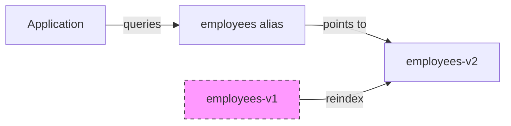

# Index Management

Foundatio.Repositories provides flexible index management strategies for different use cases. This guide covers index types, configuration, and maintenance.

## Index Types

### Index&lt;T&gt;

Basic index for simple entities:

```csharp
public sealed class EmployeeIndex : Index<Employee>
{
    public EmployeeIndex(IElasticConfiguration configuration) 
        : base(configuration, "employees") { }

    public override TypeMappingDescriptor<Employee> ConfigureIndexMapping(
        TypeMappingDescriptor<Employee> map)
    {
        return map
            .Dynamic(false)
            .Properties(p => p
                .SetupDefaults()
                .Keyword(f => f.Name(e => e.CompanyId))
                .Text(f => f.Name(e => e.Name).AddKeywordAndSortFields())
            );
    }
}
```

### VersionedIndex&lt;T&gt;

Index with schema versioning for evolving schemas:

```csharp
public sealed class EmployeeIndex : VersionedIndex<Employee>
{
    public EmployeeIndex(IElasticConfiguration configuration) 
        : base(configuration, "employees", version: 2) { }

    public override TypeMappingDescriptor<Employee> ConfigureIndexMapping(
        TypeMappingDescriptor<Employee> map)
    {
        return map
            .Dynamic(false)
            .Properties(p => p
                .SetupDefaults()
                .Keyword(f => f.Name(e => e.CompanyId))
                .Text(f => f.Name(e => e.Name).AddKeywordAndSortFields())
                .Keyword(f => f.Name(e => e.Department))  // Added in v2
            );
    }
}
```

**Index naming:**
- Version 1: `employees-v1`
- Version 2: `employees-v2`
- Alias: `employees` (points to current version)

### DailyIndex&lt;T&gt;

Time-series index with daily partitioning:

```csharp
public sealed class LogEventIndex : DailyIndex<LogEvent>
{
    public LogEventIndex(IElasticConfiguration configuration) 
        : base(configuration, "logs", version: 1)
    {
        MaxIndexAge = TimeSpan.FromDays(90);
        DiscardExpiredIndexes = true;
    }

    public override TypeMappingDescriptor<LogEvent> ConfigureIndexMapping(
        TypeMappingDescriptor<LogEvent> map)
    {
        return map
            .Dynamic(false)
            .Properties(p => p
                .SetupDefaults()
                .Keyword(f => f.Name(e => e.Level))
                .Text(f => f.Name(e => e.Message))
            );
    }
}
```

**Index naming:**
- `logs-v1-2024.01.15`
- `logs-v1-2024.01.16`
- Alias: `logs` (points to all indexes)

### MonthlyIndex&lt;T&gt;

Time-series index with monthly partitioning:

```csharp
public sealed class AuditLogIndex : MonthlyIndex<AuditLog>
{
    public AuditLogIndex(IElasticConfiguration configuration) 
        : base(configuration, "audit", version: 1)
    {
        MaxIndexAge = TimeSpan.FromDays(365);
        DiscardExpiredIndexes = true;
    }
}
```

**Index naming:**
- `audit-v1-2024.01`
- `audit-v1-2024.02`

## Querying Time-Series Indexes

### Index Selection vs. Document Filtering

When working with `DailyIndex` or `MonthlyIndex`, two separate mechanisms control what data is returned:

- **`.Index(start, end)`** — selects which physical index partitions to query. Without this, all partitions are queried via the umbrella alias.
- **`.DateRange(start, end, field)`** — filters documents within the targeted indexes by a date field value.

These must be set independently. `DateRange` alone does not narrow index selection.

```csharp
var start = DateTime.UtcNow.AddDays(-7);
var end = DateTime.UtcNow;

var results = await repository.FindAsync(q => q
    .Index(start, end)                         // target only the relevant partitions
    .DateRange(start, end, e => e.CreatedUtc)  // filter documents within those partitions
);
```

Omitting `.Index()` is correct but less efficient — the query runs against all partitions and relies solely on the `DateRange` filter to narrow results.

### Large Range Fallback

Generating an individual index name for each day or month in a very wide range would produce an excessively long list. To avoid this, `.Index(start, end)` falls back to the umbrella alias (which covers all partitions) when the range is too broad:

| Index type | Threshold | Behavior |
|---|---|---|
| `DailyIndex` | Range >= 3 months, or exceeds `MaxIndexAge` | Falls back to alias (all partitions) |
| `MonthlyIndex` | Range > 1 year, or exceeds `MaxIndexAge` | Falls back to alias (all partitions) |

In the fallback case, Elasticsearch receives the alias name rather than a list of specific index names. The query is still executed correctly, and the `.DateRange()` filter still restricts the returned documents — there is just no partition pruning at the index-routing level.

```csharp
// This range is 4 months — exceeds the DailyIndex threshold of 3 months.
// GetIndexes returns an empty list, so the query targets the "logs" alias instead.
var results = await repository.FindAsync(q => q
    .Index(DateTime.UtcNow.AddMonths(-4), DateTime.UtcNow)
    .DateRange(DateTime.UtcNow.AddMonths(-4), DateTime.UtcNow, e => e.CreatedUtc)
);
```

### Best Practices for Time-Series Queries

1. **Always pair `.Index()` with `.DateRange()`** — `.Index()` prunes partitions, `.DateRange()` filters documents. Both are needed for correct and efficient queries.
2. **Keep ranges within the fallback threshold** — queries within 3 months (daily) or 1 year (monthly) benefit from partition pruning. Wider ranges fall back to alias-level querying.
3. **Use time-based aliases for fixed windows** — for recurring queries like "last 7 days" or "last 30 days", configure named aliases via `AddAlias()` to avoid computing index ranges at query time.

```csharp
// In index configuration
public LogEventIndex(IElasticConfiguration configuration) 
    : base(configuration, "logs", version: 1)
{
    MaxIndexAge = TimeSpan.FromDays(90);
    AddAlias("logs-last-7-days", TimeSpan.FromDays(7));
    AddAlias("logs-last-30-days", TimeSpan.FromDays(30));
}

// In queries — use the alias directly instead of computing a range
var results = await repository.FindAsync(q => q.Index("logs-last-7-days"));
```

## Index Configuration

### Index Settings

```csharp
public override CreateIndexDescriptor ConfigureIndex(CreateIndexDescriptor idx)
{
    return base.ConfigureIndex(idx.Settings(s => s
        .NumberOfShards(3)
        .NumberOfReplicas(1)
        .RefreshInterval(TimeSpan.FromSeconds(5))
        .Analysis(a => a
            .AddSortNormalizer()
            .Analyzers(an => an
                .Custom("my_analyzer", ca => ca
                    .Tokenizer("standard")
                    .Filters("lowercase", "asciifolding")
                ))
        )));
}
```

### Index Mapping

```csharp
public override TypeMappingDescriptor<Employee> ConfigureIndexMapping(
    TypeMappingDescriptor<Employee> map)
{
    return map
        .Dynamic(false)  // Disable dynamic mapping
        .Properties(p => p
            .SetupDefaults()  // Configure Id, CreatedUtc, UpdatedUtc, IsDeleted
            
            // Keyword fields (exact match, aggregations)
            .Keyword(f => f.Name(e => e.CompanyId))
            .Keyword(f => f.Name(e => e.Status))
            
            // Text fields with keywords (full-text + exact match)
            .Text(f => f.Name(e => e.Name).AddKeywordAndSortFields())
            .Text(f => f.Name(e => e.Email).AddKeywordAndSortFields())
            
            // Numeric fields
            .Number(f => f.Name(e => e.Age).Type(NumberType.Integer))
            .Number(f => f.Name(e => e.Salary).Type(NumberType.Double))
            
            // Date fields
            .Date(f => f.Name(e => e.HireDate))
            
            // Boolean fields
            .Boolean(f => f.Name(e => e.IsActive))
            
            // Nested objects
            .Nested<Address>(n => n
                .Name(e => e.Addresses)
                .Properties(ap => ap
                    .Keyword(f => f.Name(a => a.City))
                    .Keyword(f => f.Name(a => a.Country))
                ))
        );
}
```

### SetupDefaults Extension

The `SetupDefaults()` extension configures common fields:

```csharp
.Properties(p => p.SetupDefaults())
```

This configures:
- `Id` as keyword
- `CreatedUtc` as date
- `UpdatedUtc` as date
- `IsDeleted` as boolean (if `ISupportSoftDeletes`)
- `Version` as keyword (if `IVersioned`)

## Schema Versioning

### How Versioned Indexes Work

When you use `VersionedIndex<T>`, the library manages schema evolution through a versioning system:

1. **Index Naming**: Each version creates a separate index (e.g., `employees-v1`, `employees-v2`)
2. **Alias Management**: An alias (`employees`) always points to the current version
3. **Automatic Reindexing**: When you increment the version, data is automatically migrated



### Version Upgrade Process

When you increment the version and call `ConfigureIndexesAsync()`, the following happens:

1. **New Index Creation**: Creates `employees-v2` with the new mapping
2. **Reindex Task**: Elasticsearch's reindex API copies data from v1 to v2
3. **Script Execution**: Any reindex scripts transform data during migration
4. **Alias Switch**: The `employees` alias is atomically switched from v1 to v2
5. **Old Index Cleanup**: If `DiscardIndexesOnReindex` is true, v1 is deleted

```csharp
// Step 1: Increment version and add migration scripts
public sealed class EmployeeIndex : VersionedIndex<Employee>
{
    public EmployeeIndex(IElasticConfiguration configuration) 
        : base(configuration, "employees", version: 2)  // Changed from 1 to 2
    {
        // Scripts run during reindex from v1 to v2
        RenameFieldScript(2, "dept", "department");
        RemoveFieldScript(2, "legacyField");
    }
}

// Step 2: Configure indexes (triggers reindex)
await configuration.ConfigureIndexesAsync();
```

### Field Operations During Reindex

#### Rename a Field

Use `RenameFieldScript` to rename a field during reindex:

```csharp
public EmployeeIndex(IElasticConfiguration configuration) 
    : base(configuration, "employees", version: 2)
{
    // Rename 'dept' to 'department' in version 2
    RenameFieldScript(2, "dept", "department");
    
    // By default, the original field is removed
    // To keep both fields:
    RenameFieldScript(2, "oldName", "newName", removeOriginal: false);
}
```

The generated Painless script:
```javascript
if (ctx._source.containsKey('dept')) { 
    ctx._source['department'] = ctx._source.dept; 
}
if (ctx._source.containsKey('dept')) { 
    ctx._source.remove('dept'); 
}
```

#### Remove a Field

Use `RemoveFieldScript` to remove a field:

```csharp
public EmployeeIndex(IElasticConfiguration configuration) 
    : base(configuration, "employees", version: 3)
{
    // Remove deprecated field in version 3
    RemoveFieldScript(3, "deprecatedField");
}
```

#### Custom Transformation

Use `AddReindexScript` for complex transformations:

```csharp
public EmployeeIndex(IElasticConfiguration configuration) 
    : base(configuration, "employees", version: 4)
{
    // Custom Painless script for complex transformation
    AddReindexScript(4, @"
        // Combine first and last name
        if (ctx._source.containsKey('firstName') && ctx._source.containsKey('lastName')) {
            ctx._source.fullName = ctx._source.firstName + ' ' + ctx._source.lastName;
        }
        
        // Convert status string to boolean
        if (ctx._source.containsKey('status')) {
            ctx._source.isActive = ctx._source.status == 'active';
            ctx._source.remove('status');
        }
        
        // Set default values
        if (!ctx._source.containsKey('createdUtc')) {
            ctx._source.createdUtc = '2024-01-01T00:00:00Z';
        }
    ");
}
```

### Multi-Version Migration

Scripts are applied incrementally. If upgrading from v1 to v3, both v2 and v3 scripts run:

```csharp
public EmployeeIndex(IElasticConfiguration configuration) 
    : base(configuration, "employees", version: 3)
{
    // v2 scripts (run when upgrading from v1)
    RenameFieldScript(2, "dept", "department");
    
    // v3 scripts (run when upgrading from v1 or v2)
    AddReindexScript(3, "ctx._source.version = 3;");
}
```

### Controlling Old Index Deletion

```csharp
public EmployeeIndex(IElasticConfiguration configuration) 
    : base(configuration, "employees", version: 2)
{
    // Delete old index after successful reindex (default: true)
    DiscardIndexesOnReindex = true;
    
    // Keep old index for rollback capability
    // DiscardIndexesOnReindex = false;
}
```

### Reindex Progress Monitoring

Monitor reindex progress with a callback:

```csharp
await configuration.ReindexAsync(async (progress, message) =>
{
    _logger.LogInformation("Reindex {Progress}%: {Message}", progress, message);
    
    // Update UI or metrics
    await UpdateProgressAsync(progress, message);
});
```

### Error Handling During Reindex

Failed documents are stored in an error index (`employees-v2-error`):

```csharp
// Query failed documents
var errorIndex = "employees-v2-error";
var failures = await _client.SearchAsync<object>(s => s.Index(errorIndex));

foreach (var failure in failures.Documents)
{
    // Handle failed document
    _logger.LogError("Failed to reindex: {Document}", failure);
}
```

## Retention Policy for Time-Series Indexes

### Configuring Retention

For `DailyIndex` and `MonthlyIndex`, configure retention with `MaxIndexAge`:

```csharp
public sealed class LogEventIndex : DailyIndex<LogEvent>
{
    public LogEventIndex(IElasticConfiguration configuration) 
        : base(configuration, "logs", version: 1)
    {
        // Keep indexes for 90 days
        MaxIndexAge = TimeSpan.FromDays(90);
        
        // Automatically delete expired indexes during maintenance
        DiscardExpiredIndexes = true;
    }
}
```

### How Retention Works

1. **Index Expiration**: Each index has an expiration date based on its date + `MaxIndexAge`
2. **Maintenance Job**: `MaintainIndexesAsync()` checks for expired indexes
3. **Automatic Deletion**: If `DiscardExpiredIndexes` is true, expired indexes are deleted

```csharp
// Index: logs-v1-2024.01.15
// MaxIndexAge: 90 days
// Expiration: 2024.01.15 + 90 days = 2024.04.15

// After 2024.04.15, this index is eligible for deletion
```

### Running Maintenance

Call `MaintainIndexesAsync()` regularly (e.g., via a scheduled job):

```csharp
// In a background job
public class IndexMaintenanceJob : IJob
{
    private readonly MyElasticConfiguration _configuration;

    public async Task RunAsync(CancellationToken cancellationToken)
    {
        // This will:
        // 1. Update aliases for time-series indexes
        // 2. Delete expired indexes (if DiscardExpiredIndexes = true)
        await _configuration.MaintainIndexesAsync();
    }
}
```

Or use the built-in `MaintainIndexesJob`:

```csharp
services.AddJob<MaintainIndexesJob>(o => o.ApplyDefaults<MaintainIndexesJob>());
```

### Preventing Writes to Expired Indexes

The library prevents writing to indexes that have exceeded `MaxIndexAge`:

```csharp
// If MaxIndexAge is 90 days and you try to write a document
// with a date older than 90 days, an ArgumentException is thrown
var oldDocument = new LogEvent 
{ 
    CreatedUtc = DateTime.UtcNow.AddDays(-100)  // Older than MaxIndexAge
};

// This will throw: "Index max age exceeded"
await repository.AddAsync(oldDocument);
```

### Time-Based Aliases

Create aliases that automatically include only recent indexes:

```csharp
public LogEventIndex(IElasticConfiguration configuration) 
    : base(configuration, "logs", version: 1)
{
    MaxIndexAge = TimeSpan.FromDays(90);
    DiscardExpiredIndexes = true;
    
    // Create aliases for recent data windows
    AddAlias("logs-last-7-days", TimeSpan.FromDays(7));
    AddAlias("logs-last-30-days", TimeSpan.FromDays(30));
    AddAlias("logs-last-90-days", TimeSpan.FromDays(90));
}
```

These aliases are automatically updated during maintenance:
- `logs-last-7-days` only includes indexes from the last 7 days
- Older indexes are removed from the alias but not deleted (until they exceed `MaxIndexAge`)

### Monthly Index Retention

For `MonthlyIndex`, retention works the same way but with monthly granularity:

```csharp
public sealed class AuditLogIndex : MonthlyIndex<AuditLog>
{
    public AuditLogIndex(IElasticConfiguration configuration) 
        : base(configuration, "audit", version: 1)
    {
        // Keep audit logs for 1 year
        MaxIndexAge = TimeSpan.FromDays(365);
        DiscardExpiredIndexes = true;
    }
}

// Index naming: audit-v1-2024.01, audit-v1-2024.02, etc.
// Expiration: End of month + 365 days
```

### Retention Best Practices

1. **Set appropriate retention**: Balance storage costs with data retention requirements
2. **Run maintenance regularly**: Schedule `MaintainIndexesAsync()` daily or more frequently
3. **Monitor disk usage**: Track index sizes and adjust retention as needed
4. **Use aliases for queries**: Query against aliases like `logs-last-30-days` for better performance
5. **Consider compliance**: Ensure retention meets regulatory requirements

```csharp
// Example: Different retention for different data types
public class LogsIndex : DailyIndex<LogEvent>
{
    public LogsIndex(IElasticConfiguration config) : base(config, "logs")
    {
        MaxIndexAge = TimeSpan.FromDays(30);  // Short retention for logs
    }
}

public class AuditIndex : MonthlyIndex<AuditEvent>
{
    public AuditIndex(IElasticConfiguration config) : base(config, "audit")
    {
        MaxIndexAge = TimeSpan.FromDays(365 * 7);  // 7 years for compliance
    }
}
```

## Index Operations

### Configure Indexes

Create indexes and update mappings:

```csharp
await configuration.ConfigureIndexesAsync();
```

Options:
- Creates indexes that don't exist
- Updates mappings for existing indexes (if compatible)
- Creates aliases
- Starts reindexing for outdated indexes

### Maintain Indexes

Run maintenance tasks:

```csharp
await configuration.MaintainIndexesAsync();
```

Tasks:
- Update aliases for time-series indexes
- Delete expired indexes
- Ensure index consistency

### Delete Indexes

```csharp
// Delete all indexes
await configuration.DeleteIndexesAsync();

// Delete specific index
await index.DeleteAsync();
```

### Reindex

```csharp
// Reindex all indexes
await configuration.ReindexAsync();

// Reindex with progress callback
await configuration.ReindexAsync(async (progress, message) =>
{
    Console.WriteLine($"{progress}%: {message}");
});

// Reindex specific index
await index.ReindexAsync();
```

## Index Properties

### IIndex Interface

```csharp
public interface IIndex : IDisposable
{
    string Name { get; }
    bool HasMultipleIndexes { get; }
    IElasticQueryBuilder QueryBuilder { get; }
    ElasticMappingResolver MappingResolver { get; }
    ElasticQueryParser QueryParser { get; }
    IElasticConfiguration Configuration { get; }
    
    Task ConfigureAsync();
    Task EnsureIndexAsync(object target);
    Task MaintainAsync(bool includeOptionalTasks = true);
    Task DeleteAsync();
    Task ReindexAsync(Func<int, string, Task> progressCallbackAsync = null);
    string CreateDocumentId(object document);
    string[] GetIndexesByQuery(IRepositoryQuery query);
    string GetIndex(object target);
}
```

### Index Properties

```csharp
public class Index<T>
{
    public string Name { get; }
    public bool HasMultipleIndexes { get; }
    public int BulkBatchSize { get; set; } = 1000;
    
    // Query field restrictions
    public ISet<string> AllowedQueryFields { get; }
    public ISet<string> AllowedAggregationFields { get; }
    public ISet<string> AllowedSortFields { get; }
}
```

### VersionedIndex Properties

```csharp
public class VersionedIndex<T>
{
    public int Version { get; }
    public string VersionedName { get; }  // e.g., "employees-v2"
    public bool DiscardIndexesOnReindex { get; set; }
}
```

### DailyIndex Properties

```csharp
public class DailyIndex<T>
{
    public TimeSpan? MaxIndexAge { get; set; }
    public bool DiscardExpiredIndexes { get; set; }
}
```

## Best Practices

### 1. Use Versioned Indexes for Evolving Schemas

```csharp
// Start with version 1
public EmployeeIndex(...) : base(configuration, "employees", version: 1) { }

// Increment when schema changes
public EmployeeIndex(...) : base(configuration, "employees", version: 2) { }
```

### 2. Use Time-Series Indexes for Log Data

```csharp
// Daily for high-volume, short retention
public class LogIndex : DailyIndex<Log> { }

// Monthly for lower-volume, longer retention
public class AuditIndex : MonthlyIndex<Audit> { }
```

### 3. Configure Appropriate Retention

```csharp
MaxIndexAge = TimeSpan.FromDays(90);
DiscardExpiredIndexes = true;
```

### 4. Use Aliases for Zero-Downtime Migrations

```csharp
// Alias always points to current version
// Applications use alias, not versioned index name
```

### 5. Test Reindex Scripts

```csharp
// Test scripts in development before production
AddReindexScript(2, @"
    // Validate script works correctly
    ctx._source.newField = ctx._source.oldField;
");
```

## Next Steps

- [Migrations](/guide/migrations) - Document migrations
- [Jobs](/guide/jobs) - Index maintenance jobs
- [Elasticsearch Setup](/guide/elasticsearch-setup) - Connection configuration
