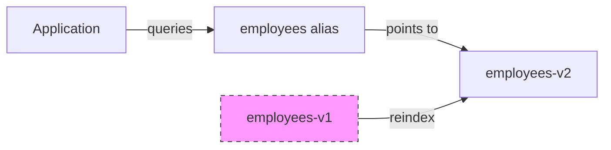
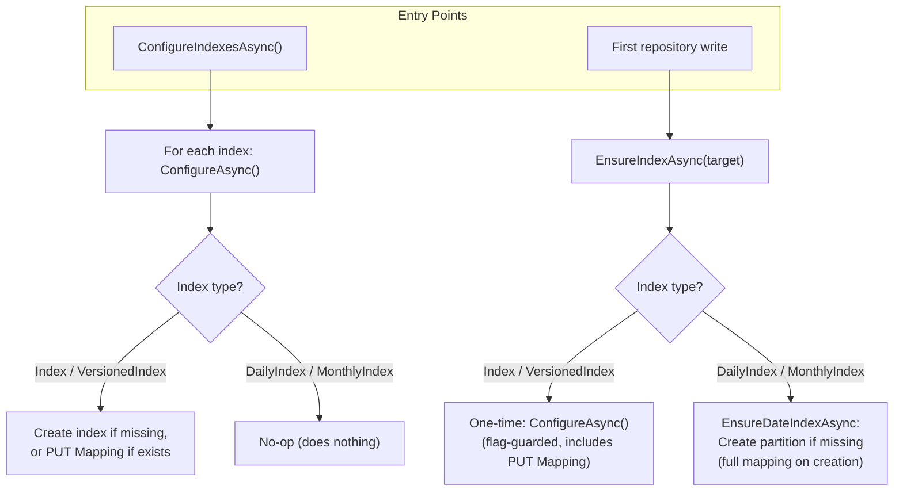

# Index Management

Foundatio.Repositories provides flexible index management strategies for different use cases. This guide covers index types, configuration, and maintenance.

## Index Types

### Index&lt;T&gt;

Basic index for simple entities:

```csharp
public sealed class EmployeeIndex : Index<Employee>
{
    public EmployeeIndex(IElasticConfiguration configuration)
        : base(configuration, "employees") { }

    public override void ConfigureIndexMapping(TypeMappingDescriptor<Employee> map)
    {
        map
            .Dynamic(DynamicMapping.False)
            .Properties(p => p
                .SetupDefaults()
                .Keyword(e => e.CompanyId)
                .Text(e => e.Name, t => t.AddKeywordAndSortFields())
            );
    }
}
```

### VersionedIndex&lt;T&gt;

Index with schema versioning for evolving schemas:

```csharp
public sealed class EmployeeIndex : VersionedIndex<Employee>
{
    public EmployeeIndex(IElasticConfiguration configuration)
        : base(configuration, "employees", version: 2) { }

    public override void ConfigureIndexMapping(TypeMappingDescriptor<Employee> map)
    {
        map
            .Dynamic(DynamicMapping.False)
            .Properties(p => p
                .SetupDefaults()
                .Keyword(e => e.CompanyId)
                .Text(e => e.Name, t => t.AddKeywordAndSortFields())
                .Keyword(e => e.Department)  // Added in v2
            );
    }
}
```

**Index naming:**
- Version 1: `employees-v1`
- Version 2: `employees-v2`
- Alias: `employees` (points to current version)

### DailyIndex&lt;T&gt;

Time-series index with daily partitioning:

```csharp
public sealed class LogEventIndex : DailyIndex<LogEvent>
{
    public LogEventIndex(IElasticConfiguration configuration)
        : base(configuration, "logs", version: 1)
    {
        MaxIndexAge = TimeSpan.FromDays(90);
        DiscardExpiredIndexes = true;
    }

    public override void ConfigureIndexMapping(TypeMappingDescriptor<LogEvent> map)
    {
        map
            .Dynamic(DynamicMapping.False)
            .Properties(p => p
                .SetupDefaults()
                .Keyword(e => e.Level)
                .Text(e => e.Message)
            );
    }
}
```

**Index naming:**
- `logs-v1-2024.01.15`
- `logs-v1-2024.01.16`
- Alias: `logs` (points to all indexes)

### MonthlyIndex&lt;T&gt;

Time-series index with monthly partitioning:

```csharp
public sealed class AuditLogIndex : MonthlyIndex<AuditLog>
{
    public AuditLogIndex(IElasticConfiguration configuration)
        : base(configuration, "audit", version: 1)
    {
        MaxIndexAge = TimeSpan.FromDays(365);
        DiscardExpiredIndexes = true;
    }
}
```

**Index naming:**
- `audit-v1-2024.01`
- `audit-v1-2024.02`

## Querying Time-Series Indexes

### Index Selection vs. Document Filtering

When working with `DailyIndex` or `MonthlyIndex`, two separate mechanisms control what data is returned:

- **`.Index(start, end)`** — selects which physical index partitions to query. Without this, all partitions are queried via the umbrella alias.
- **`.DateRange(start, end, field)`** — filters documents within the targeted indexes by a date field value.

These must be set independently. `DateRange` alone does not narrow index selection.

```csharp
var start = DateTime.UtcNow.AddDays(-7);
var end = DateTime.UtcNow;

var results = await repository.FindAsync(q => q
    .Index(start, end)                         // target only the relevant partitions
    .DateRange(start, end, e => e.CreatedUtc)  // filter documents within those partitions
);
```

Omitting `.Index()` is correct but less efficient — the query runs against all partitions and relies solely on the `DateRange` filter to narrow results.

### Large Range Fallback

Generating an individual index name for each day or month in a very wide range would produce an excessively long list. To avoid this, `.Index(start, end)` falls back to the umbrella alias (which covers all partitions) when the range is too broad:

| Index type | Threshold | Behavior |
|---|---|---|
| `DailyIndex` | Range >= 3 months, or exceeds `MaxIndexAge` | Falls back to alias (all partitions) |
| `MonthlyIndex` | Range > 1 year, or exceeds `MaxIndexAge` | Falls back to alias (all partitions) |

In the fallback case, Elasticsearch receives the alias name rather than a list of specific index names. The query is still executed correctly, and the `.DateRange()` filter still restricts the returned documents — there is just no partition pruning at the index-routing level.

```csharp
// This range is 4 months — exceeds the DailyIndex threshold of 3 months.
// GetIndexes returns an empty list, so the query targets the "logs" alias instead.
var results = await repository.FindAsync(q => q
    .Index(DateTime.UtcNow.AddMonths(-4), DateTime.UtcNow)
    .DateRange(DateTime.UtcNow.AddMonths(-4), DateTime.UtcNow, e => e.CreatedUtc)
);
```

### Best Practices for Time-Series Queries

1. **Always pair `.Index()` with `.DateRange()`** — `.Index()` prunes partitions, `.DateRange()` filters documents. Both are needed for correct and efficient queries.
2. **Keep ranges within the fallback threshold** — queries within 3 months (daily) or 1 year (monthly) benefit from partition pruning. Wider ranges fall back to alias-level querying.
3. **Use time-based aliases for fixed windows** — for recurring queries like "last 7 days" or "last 30 days", configure named aliases via `AddAlias()` to avoid computing index ranges at query time.

```csharp
// In index configuration
public LogEventIndex(IElasticConfiguration configuration)
    : base(configuration, "logs", version: 1)
{
    MaxIndexAge = TimeSpan.FromDays(90);
    AddAlias("logs-last-7-days", TimeSpan.FromDays(7));
    AddAlias("logs-last-30-days", TimeSpan.FromDays(30));
}

// In queries — use the alias directly instead of computing a range
var results = await repository.FindAsync(q => q.Index("logs-last-7-days"));
```

## Index Configuration

### Index Settings

```csharp
public override void ConfigureIndex(CreateIndexRequestDescriptor idx)
{
    base.ConfigureIndex(idx.Settings(s => s
        .NumberOfShards(3)
        .NumberOfReplicas(1)
        .RefreshInterval(new Duration(TimeSpan.FromSeconds(5)))
        .Analysis(a => a
            .AddSortNormalizer()
        )));
}
```

### Index Mapping

```csharp
public override void ConfigureIndexMapping(TypeMappingDescriptor<Employee> map)
{
    map
        .Dynamic(DynamicMapping.False)  // Disable dynamic mapping
        .Properties(p => p
            .SetupDefaults()  // Configure Id, CreatedUtc, UpdatedUtc, IsDeleted

            // Keyword fields (exact match, aggregations)
            .Keyword(e => e.CompanyId)
            .Keyword(e => e.Status)

            // Text fields with keywords (full-text + exact match)
            .Text(e => e.Name, t => t.AddKeywordAndSortFields())
            .Text(e => e.Email, t => t.AddKeywordAndSortFields())

            // Numeric fields
            .IntegerNumber(e => e.Age)
            .DoubleNumber(e => e.Salary)

            // Date fields
            .Date(e => e.HireDate)

            // Boolean fields
            .Boolean(e => e.IsActive)

            // Nested objects
            .Nested(e => e.Addresses, n => n
                .Properties(ap => ap
                    .Keyword(a => a.City)
                    .Keyword(a => a.Country)
                ))
        );
}
```

### SetupDefaults Extension

The `SetupDefaults()` extension configures common fields:

```csharp
.Properties(p => p.SetupDefaults())
```

This configures:
- `Id` as keyword
- `CreatedUtc` as date
- `UpdatedUtc` as date
- `IsDeleted` as boolean (if `ISupportSoftDeletes`)
- `Version` as keyword (if `IVersioned`)

## Schema Versioning

### How Versioned Indexes Work

When you use `VersionedIndex<T>`, the library manages schema evolution through a versioning system:

1. **Index Naming**: Each version creates a separate index (e.g., `employees-v1`, `employees-v2`)
2. **Alias Management**: An alias (`employees`) always points to the current version
3. **Automatic Reindexing**: When you increment the version, data is automatically migrated


```mermaid
graph LR
    A[Application] -->|queries| B[employees alias]
    B -->|points to| C[employees-v2]
    D[employees-v1] -->|reindex| C
    style D fill:#f9f,stroke:#333,stroke-dasharray: 5 5
```

::: tip When to bump the version
Only increment the version when you need to **change an existing field's mapping type** (e.g., `text` to `keyword`) or run a **data transformation** via reindex script. Elasticsearch [does not allow in-place type changes](https://www.elastic.co/docs/manage-data/data-store/mapping/update-mappings-examples) on existing fields.

**Adding a mapping for a brand-new field does NOT require a version bump.** See [Mapping Lifecycle](#mapping-lifecycle) for the full breakdown of how mappings are applied per index type, including important differences for `DailyIndex`/`MonthlyIndex`.
:::

### Version Upgrade Process

When you increment the version and call `ConfigureIndexesAsync()`, the following happens:

1. **New Index Creation**: Creates `employees-v2` with the new mapping
2. **Reindex Task**: Elasticsearch's reindex API copies data from v1 to v2
3. **Script Execution**: Any reindex scripts transform data during migration
4. **Alias Switch**: The `employees` alias is atomically switched from v1 to v2
5. **Old Index Cleanup**: If `DiscardIndexesOnReindex` is true, v1 is deleted

```csharp
// Step 1: Increment version and add migration scripts
public sealed class EmployeeIndex : VersionedIndex<Employee>
{
    public EmployeeIndex(IElasticConfiguration configuration)
        : base(configuration, "employees", version: 2)  // Changed from 1 to 2
    {
        // Scripts run during reindex from v1 to v2
        RenameFieldScript(2, "dept", "department");
        RemoveFieldScript(2, "legacyField");
    }
}

// Step 2: Configure indexes (triggers reindex)
await configuration.ConfigureIndexesAsync();
```

### Field Operations During Reindex

`RenameFieldScript` and `RemoveFieldScript` generate Painless scripts that automatically handle field names with special characters. Standard identifiers use dot-notation (e.g. `ctx._source.data.field`), while field names containing hyphens, `@`, spaces, or other non-identifier characters automatically use bracket notation (e.g. `ctx._source['@timestamp']`). Field paths cannot contain single quotes (`'`), backslashes (`\`), or control characters (such as newlines), since these would break Painless string literals.

#### Rename a Field

Use `RenameFieldScript` to rename a field during reindex:

```csharp
public EmployeeIndex(IElasticConfiguration configuration)
    : base(configuration, "employees", version: 2)
{
    // Rename 'dept' to 'department' in version 2
    RenameFieldScript(2, "dept", "department");

    // By default, the original field is removed
    // To keep both fields:
    RenameFieldScript(2, "oldName", "newName", removeOriginal: false);
}
```

The generated Painless script:
```javascript
if (ctx._source.containsKey('dept')) {
    ctx._source.department = ctx._source.dept;
}
if (ctx._source.containsKey('dept')) {
    ctx._source.remove('dept');
}
```

#### Rename a Nested Field

`RenameFieldScript` supports dotted paths for nested properties:

```csharp
public EmployeeIndex(IElasticConfiguration configuration)
    : base(configuration, "employees", version: 2)
{
    RenameFieldScript(2, "data.oldField", "data.newField");

    // Deeply nested paths are also supported:
    RenameFieldScript(2, "metadata.author.name", "metadata.author.displayName");
}
```

The generated Painless script for nested paths includes null-safety guards:
```javascript
if (ctx._source.data != null && ctx._source.data.containsKey('oldField')) {
    if (ctx._source.data == null) { ctx._source.data = [:]; }
    ctx._source.data.newField = ctx._source.data.oldField;
}
if (ctx._source.data != null && ctx._source.data.containsKey('oldField')) {
    ctx._source.data.remove('oldField');
}
```

#### Remove a Field

Use `RemoveFieldScript` to remove a field:

```csharp
public EmployeeIndex(IElasticConfiguration configuration)
    : base(configuration, "employees", version: 3)
{
    RemoveFieldScript(3, "deprecatedField");
}
```

#### Remove a Nested Field

`RemoveFieldScript` also supports dotted paths:

```csharp
public EmployeeIndex(IElasticConfiguration configuration)
    : base(configuration, "employees", version: 3)
{
    RemoveFieldScript(3, "data.legacyField");
}
```

#### Custom Transformation

Use `AddReindexScript` for complex transformations:

```csharp
public EmployeeIndex(IElasticConfiguration configuration)
    : base(configuration, "employees", version: 4)
{
    // Custom Painless script for complex transformation
    AddReindexScript(4, @"
        // Combine first and last name
        if (ctx._source.containsKey('firstName') && ctx._source.containsKey('lastName')) {
            ctx._source.fullName = ctx._source.firstName + ' ' + ctx._source.lastName;
        }

        // Convert status string to boolean
        if (ctx._source.containsKey('status')) {
            ctx._source.isActive = ctx._source.status == 'active';
            ctx._source.remove('status');
        }

        // Set default values
        if (!ctx._source.containsKey('createdUtc')) {
            ctx._source.createdUtc = '2024-01-01T00:00:00Z';
        }
    ");
}
```

### Multi-Version Migration

Scripts are applied incrementally. When upgrading, only scripts with a version greater than the current index version (and less than or equal to the target version) are applied. If upgrading from v1 to v3, both v2 and v3 scripts run:

```csharp
public EmployeeIndex(IElasticConfiguration configuration)
    : base(configuration, "employees", version: 3)
{
    // v2 scripts (run when upgrading from v1)
    RenameFieldScript(2, "dept", "department");

    // v3 scripts (run when upgrading from v1 or v2)
    AddReindexScript(3, "ctx._source.version = 3;");
}
```

When a single script applies, it is sent directly to Elasticsearch. When multiple scripts apply, they are each wrapped in a named function and called sequentially:

```javascript
void f000(def ctx) { /* v2 rename script */ }
void f001(def ctx) { /* v2 remove script */ }
void f002(def ctx) { /* v3 custom script */ }
f000(ctx); f001(ctx); f002(ctx);
```

Note that `RenameFieldScript` with `removeOriginal: true` (the default) generates **two** scripts at the same version number — one to copy the value and one to remove the original field. Both are included in the combined script.

#### Skipping Over Multiple Versions

If an index is multiple versions behind (e.g., v1 upgrading to v5), all intermediate scripts run in order:

```csharp
public EmployeeIndex(IElasticConfiguration configuration)
    : base(configuration, "employees", version: 5)
{
    RenameFieldScript(2, "dept", "department");           // v2
    RemoveFieldScript(3, "data.legacyField");             // v3
    RenameFieldScript(4, "data.oldField", "data.newField"); // v4
    AddReindexScript(5, "ctx._source.migrated = true;");  // v5
}
```

When upgrading from v1 to v5, scripts for v2 through v5 all apply. When upgrading from v3 to v5, only v4 and v5 scripts apply. Scripts for versions at or below the current version are always skipped.

#### Moving Fields Between Objects

You can rename fields across different parent objects:

```csharp
RenameFieldScript(2, "data.oldField", "meta.newField");  // Move between parents
RenameFieldScript(3, "data.name", "displayName");         // Promote nested to top-level
RenameFieldScript(4, "companyName", "data.company");      // Demote top-level to nested
```

### Controlling Old Index Deletion

```csharp
public EmployeeIndex(IElasticConfiguration configuration)
    : base(configuration, "employees", version: 2)
{
    // Delete old index after successful reindex (default: true)
    DiscardIndexesOnReindex = true;

    // Keep old index for rollback capability
    // DiscardIndexesOnReindex = false;
}
```

### Reindex Progress Monitoring

Monitor reindex progress with a callback:

```csharp
await configuration.ReindexAsync(async (progress, message) =>
{
    _logger.LogInformation("Reindex {Progress}%: {Message}", progress, message);

    // Update UI or metrics
    await UpdateProgressAsync(progress, message);
});
```

### Error Handling During Reindex

Failed documents are stored in an error index (`employees-v2-error`):

```csharp
// Query failed documents
var errorIndex = "employees-v2-error";
var failures = await _client.SearchAsync<object>(s => s.Index(errorIndex));

foreach (var failure in failures.Documents)
{
    // Handle failed document
    _logger.LogError("Failed to reindex: {Document}", failure);
}
```

## Mapping Lifecycle

Understanding how and when Elasticsearch field mappings are applied is critical to avoiding silent query failures. The behavior differs significantly by index type, and `DailyIndex`/`MonthlyIndex` require special attention.

### How Mappings Are Applied by Index Type

| Index type | `ConfigureIndexesAsync` behavior | First write (without explicit configure) | How to apply a new field mapping to existing data |
|---|---|---|---|
| `Index<T>` | Creates index if missing; calls PUT Mapping on existing index | `EnsureIndexAsync` triggers create-or-update (one-time, flag-guarded) | Automatic — `ConfigureIndexesAsync` or first write applies it |
| `VersionedIndex<T>` | Same as `Index<T>`, targets the concrete versioned index (e.g., `employees-v2`) | Same one-time `EnsureIndexAsync` path | Automatic — same as `Index<T>` |
| `DailyIndex<T>` | **No-op** — `ConfigureAsync` does nothing. Existing partitions are never updated. | Creates a new dated partition (with full mapping) only if one doesn't exist for that date | **Manual** — you must apply the mapping to existing partitions yourself (see below) |
| `MonthlyIndex<T>` | Same as `DailyIndex<T>` | Same as `DailyIndex<T>` | Same as `DailyIndex<T>` |

::: warning DailyIndex and MonthlyIndex do not update existing partitions
`DailyIndex.ConfigureAsync()` is intentionally a no-op. Neither `ConfigureIndexesAsync` nor the lazy `EnsureIndexAsync` path will ever call PUT Mapping on an already-created daily or monthly partition. Only **new** partitions created after you add the field mapping will have it.
:::

### What Happens Without Calling `ConfigureIndexesAsync`

You are not required to call `ConfigureIndexesAsync` explicitly. Repository **write** operations (`AddAsync`, `SaveAsync`, `PatchAsync`, `RemoveAsync`, `PatchAllAsync`, `BatchProcessAsync`) call `EnsureIndexAsync` internally before mutating data.

However, **read** operations (`FindAsync`, `GetByIdAsync`, `CountAsync`) do **not** call `EnsureIndexAsync`. If you query before any write has occurred, the index may not exist yet.


```mermaid
flowchart TD
  subgraph entryPoints [Entry Points]
    ConfigureIndexesAsync["ConfigureIndexesAsync()"]
    FirstWrite["First repository write"]
  end

  ConfigureIndexesAsync --> PerIndex["For each index: ConfigureAsync()"]
  FirstWrite --> EnsureIndex["EnsureIndexAsync(target)"]

  PerIndex --> IndexT{"Index type?"}
  EnsureIndex --> IndexT2{"Index type?"}

  IndexT -->|"Index / VersionedIndex"| UpdateOrCreate["Create index if missing,\nor PUT Mapping if exists"]
  IndexT -->|"DailyIndex / MonthlyIndex"| NoOp["No-op (does nothing)"]

  IndexT2 -->|"Index / VersionedIndex"| OnceGuard["One-time: ConfigureAsync()\n(flag-guarded, includes PUT Mapping)"]
  IndexT2 -->|"DailyIndex / MonthlyIndex"| EnsureDate["EnsureDateIndexAsync:\nCreate partition if missing\n(full mapping on creation)"]
```

**For `Index<T>` / `VersionedIndex<T>`**: The first write auto-configures the index (create or update settings + mappings). It is safe to skip `ConfigureIndexesAsync` in development — the first mutation handles it. In production, calling `ConfigureIndexesAsync` on startup is still recommended to surface mapping errors early.

**For `DailyIndex<T>` / `MonthlyIndex<T>`**: The first write to a new date creates that partition with the full current mapping. Writes to dates whose partitions already exist do nothing to the mapping. If you add a new field and only write to existing dates, the mapping is never applied anywhere.

### Updating Existing Daily/Monthly Partitions

When you add a new field to `ConfigureIndexMapping` on a `DailyIndex` or `MonthlyIndex`, you have several options for existing partitions:

| Strategy | Cost | When to use |
|----------|------|-------------|
| **Roll forward** (do nothing to old partitions) | Zero cost; new partitions pick up the mapping on creation | Feature can wait until enough data has naturally accumulated (e.g., after 7/30/90 days of retention). Best for non-critical analytics fields or gradual rollouts. |
| **PutMapping + update-by-query on all partitions** | High I/O cost proportional to total data volume; re-indexes every document in every partition | Need the field searchable across all historical data immediately. Can saturate cluster I/O for hours. |
| **Targeted backfill** (PutMapping + update-by-query on recent partitions only) | Moderate cost; only touches last N days/months | Need the field on recent data but older data will age out via retention anyway. |
| **Bump version** (full reindex to new partitions) | Roughly same I/O cost as update-by-query but also doubles disk temporarily | Need a type change on an existing field, or you want a clean slate. |

::: tip Plan ahead to avoid backfill costs
Add field mappings to `ConfigureIndexMapping` **early** — even before you write data to them. There is no cost to mapping a field you don't populate yet. This ensures all future partitions are ready when you start writing the field.
:::

#### Practical Recommendations

1. **Roll forward by default.** For most analytics and reporting fields, add the mapping and wait. Once `MaxIndexAge` worth of partitions have been created with the new mapping, all queryable data will have it.

2. **Gate features on data availability.** If a UI feature depends on a new field, gate it on "created after deploy date" or gracefully handle missing data in older results.

3. **Factor retention into the decision.** If `MaxIndexAge` is 30 days and you can wait 30 days, you get full coverage for free without any backfill.

4. **Update-by-query is rarely worth it at scale.** For a `DailyIndex` with 90 days retention and millions of documents per day, an update-by-query touches the same total volume as a version bump reindex. The only advantage is no temporary disk doubling — but you still pay the full I/O cost. If you're paying that cost, consider whether a version bump gives you a cleaner outcome.

5. **Targeted backfill as a middle ground.** Apply PutMapping + update-by-query to only the last N days rather than full history. Example:

```bash
# Apply mapping to all existing daily partitions
PUT /logs-v1-*/_mapping
{
  "properties": {
    "newField": { "type": "keyword" }
  }
}

# Re-index _source into the inverted index (no script needed)
POST /logs-v1-2025.05.*/_update_by_query?conflicts=proceed
```

### Mapping Resolver Cache (Query-Time Mapping Awareness)

The repository framework does **not** cache the PUT Mapping request/response (that's purely server-side). However, the **query parser** uses an `ElasticMappingResolver` that caches field-to-type resolution for building queries, sorting, and aggregations. This resolver combines two sources:

1. **Code mapping** — derived from your `ConfigureIndexMapping` method at startup (immutable for the process lifetime)
2. **Server mapping** — fetched from the Elasticsearch GET Mapping API, cached in memory and **automatically refreshed at most once per minute**

#### What this means after a manual PUT Mapping

If you manually apply a mapping change (e.g., `PUT /index/_mapping` via the Elasticsearch API or a script), the `ElasticMappingResolver` will automatically pick it up within ~60 seconds on the next field resolution. You typically do not need to do anything in application code.

If you need immediate recognition (e.g., in tests or a migration script that queries the new field right after applying the mapping), call:

```csharp
index.MappingResolver.RefreshMapping();
```

This clears the cached server mapping and forces the next `GetMapping()` call to re-fetch from the cluster.

#### Cache lifetime summary

| Cache layer | Lifetime | How to invalidate |
|---|---|---|
| `ElasticMappingResolver` field cache | Auto-refreshes from server every ~60 seconds | `index.MappingResolver.RefreshMapping()` |
| `_isEnsured` flag (`Index<T>` / `VersionedIndex<T>`) | Process lifetime (one-time flag) | Deleting the index resets it; otherwise persists until app restart |
| `_ensuredDates` (`DailyIndex<T>`) | Process lifetime per-date | Cleared on `DeleteAsync(name)` or `Dispose()`; otherwise persists until app restart |
| `ConfigureIndexesAsync` cache marker | 5 minutes (distributed via `ICacheClient`) | Automatically expires; or call `ConfigureIndexesAsync(force: true)` |

#### No cluster-side action needed

Elasticsearch itself has no mapping cache you need to invalidate — once a PUT Mapping succeeds, the mapping is immediately active for new indexing and queries. The only caching is in-process within the .NET application:

- **For queries**: The `ElasticMappingResolver` auto-refreshes. If you need it sooner, call `RefreshMapping()`.
- **For writes**: The `_isEnsured` / `_ensuredDates` flags only control whether `ConfigureAsync` runs again. They don't prevent writes to the index — they just skip redundant index creation/mapping calls. Manual PUT Mapping changes are orthogonal to these flags.

### Failure Log Messages

When mapping or settings updates fail, the following log messages are emitted:

| Level | Message | Meaning |
|-------|---------|---------|
| Error | `Error updating index ({name}) settings` | Index settings PUT failed |
| Error | `Error updating index ({name}) mappings.` | PUT Mapping failed on `Index<T>` |
| Error | `Error updating index ({name}) mappings. Changing existing fields requires a new index version.` | PUT Mapping rejected on `VersionedIndex<T>` — you tried to change an existing field's type |
| Warning | `Adding new analyzer {AnalyzerKey} to existing index (requires close/reopen)` | New analyzer detected in settings; requires index close/reopen to take effect |
| Warning | `Adding new tokenizer {TokenizerKey} to existing index (requires close/reopen)` | Same for tokenizers |
| Warning | `Adding new token filter {TokenFilterKey} to existing index (requires close/reopen)` | Same for token filters |
| Warning | `Adding new normalizer {NormalizerKey} to existing index (requires close/reopen)` | Same for normalizers |
| Warning | `Adding new char filter {CharFilterKey} to existing index (requires close/reopen)` | Same for char filters |

::: info DailyIndex never emits mapping errors
Since `DailyIndex.ConfigureAsync()` is a no-op, you will never see mapping error logs from the built-in configuration path for daily/monthly indexes. If a mapping is incompatible with an existing partition, you will only discover it when manually calling the PUT Mapping API.
:::

## Retention Policy for Time-Series Indexes

### Configuring Retention

For `DailyIndex` and `MonthlyIndex`, configure retention with `MaxIndexAge`:

```csharp
public sealed class LogEventIndex : DailyIndex<LogEvent>
{
    public LogEventIndex(IElasticConfiguration configuration)
        : base(configuration, "logs", version: 1)
    {
        // Keep indexes for 90 days
        MaxIndexAge = TimeSpan.FromDays(90);

        // Automatically delete expired indexes during maintenance
        DiscardExpiredIndexes = true;
    }
}
```

### How Retention Works

1. **Index Expiration**: Each index has an expiration date based on its date + `MaxIndexAge`
2. **Maintenance Job**: `MaintainIndexesAsync()` checks for expired indexes
3. **Automatic Deletion**: If `DiscardExpiredIndexes` is true, expired indexes are deleted

```csharp
// Index: logs-v1-2024.01.15
// MaxIndexAge: 90 days
// Expiration: 2024.01.15 + 90 days = 2024.04.15

// After 2024.04.15, this index is eligible for deletion
```

### Running Maintenance

Call `MaintainIndexesAsync()` regularly (e.g., via a scheduled job):

```csharp
// In a background job
public class IndexMaintenanceJob : IJob
{
    private readonly MyElasticConfiguration _configuration;

    public async Task RunAsync(CancellationToken cancellationToken)
    {
        // This will:
        // 1. Update aliases for time-series indexes
        // 2. Delete expired indexes (if DiscardExpiredIndexes = true)
        await _configuration.MaintainIndexesAsync();
    }
}
```

Or use the built-in `MaintainIndexesJob`:

```csharp
services.AddJob<MaintainIndexesJob>(o => o.ApplyDefaults<MaintainIndexesJob>());
```

### Preventing Writes to Expired Indexes

The library prevents writing to indexes that have exceeded `MaxIndexAge`:

```csharp
// If MaxIndexAge is 90 days and you try to write a document
// with a date older than 90 days, an ArgumentException is thrown
var oldDocument = new LogEvent
{
    CreatedUtc = DateTime.UtcNow.AddDays(-100)  // Older than MaxIndexAge
};

// This will throw: "Index max age exceeded"
await repository.AddAsync(oldDocument);
```

### Time-Based Aliases

Create aliases that automatically include only recent indexes:

```csharp
public LogEventIndex(IElasticConfiguration configuration)
    : base(configuration, "logs", version: 1)
{
    MaxIndexAge = TimeSpan.FromDays(90);
    DiscardExpiredIndexes = true;

    // Create aliases for recent data windows
    AddAlias("logs-last-7-days", TimeSpan.FromDays(7));
    AddAlias("logs-last-30-days", TimeSpan.FromDays(30));
    AddAlias("logs-last-90-days", TimeSpan.FromDays(90));
}
```

These aliases are automatically updated during maintenance:
- `logs-last-7-days` only includes indexes from the last 7 days
- Older indexes are removed from the alias but not deleted (until they exceed `MaxIndexAge`)

### Monthly Index Retention

For `MonthlyIndex`, retention works the same way but with monthly granularity:

```csharp
public sealed class AuditLogIndex : MonthlyIndex<AuditLog>
{
    public AuditLogIndex(IElasticConfiguration configuration)
        : base(configuration, "audit", version: 1)
    {
        // Keep audit logs for 1 year
        MaxIndexAge = TimeSpan.FromDays(365);
        DiscardExpiredIndexes = true;
    }
}

// Index naming: audit-v1-2024.01, audit-v1-2024.02, etc.
// Expiration: End of month + 365 days
```

### Retention Best Practices

1. **Set appropriate retention**: Balance storage costs with data retention requirements
2. **Run maintenance regularly**: Schedule `MaintainIndexesAsync()` daily or more frequently
3. **Monitor disk usage**: Track index sizes and adjust retention as needed
4. **Use aliases for queries**: Query against aliases like `logs-last-30-days` for better performance
5. **Consider compliance**: Ensure retention meets regulatory requirements

```csharp
// Example: Different retention for different data types
public class LogsIndex : DailyIndex<LogEvent>
{
    public LogsIndex(IElasticConfiguration config) : base(config, "logs")
    {
        MaxIndexAge = TimeSpan.FromDays(30);  // Short retention for logs
    }
}

public class AuditIndex : MonthlyIndex<AuditEvent>
{
    public AuditIndex(IElasticConfiguration config) : base(config, "audit")
    {
        MaxIndexAge = TimeSpan.FromDays(365 * 7);  // 7 years for compliance
    }
}
```

## Index Operations

### Configure Indexes

Create indexes and update mappings:

```csharp
await configuration.ConfigureIndexesAsync();
```

Options:
- Creates indexes that don't exist
- Updates mappings for existing indexes (if compatible)
- Creates aliases
- Starts reindexing for outdated indexes

#### Concurrency Protection

When multiple distributed processes (pods, workers, migration runners) call `ConfigureIndexesAsync` on startup, a distributed lock and cache marker prevent redundant Elasticsearch admin API calls:

1. **Cache check**: If a configuration marker exists in the distributed cache, the call returns immediately with zero Elasticsearch calls and zero lock overhead.
2. **Distributed lock**: A distributed lock serializes concurrent callers so only one process runs the full configure pass at a time.
3. **Double-check**: After acquiring the lock, the cache is checked again in case another process finished while waiting.
4. **Configure**: The full configure and maintain pass runs on all indexes in parallel.
5. **Set cache marker**: A 5-minute TTL marker is set in the distributed cache so subsequent callers skip.

The cache marker key includes a stable hash of all index names and versions, so deploying a new configuration (adding indexes, changing versions) automatically bypasses stale markers from a previous configuration. Old markers expire naturally after 5 minutes.

The marker is explicitly cleared by `DeleteIndexesAsync` and `ReindexAsync` so the next configure call re-validates after any structural change. `MaintainIndexesAsync` does not clear the marker because it does not change index structure (names or versions).

```csharp
// First call configures and sets the marker
await configuration.ConfigureIndexesAsync();

// Subsequent calls within 5 minutes skip (fast path)
await configuration.ConfigureIndexesAsync();

// Passing explicit indexes bypasses the lock and cache marker
await configuration.ConfigureIndexesAsync([myIndex]);
```

### Maintain Indexes

Run maintenance tasks:

```csharp
await configuration.MaintainIndexesAsync();
```

Tasks:
- Update aliases for time-series indexes
- Delete expired indexes
- Ensure index consistency

### Delete Indexes

```csharp
// Delete all indexes
await configuration.DeleteIndexesAsync();

// Delete specific index
await index.DeleteAsync();
```

### Reindex

```csharp
// Reindex all indexes
await configuration.ReindexAsync();

// Reindex with progress callback
await configuration.ReindexAsync(async (progress, message) =>
{
    Console.WriteLine($"{progress}%: {message}");
});

// Reindex specific index
await index.ReindexAsync();
```

## Index Properties

### IIndex Interface

```csharp
public interface IIndex : IDisposable
{
    string Name { get; }
    bool HasMultipleIndexes { get; }
    IElasticQueryBuilder QueryBuilder { get; }
    ElasticMappingResolver MappingResolver { get; }
    ElasticQueryParser QueryParser { get; }
    IElasticConfiguration Configuration { get; }

    Task ConfigureAsync();
    Task EnsureIndexAsync(object target);
    Task MaintainAsync(bool includeOptionalTasks = true);
    Task DeleteAsync();
    Task ReindexAsync(Func<int, string, Task> progressCallbackAsync = null);
    string CreateDocumentId(object document);
    string[] GetIndexesByQuery(IRepositoryQuery query);
    string GetIndex(object target);
}
```

### Index Properties

```csharp
public class Index<T>
{
    public string Name { get; }
    public bool HasMultipleIndexes { get; }
    public int BulkBatchSize { get; set; } = 1000;

    // Query field restrictions
    public ISet<string> AllowedQueryFields { get; }
    public ISet<string> AllowedAggregationFields { get; }
    public ISet<string> AllowedSortFields { get; }
}
```

### VersionedIndex Properties

```csharp
public class VersionedIndex<T>
{
    public int Version { get; }
    public string VersionedName { get; }  // e.g., "employees-v2"
    public bool DiscardIndexesOnReindex { get; set; }
}
```

### DailyIndex Properties

```csharp
public class DailyIndex<T>
{
    public TimeSpan? MaxIndexAge { get; set; }
    public bool DiscardExpiredIndexes { get; set; }
}
```

## Best Practices

### 1. Use Versioned Indexes for Evolving Schemas

```csharp
// Start with version 1
public EmployeeIndex(...) : base(configuration, "employees", version: 1) { }

// Increment when schema changes
public EmployeeIndex(...) : base(configuration, "employees", version: 2) { }
```

### 2. Use Time-Series Indexes for Log Data

```csharp
// Daily for high-volume, short retention
public class LogIndex : DailyIndex<Log> { }

// Monthly for lower-volume, longer retention
public class AuditIndex : MonthlyIndex<Audit> { }
```

### 3. Configure Appropriate Retention

```csharp
MaxIndexAge = TimeSpan.FromDays(90);
DiscardExpiredIndexes = true;
```

### 4. Use Aliases for Zero-Downtime Migrations

```csharp
// Alias always points to current version
// Applications use alias, not versioned index name
```

### 5. Test Reindex Scripts

```csharp
// Test scripts in development before production
AddReindexScript(2, @"
    // Validate script works correctly
    ctx._source.newField = ctx._source.oldField;
");
```

## Next Steps

- [Migrations](/guide/migrations) - Document migrations
- [Jobs](/guide/jobs) - Index maintenance jobs
- [Elasticsearch Setup](/guide/elasticsearch-setup) - Connection configuration

## Concurrency Safety

Reindexing is protected by a distributed lock keyed on the index alias to prevent concurrent reindex operations from corrupting data.

### Lock Strategy

- **Lock key**: `reindex:{alias}` (e.g., `reindex:employees`)
- **Lock TTL**: 20 minutes, auto-renewed during long-running operations
- Both direct (`VersionedIndex.ReindexAsync`) and work-item (`ReindexWorkItemHandler`) paths use the same lock
- Only one reindex per logical index can run at a time — subsequent version transitions wait for the current one to complete

### Why Alias-Only Keys

Using the alias as the lock key ensures that sequential version transitions (v1→v2, then v2→v3) cannot overlap. If v2→v3 started before v1→v2 completed, v3 would contain incomplete data from v2.

### Lock Renewal for Long-Running Reindexes

For indexes with millions of documents that take hours to reindex, the lock is automatically renewed on every progress callback (every 1-10 seconds during the polling loop). This prevents lock expiration during legitimate long-running operations.

### Crash Recovery

If an instance crashes mid-reindex, the lock expires after 20 minutes. Another instance can then retry the reindex. `VersionedIndex.ReindexAsync()` is resume-safe — it picks up from the last document using timestamp-based or ID-based range queries.

### Second-Pass Catch-Up Strategy

Reindexing performs a second pass after the first completes to catch documents written during the first pass. The strategy depends on the index configuration:

1. **TimestampField available** (e.g., `IHaveDates` models): Uses a timestamp-based range query starting from the reindex start time. This is the preferred approach.
2. **No TimestampField, ObjectId-format IDs**: Falls back to ObjectId-based range queries on the document `id` field (ObjectIds encode a timestamp). Logged at Information level.
3. **No TimestampField, non-ObjectId IDs**: Cannot perform a second pass. Logs a Warning — documents written during reindex may be lost. Consider adding `IHaveDates` to your model or using ObjectId-format IDs.
4. **Empty source index**: Skips the second pass entirely (nothing to catch up).

### Unique Index Names

`ElasticConfiguration.AddIndex()` enforces unique index names (case-insensitive). Registering two indexes with the same alias throws an `ArgumentException` at startup, preventing conflicts before they can cause data corruption.
