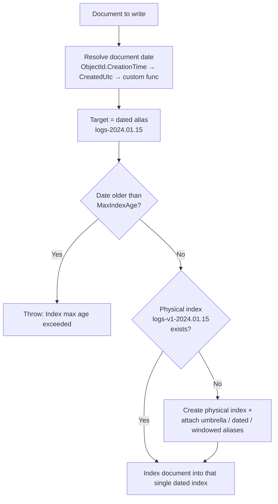
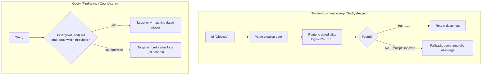
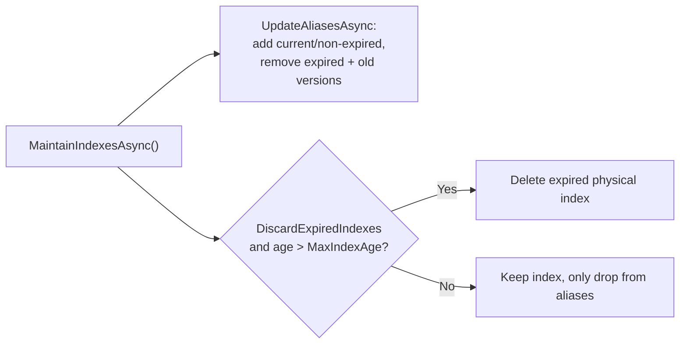
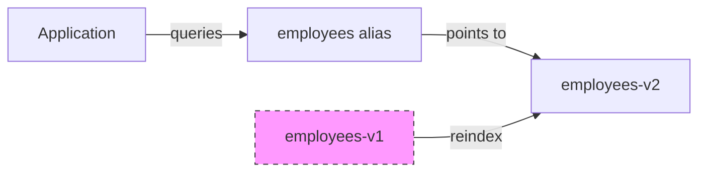
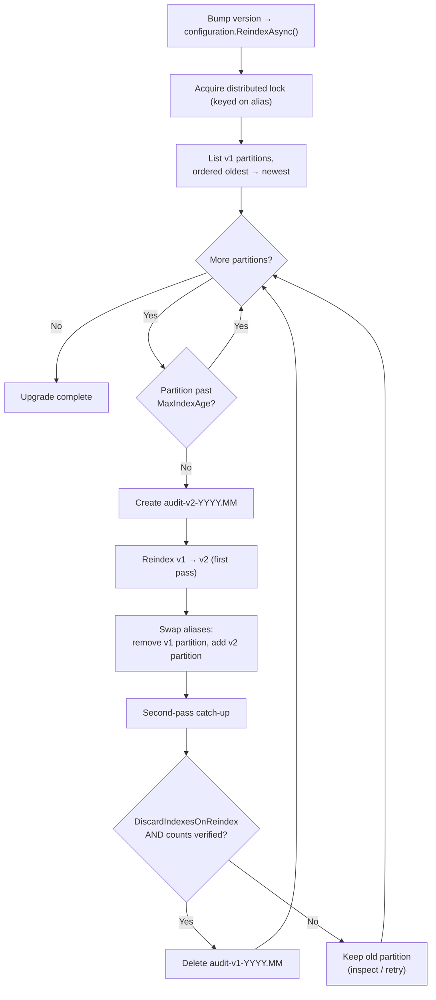
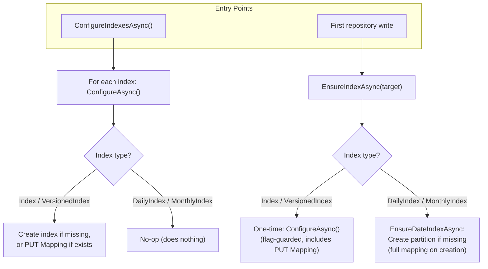

# Index Management

Foundatio.Repositories provides flexible index management strategies for different use cases. This guide covers index types, configuration, and maintenance.

## Index Types

### Index&lt;T&gt;

Basic index for simple entities:

```csharp
public sealed class EmployeeIndex : Index<Employee>
{
    public EmployeeIndex(IElasticConfiguration configuration)
        : base(configuration, "employees") { }

    public override void ConfigureIndexMapping(TypeMappingDescriptor<Employee> map)
    {
        map
            .Dynamic(DynamicMapping.False)
            .Properties(p => p
                .SetupDefaults()
                .Keyword(e => e.CompanyId)
                .Text(e => e.Name, t => t.AddKeywordAndSortFields())
            );
    }
}
```

### VersionedIndex&lt;T&gt;

Index with schema versioning for evolving schemas:

```csharp
public sealed class EmployeeIndex : VersionedIndex<Employee>
{
    public EmployeeIndex(IElasticConfiguration configuration)
        : base(configuration, "employees", version: 2) { }

    public override void ConfigureIndexMapping(TypeMappingDescriptor<Employee> map)
    {
        map
            .Dynamic(DynamicMapping.False)
            .Properties(p => p
                .SetupDefaults()
                .Keyword(e => e.CompanyId)
                .Text(e => e.Name, t => t.AddKeywordAndSortFields())
                .Keyword(e => e.Department)  // Added in v2
            );
    }
}
```

**Index naming:**
- Version 1: `employees-v1`
- Version 2: `employees-v2`
- Alias: `employees` (points to current version)

### DailyIndex&lt;T&gt;

Time-series index with daily partitioning:

```csharp
public sealed class LogEventIndex : DailyIndex<LogEvent>
{
    public LogEventIndex(IElasticConfiguration configuration)
        : base(configuration, "logs", version: 1)
    {
        MaxIndexAge = TimeSpan.FromDays(90);
        DiscardExpiredIndexes = true;
    }

    public override void ConfigureIndexMapping(TypeMappingDescriptor<LogEvent> map)
    {
        map
            .Dynamic(DynamicMapping.False)
            .Properties(p => p
                .SetupDefaults()
                .Keyword(e => e.Level)
                .Text(e => e.Message)
            );
    }
}
```

**Index naming:**
- `logs-v1-2024.01.15`
- `logs-v1-2024.01.16`
- Alias: `logs` (points to all indexes)

### MonthlyIndex&lt;T&gt;

Time-series index with monthly partitioning:

```csharp
public sealed class AuditLogIndex : MonthlyIndex<AuditLog>
{
    public AuditLogIndex(IElasticConfiguration configuration)
        : base(configuration, "audit", version: 1)
    {
        MaxIndexAge = TimeSpan.FromDays(365);
        DiscardExpiredIndexes = true;
    }
}
```

**Index naming:**
- `audit-v1-2024.01`
- `audit-v1-2024.02`

## How Time-Series Indexes Work

`DailyIndex` and `MonthlyIndex` spread documents across many small time-partitioned indexes rather than one large index. Understanding how a document's index is **picked at write time** and **resolved at read time** explains the whole model — including why there is normally exactly **one** index per time period and no parallel copies of the same data.

### One index per period, not parallel copies

A common question is whether the library keeps multiple copies of an index in parallel or processes one index at a time with cleanup. The answer is the latter:

- **Steady state:** exactly **one** physical index exists per time period (per day for `DailyIndex`, per month for `MonthlyIndex`). The umbrella alias unions all of them so the repository can query them as if they were a single index.
- **Retention:** as periods age past `MaxIndexAge`, their indexes are removed from the aliases and then deleted (see [Retention Policy](#retention-policy-for-time-series-indexes)). Old data is cleaned up one index at a time, not held indefinitely.
- **The only time two copies of the same period coexist** is transiently during a [version reindex](#version-upgrade-process) (e.g. `logs-v1-2024.01.15` → `logs-v2-2024.01.15`). After the reindex succeeds, the old version is discarded when `DiscardIndexesOnReindex` is `true` (the default).

### Three naming layers

Time-series indexes use three distinct name layers. Knowing which is which is the key to understanding routing:

| Layer | Example | Points to | Used for |
|---|---|---|---|
| **Physical index** | `logs-v1-2024.01.15` | Actual Lucene index on disk (version encoded) | Where documents physically live |
| **Dated alias** | `logs-2024.01.15` | The current version's physical index for that one day | Routing a single document's read/write |
| **Umbrella alias** | `logs` | All current, non-expired physical indexes | Querying across all periods |
| **Windowed alias** | `logs-last-7-days` | Physical indexes within a rolling window | Fixed-window queries (see [Time-Based Aliases](#time-based-aliases)) |

Because read/write routing targets the **dated alias** (unversioned), the physical version can change underneath (via reindex) without changing how the repository addresses documents.

### Picking the index at write time

When you write a document (`AddAsync`, `SaveAsync`, bulk operations), the library derives the target index from the document's **date**, resolved in this order (`DailyIndex.GetIndex` / `_getDocumentDateUtc`):

1. If the document id is an [ObjectId](/guide/crud-operations), its embedded **creation timestamp** is used. `CreateDocumentId` generates an ObjectId that encodes the document date, so the id and its index stay consistent.
2. Otherwise, if the model implements `IHaveCreatedDate`, its `CreatedUtc` value is used.
3. You can override resolution entirely by passing a `getDocumentDateUtc` delegate to the index constructor.

That date maps to a dated alias (`logs-2024.01.15` for daily, `logs-2024.01` for monthly). Before the write, `EnsureIndexAsync` creates the physical index for that period **if it does not already exist** and attaches its aliases in the same call:

- the **dated alias** (`logs-2024.01.15`),
- the **umbrella alias** (`logs`), and
- any **windowed aliases** whose age window still includes that date.

Writes are grouped by resolved index, so a bulk insert spanning several days fans out into one write per dated index.


```mermaid
flowchart TD
    Doc["Document to write"] --> Date["Resolve document date\nObjectId.CreationTime → CreatedUtc → custom func"]
    Date --> Dated["Target = dated alias\nlogs-2024.01.15"]
    Dated --> Age{"Date older than\nMaxIndexAge?"}
    Age -->|Yes| Reject["Throw: Index max age exceeded"]
    Age -->|No| Exists{"Physical index\nlogs-v1-2024.01.15\nexists?"}
    Exists -->|No| Create["Create physical index +\nattach umbrella / dated / windowed aliases"]
    Exists -->|Yes| Write
    Create --> Write["Index document into that single dated index"]
```

::: warning Writing to an already-expired period fails
If a document's date is older than `MaxIndexAge`, `EnsureDateIndexAsync` throws `ArgumentException: Index max age exceeded` rather than silently recreating a period that retention has already reclaimed. See [Preventing Writes to Expired Indexes](#preventing-writes-to-expired-indexes).
:::

### Resolving the index at read time

Reads resolve differently depending on whether you look up a single document or run a query:

- **Single-document lookups** (`GetByIdAsync`, `ExistsAsync`, and id-based `PatchAsync` / `RemoveAsync`) route directly to **one** dated alias by parsing the ObjectId in the id back into its creation date. This avoids scanning every period. If the document is not found there and the index has multiple partitions, the repository falls back to a query across the umbrella alias.
- **Queries** (`FindAsync`, `CountAsync`, `PatchAllAsync`, `RemoveAllAsync`) resolve their target indexes via `GetIndexesByQuery`:
  - `.Index("name")` targets explicit index/alias names.
  - `.Index(start, end)` expands to the list of dated aliases in that range (partition pruning).
  - When neither is set — or the range is too wide (see [Large Range Fallback](#large-range-fallback)) — the query targets the **umbrella alias** covering all periods.


```mermaid
flowchart TD
    subgraph Single["Single-document lookup (GetByIdAsync)"]
        Id["id (ObjectId)"] --> Parse["Parse creation date"]
        Parse --> Route["Route to dated alias\nlogs-2024.01.15"]
        Route --> Found{"Found?"}
        Found -->|Yes| Return["Return document"]
        Found -->|"No + multiple indexes"| Umbrella1["Fallback: query umbrella alias logs"]
    end

    subgraph Query["Query (FindAsync / CountAsync)"]
        Q["Query"] --> HasRange{".Index(start, end) set\nand range within threshold?"}
        HasRange -->|Yes| Prune["Target only matching dated aliases"]
        HasRange -->|"No / too wide"| Umbrella2["Target umbrella alias logs (all periods)"]
    end
```

### Alias management and retention over time

`MaintainIndexesAsync` (run on a schedule via [`MaintainIndexesJob`](/guide/jobs)) keeps aliases in sync with `MaxIndexAge`:

- Current-version, non-expired indexes are **added** to the umbrella and any matching windowed aliases.
- Expired indexes (age past `MaxIndexAge`) and superseded versions are **removed** from all aliases so queries stop hitting them.
- When `DiscardExpiredIndexes` is `true`, expired physical indexes are then **deleted**.


```mermaid
flowchart LR
    Maintain["MaintainIndexesAsync()"] --> Update["UpdateAliasesAsync:\nadd current/non-expired,\nremove expired + old versions"]
    Maintain --> Age{"DiscardExpiredIndexes\nand age &gt; MaxIndexAge?"}
    Age -->|Yes| Delete["Delete expired physical index"]
    Age -->|No| Keep["Keep index, only drop from aliases"]
```

See [Retention Policy for Time-Series Indexes](#retention-policy-for-time-series-indexes) for configuration details.

## Querying Time-Series Indexes

### Index Selection vs. Document Filtering

When working with `DailyIndex` or `MonthlyIndex`, two separate mechanisms control what data is returned:

- **`.Index(start, end)`** — selects which physical index partitions to query. Without this, all partitions are queried via the umbrella alias.
- **`.DateRange(start, end, field)`** — filters documents within the targeted indexes by a date field value.

These must be set independently. `DateRange` alone does not narrow index selection.

```csharp
var start = DateTime.UtcNow.AddDays(-7);
var end = DateTime.UtcNow;

var results = await repository.FindAsync(q => q
    .Index(start, end)                         // target only the relevant partitions
    .DateRange(start, end, e => e.CreatedUtc)  // filter documents within those partitions
);
```

Omitting `.Index()` is correct but less efficient — the query runs against all partitions and relies solely on the `DateRange` filter to narrow results.

### Large Range Fallback

Generating an individual index name for each day or month in a very wide range would produce an excessively long list. To avoid this, `.Index(start, end)` falls back to the umbrella alias (which covers all partitions) when the range is too broad:

| Index type | Threshold | Behavior |
|---|---|---|
| `DailyIndex` | Range >= 3 months, or exceeds `MaxIndexAge` | Falls back to alias (all partitions) |
| `MonthlyIndex` | Range > 1 year, or exceeds `MaxIndexAge` | Falls back to alias (all partitions) |

In the fallback case, Elasticsearch receives the alias name rather than a list of specific index names. The query is still executed correctly, and the `.DateRange()` filter still restricts the returned documents — there is just no partition pruning at the index-routing level.

```csharp
// This range is 4 months — exceeds the DailyIndex threshold of 3 months.
// GetIndexes returns an empty list, so the query targets the "logs" alias instead.
var results = await repository.FindAsync(q => q
    .Index(DateTime.UtcNow.AddMonths(-4), DateTime.UtcNow)
    .DateRange(DateTime.UtcNow.AddMonths(-4), DateTime.UtcNow, e => e.CreatedUtc)
);
```

### Best Practices for Time-Series Queries

1. **Always pair `.Index()` with `.DateRange()`** — `.Index()` prunes partitions, `.DateRange()` filters documents. Both are needed for correct and efficient queries.
2. **Keep ranges within the fallback threshold** — queries within 3 months (daily) or 1 year (monthly) benefit from partition pruning. Wider ranges fall back to alias-level querying.
3. **Use time-based aliases for fixed windows** — for recurring queries like "last 7 days" or "last 30 days", configure named aliases via `AddAlias()` to avoid computing index ranges at query time.

```csharp
// In index configuration
public LogEventIndex(IElasticConfiguration configuration)
    : base(configuration, "logs", version: 1)
{
    MaxIndexAge = TimeSpan.FromDays(90);
    AddAlias("logs-last-7-days", TimeSpan.FromDays(7));
    AddAlias("logs-last-30-days", TimeSpan.FromDays(30));
}

// In queries — use the alias directly instead of computing a range
var results = await repository.FindAsync(q => q.Index("logs-last-7-days"));
```

## Index Configuration

### Index Settings

```csharp
public override void ConfigureIndex(CreateIndexRequestDescriptor idx)
{
    base.ConfigureIndex(idx.Settings(s => s
        .NumberOfShards(3)
        .NumberOfReplicas(1)
        .RefreshInterval(new Duration(TimeSpan.FromSeconds(5)))
        .Analysis(a => a
            .AddSortNormalizer()
        )));
}
```

### Index Mapping

```csharp
public override void ConfigureIndexMapping(TypeMappingDescriptor<Employee> map)
{
    map
        .Dynamic(DynamicMapping.False)  // Disable dynamic mapping
        .Properties(p => p
            .SetupDefaults()  // Configure Id, CreatedUtc, UpdatedUtc, IsDeleted

            // Keyword fields (exact match, aggregations)
            .Keyword(e => e.CompanyId)
            .Keyword(e => e.Status)

            // Text fields with keywords (full-text + exact match)
            .Text(e => e.Name, t => t.AddKeywordAndSortFields())
            .Text(e => e.Email, t => t.AddKeywordAndSortFields())

            // Numeric fields
            .IntegerNumber(e => e.Age)
            .DoubleNumber(e => e.Salary)

            // Date fields
            .Date(e => e.HireDate)

            // Boolean fields
            .Boolean(e => e.IsActive)

            // Nested objects
            .Nested(e => e.Addresses, n => n
                .Properties(ap => ap
                    .Keyword(a => a.City)
                    .Keyword(a => a.Country)
                ))
        );
}
```

### SetupDefaults Extension

The `SetupDefaults()` extension configures common fields:

```csharp
.Properties(p => p.SetupDefaults())
```

This configures:
- `Id` as keyword
- `CreatedUtc` as date
- `UpdatedUtc` as date
- `IsDeleted` as boolean (if `ISupportSoftDeletes`)
- `Version` as keyword (if `IVersioned`)

## Schema Versioning

### How Versioned Indexes Work

When you use `VersionedIndex<T>`, the library manages schema evolution through a versioning system:

1. **Index Naming**: Each version creates a separate index (e.g., `employees-v1`, `employees-v2`)
2. **Alias Management**: An alias (`employees`) always points to the current version
3. **Reindexing**: When you increment the version, data is migrated by a reindex — but that reindex has to be explicitly triggered (see [What actually triggers a reindex](#what-actually-triggers-a-reindex)); nothing runs it for you automatically


```mermaid
graph LR
    A[Application] -->|queries| B[employees alias]
    B -->|points to| C[employees-v2]
    D[employees-v1] -->|reindex| C
    style D fill:#f9f,stroke:#333,stroke-dasharray: 5 5
```

::: tip When to bump the version
Only increment the version when you need to **change an existing field's mapping type** (e.g., `text` to `keyword`) or run a **data transformation** via reindex script. Elasticsearch [does not allow in-place type changes](https://www.elastic.co/docs/manage-data/data-store/mapping/update-mappings-examples) on existing fields.

**Adding a mapping for a brand-new field does NOT require a version bump.** See [Mapping Lifecycle](#mapping-lifecycle) for the full breakdown of how mappings are applied per index type, including important differences for `DailyIndex`/`MonthlyIndex`.
:::

### Version Upgrade Process

::: info Single index vs. time-series
The steps below describe a single-index type (`Index<T>` / `VersionedIndex<T>`), where one physical index is swapped. For `DailyIndex` / `MonthlyIndex`, the same steps run **per dated partition, one at a time** — see [Version Upgrades for Time-Series Indexes](#version-upgrades-for-time-series-indexes-daily-monthly) for exactly when each old partition is dropped.
:::

When an index's version is incremented, the actual upgrade is always these 5 steps. The only variable is *what triggers them* — see [What actually triggers a reindex](#what-actually-triggers-a-reindex) below, because it is **not** simply "calling `ConfigureIndexesAsync()`":

1. **New Index Creation**: Creates `employees-v2` with the new mapping
2. **Reindex Task**: Elasticsearch's reindex API copies data from v1 to v2
3. **Script Execution**: Any reindex scripts transform data during migration
4. **Alias Switch**: The `employees` alias is atomically switched from v1 to v2
5. **Old Index Cleanup**: If `DiscardIndexesOnReindex` is true, v1 is deleted

```csharp
// Step 1: Increment version and add migration scripts
public sealed class EmployeeIndex : VersionedIndex<Employee>
{
    public EmployeeIndex(IElasticConfiguration configuration)
        : base(configuration, "employees", version: 2)  // Changed from 1 to 2
    {
        // Scripts run during reindex from v1 to v2
        RenameFieldScript(2, "dept", "department");
        RemoveFieldScript(2, "legacyField");
    }
}

// Step 2: Run the reindex directly — deterministic and awaitable.
// ConfigureIndexesAsync()'s default only enqueues a work item; see below.
await configuration.ReindexAsync();
```

::: warning `ConfigureIndexesAsync()` does not reindex inline
`ConfigureIndexesAsync()` (default `beginReindexingOutdated: true`) does **not** run the 5 steps above itself — it only *enqueues* a `ReindexWorkItem`. Something else (a queue worker with `ReindexWorkItemHandler` registered) has to dequeue and actually run it. If you never configured an `IQueue<WorkItemData>` on `ElasticConfiguration`, this throws `InvalidOperationException: Must specify work item queue and lock provider in order to migrate index versions.` the moment it finds an outdated index. See [What actually triggers a reindex](#what-actually-triggers-a-reindex) for the recommended, direct alternative.
:::

### Version Upgrades for Time-Series Indexes (Daily/Monthly)

`DailyIndex` and `MonthlyIndex` store one physical index per time period, so bumping the version has to migrate **every** existing partition. It does this **one partition at a time**, and each partition's old index is deleted as the *final step of that partition's own reindex* — before the next partition begins. It never creates new copies of all partitions first and then bulk-deletes the originals.

::: tip One at a time, not all-at-once
Peak extra disk usage during a time-series version upgrade is roughly **one partition** (the one currently being migrated), not a full duplicate of the entire dataset. Already-migrated partitions have their old index deleted; not-yet-migrated partitions still have only their original.
:::

Trigger a time-series version upgrade explicitly with `configuration.ReindexAsync()` (or `auditIndex.ReindexAsync()`). It runs inline (awaitable) and reports progress through the optional callback:

```csharp
// After bumping the index version (e.g. new MonthlyIndex<AuditLog>(configuration, version: 2)):
await configuration.ReindexAsync((progress, message) =>
{
    logger.LogInformation("Reindex {Progress:F0}%: {Message}", progress, message);
    return Task.CompletedTask;
});

// Or reindex a single time-series index directly:
await auditIndex.ReindexAsync();
```

::: warning Trigger time-series upgrades with `ReindexAsync()`, not `ConfigureIndexesAsync()`
Unlike a single `VersionedIndex<T>`, a `DailyIndex` / `MonthlyIndex` is **not** migrated by the automatic background reindex that `ConfigureIndexesAsync(beginReindexingOutdated: true)` enqueues — that path targets the unversioned base name (`audit-v1`), which does not match the dated partitions (`audit-v1-2024.01`, …). Always trigger a time-series version upgrade explicitly with `configuration.ReindexAsync()` or `index.ReindexAsync()`, which runs the per-partition loop described below.
:::

`ReindexAsync` then:

1. **Acquires a distributed lock** keyed on the alias (`reindex:audit`) so only one reindex runs at a time. The lock is auto-renewed on every progress callback.
2. **Lists all v1 partitions** and orders them **oldest → newest** by index date.
3. **For each partition**, runs the full sequence to completion before moving to the next:
   1. Create `audit-v2-2024.01` with the new mapping.
   2. Reindex documents from `audit-v1-2024.01` into it (first pass).
   3. **Swap aliases** — atomically remove `audit-v1-2024.01` from every alias and add `audit-v2-2024.01`. Reads for that month now hit v2.
   4. **Second-pass catch-up** copies any documents written during the first pass (see [Second-Pass Catch-Up Strategy](#second-pass-catch-up-strategy)).
   5. **Delete `audit-v1-2024.01`** (conditional — see below).
4. Move on to `audit-v1-2024.02`, then `audit-v1-2024.03`, and so on.

Partitions already past `MaxIndexAge` are **skipped** (left for [retention/maintenance](#retention-policy-for-time-series-indexes) to clean up rather than reindexed).

#### Cancelling a reindex

`ReindexAsync` accepts a `CancellationToken`, so a long-running migration can be stopped when the host shuts down:

```csharp
await configuration.ReindexAsync(cancellationToken: stoppingToken);

// Or for a single index:
await auditIndex.ReindexAsync(cancellationToken: stoppingToken);
```

Cancellation is a throwing concept: the copy loop checks the token on every poll and raises `OperationCanceledException`, so a cancelled reindex **never** promotes a partially-copied index into the alias. The old index is left in place and untouched, which makes the operation safe to re-run: the next reindex recopies the source, which converges because reindex writes by document id.

::: warning Cancellation stops the client, not the server
The copy runs server-side as an Elasticsearch `_reindex` task started with `wait_for_completion=false`. Cancelling the token abandons the client's *wait* and attempts to cancel the server task, but documents may continue to be written to the new index for a short period afterwards. Do not assume the destination is frozen the instant the token fires.
:::

#### Alias metadata survives the cutover

The alias swap carries each alias's full definition across to the new index — `filter`, `index_routing`, `search_routing`, `is_write_index`, and `is_hidden` — rather than recreating it from its name alone.

::: warning Filtered aliases
If you use filtered aliases for tenant isolation, this matters: an alias recreated without its filter would match **every** document in the index, exposing data the alias existed to hide. If the alias list cannot be read, the reindex now throws a `RepositoryException` instead of continuing, because moving the primary alias without knowing what was on it risks exactly that exposure.
:::

#### Lock contention is not an error

Only one reindex per alias runs at a time. If the lock cannot be acquired within the timeout — typically because another instance is already migrating that index — `ReindexAsync` logs a warning and returns without doing anything. It does not throw, since losing this race is expected in a multi-instance deployment.

#### Version conflicts count as progress

A reindex is abandoned if it reports no progress for too long (see [`ReindexAsync`](#reindexasync)). Progress for that stall check is measured by the number of documents Elasticsearch *examined*, which includes documents skipped as version conflicts — not just those it changed. A reindex replaying over a destination that already holds newer documents does real work while changing nothing, and would otherwise be misread as frozen and cancelled. The percentage reported to your progress callback still reflects only documents actually written.

During the migration the umbrella alias (`audit`) transparently spans both already-migrated (v2) and not-yet-migrated (v1) partitions, so reads and writes keep working the entire time.


```mermaid
flowchart TD
    Start["Bump version → configuration.ReindexAsync()"] --> Lock["Acquire distributed lock (keyed on alias)"]
    Lock --> List["List v1 partitions,\nordered oldest → newest"]
    List --> Loop{"More partitions?"}
    Loop -->|No| Done["Upgrade complete"]
    Loop -->|Yes| Expired{"Partition past\nMaxIndexAge?"}
    Expired -->|Yes| Loop
    Expired -->|No| Create["Create audit-v2-YYYY.MM"]
    Create --> Reindex["Reindex v1 → v2 (first pass)"]
    Reindex --> Swap["Swap aliases:\nremove v1 partition, add v2 partition"]
    Swap --> Catchup["Second-pass catch-up"]
    Catchup --> Check{"DiscardIndexesOnReindex\nAND counts verified?"}
    Check -->|Yes| Delete["Delete audit-v1-YYYY.MM"]
    Check -->|No| Keep["Keep old partition\n(inspect / retry)"]
    Delete --> Loop
    Keep --> Loop
```

Any pass that does not complete throws `ReindexIncompleteException` before reaching the `Check` node, leaving the old partition in place — see [Error Handling During Reindex](#error-handling-during-reindex).

#### When the old partition is deleted

The old index for a period is deleted at the very end of *that period's* reindex (~98–99% progress), and **only** when both of the following hold:

- `DiscardIndexesOnReindex` is `true` (the default).
- The new partition's document count is **greater than or equal to** the old partition's count, and both counts could be read.

If either condition fails, the old partition is **retained** so you can inspect or retry it, and the alias already points at the new partition. A copy that failed outright never gets this far — it throws. Because deletion happens per-partition immediately after that partition's data is verified, the originals are never all held simultaneously and then dropped in one batch.

#### What actually triggers a reindex

No mechanism in the library starts a reindex automatically — there is no background timer, hosted service, or auto-discovered job. A version bump only takes effect once something explicitly calls it. There are three ways to do that:

1. **Call `configuration.ReindexAsync()` / `index.ReindexAsync()` directly.** This is the deterministic, inline, awaitable path described throughout this section — one partition at a time — and it's what every reindex test in this repo uses. Run it from a deploy step, an admin endpoint, a one-off console command, or a job you write and schedule yourself. **This is the recommended way to run a version upgrade**, time-series or not.

2. **The `beginReindexingOutdated: true` default on `ConfigureIndexesAsync()`.** This does **not** perform a reindex itself — it only *enqueues* a `ReindexWorkItem` (see [Configure Indexes](#configure-indexes)). For that work item to actually run, two more things must be true: (a) a real `IQueue<WorkItemData>` was passed into `ElasticConfiguration`'s constructor, and (b) something in the app is dequeuing work items with `ReindexWorkItemHandler` registered to handle `ReindexWorkItem`s. **Neither is wired up by the library.** If no queue is configured and an index turns out to be outdated, `ConfigureIndexesAsync()` throws `InvalidOperationException: Must specify work item queue and lock provider in order to migrate index versions.` — which is why this repo's own [sample app](https://github.com/FoundatioFx/Foundatio.Repositories/blob/main/samples/Foundatio.SampleApp/Server/Repositories/Configuration/ElasticExtensions.cs) calls `ConfigureIndexesAsync(beginReindexingOutdated: false)` instead of relying on the default. Even fully wired up, this path is a **no-op for time-series indexes** (see the warning above) — the enqueued work item names the non-dated base index, which matches no dated partition.

3. **`ElasticMigrationJobBase`** (`Jobs/ElasticMigrationJob.cs`) is an abstract helper class for a repeatable "run migrations, then reindex everything outdated" job — it correctly calls `ConfigureIndexesAsync(beginReindexingOutdated: false)` (sidestepping the no-op queue path) and then `index.ReindexAsync()` for every outdated index. **It is opt-in scaffolding, not something registered or run automatically.** Nothing in the library subclasses it, schedules it, or references it, and no consuming application in this repository — including its own sample app — derives from it. Derive from it and register it with your own job runner for a repeatable/scheduled job; for a one-time upgrade, calling `ReindexAsync()` directly (option 1) is simpler and is what's actually tested.

For a manual, one-time upgrade — such as bumping the version on a monthly audit index — call `configuration.ReindexAsync()` or `auditIndex.ReindexAsync()` explicitly when ready to run it. `ConfigureIndexesAsync()`'s default does not perform the upgrade, and no built-in job runs it automatically.

Neither of the following reindexes time-series data: `MaintainIndexesJob` (aliases/retention only), and the `ReindexWorkItemHandler` queue path for daily/monthly indexes (the enqueued work item's name doesn't match any dated partition).

#### Concurrency: within an index, one partition at a time

**Within a single index** a reindex is **strictly sequential** — one partition at a time, with no parallel fan-out:

| Level | Behavior | Where |
|---|---|---|
| **Partitions within an index** | `ReindexAsync` iterates partitions in a single `await`ed `foreach`; the next partition never starts until the current one finishes (including its delete). | `DailyIndex.ReindexAsync` |
| **The Elasticsearch reindex itself** | Each partition is copied with a **single, unsliced** `_reindex` task. The library does not set `slices`, so there is no parallel sub-task fan-out; it submits the task and polls until it completes. | `ElasticReindexer.InternalReindexAsync` |

**Across different indexes** it depends on how you trigger it: `configuration.ReindexAsync()` processes indexes **sequentially** (one index fully finishes before the next starts), while `ElasticMigrationJob` reindexes them **in parallel** (`Task.WhenAll`, one task per outdated index). Either way each index is internally sequential, and a **distributed lock keyed on the alias** (`reindex:audit`) guarantees a given index is never reindexed by two runners at once — even across multiple application instances (pods, workers). The lock is held for 20 minutes and auto-renewed on every progress callback, so long partition copies keep it alive.

::: tip Predictable, bounded disk usage per index
Within one index the upgrade only ever duplicates **one partition at a time**, so bumping a single index (e.g. `audit`) needs roughly one extra partition of headroom regardless of how many partitions it has. If several indexes reindex in parallel (via `ElasticMigrationJob`), peak extra disk is about the sum of one in-flight partition per concurrently-migrating index. Wall-clock time scales with partition count; run during off-peak hours if needed.
:::

#### Multiple versions and interrupted upgrades

In normal operation only **two** versions of a period ever coexist, and only transiently — the old partition and the new one — during that single period's reindex. The process is designed to be **resumable and idempotent**:

- The **lowest version still present** is treated as the current version (`GetCurrentVersionAsync`), and each run processes only the partitions still on that version. Partitions that were already migrated are excluded automatically, so re-running never redoes completed work.
- If a run is interrupted — a process restart, a failure on one partition, a lost lock — just **run it again**. It picks up the remaining old partitions and continues, oldest first. A partition whose reindex failed keeps its old index (the delete is gated on success), so nothing is lost.
- Reindex scripts **compose across skipped versions**: going straight from v1 to v3 applies the v2 and v3 scripts in order, so transformations are never skipped.
- If partitions end up at genuinely mixed versions (for example a v1→v2 upgrade was interrupted and you have since bumped to v3), each run advances the oldest cohort one step; run the reindex until `GetCurrentVersionAsync()` equals the target `Version`. The migration job converges this over repeated runs.

Throughout, the umbrella alias spans whatever the current partitions are, so reads and writes keep working even while the index is a mix of versions.

#### Recovering from a rolling restart mid-upgrade

A reindex can be interrupted at any point — a deploy recycles the pod running it, a node is drained, the process crashes. Re-running `configuration.ReindexAsync()` (or `index.ReindexAsync()`) afterward recovers cleanly, without manual cleanup, for the following reasons:

- **The lock expires; nobody has to release it.** The distributed lock (`reindex:audit`) is held for 20 minutes and renewed on every progress callback. If the process holding it dies, the lock is never explicitly released — it simply expires 20 minutes after the last renewal. A new instance's call to `ReindexAsync()` waits for the lock (up to 30 minutes) and then proceeds.
- **The Elasticsearch-side copy isn't tied to the calling process.** Each partition's copy runs as an asynchronous Elasticsearch task (`wait_for_completion=false`); the library only polls it for progress. That task lives in the cluster's task manager, so if the .NET process dies while polling, the copy already running in Elasticsearch is unaffected and keeps going independently.
- **A retried first pass copies only the delta.** On retry, the first pass queries the new partition for the most recent document it already contains and reindexes only source documents at or after that point, rather than recopying the whole period. If the new partition is empty (nothing had landed before the interruption), the retry does a full copy, same as an initial run.
- **A partition whose alias was already swapped is still found and finished.** Partitions to migrate are discovered by matching physical index names, not by current alias membership. If the process died after the alias swap but before the old partition's delete, the next run still finds that now-orphaned old partition, recopies it, reruns its alias swap, and deletes it — reaching the same end state as an uninterrupted run.
- **Two instances never migrate the same index at once.** The alias-keyed lock caps a given index to one active reindex cluster-wide. If a rolling restart briefly leaves two instances both calling `ReindexAsync()` for the same index, one holds the lock while the other waits; once the first finishes, the current version has already advanced, so the second call's version check finds nothing left to do and returns immediately.

#### When do writes flip to the new partition — and is there a gap?

Writes for a period target the **unversioned dated alias** (e.g. `audit-2024.01`), so they flip when that alias is repointed:

1. During the **first pass**, the dated alias still points to the old partition, so any concurrent writes for that period land in **v1**.
2. When the first pass finishes (~91–92%), **every alias pointing at the old partition — the dated alias, the umbrella alias, and any windowed aliases — is repointed to the new partition in a single `UpdateAliases` call**. From that instant, new writes for that period land in **v2**.
3. The **second-pass catch-up** then copies anything written to v1 during the first pass into v2.

**Is there a gap?**

- **No aliasing gap.** The remove-old and add-new actions are submitted together in one `UpdateAliases` request, which Elasticsearch applies **atomically**. The alias is never pointing at zero indexes (or at both), so reads and writes always resolve to exactly one partition — there is no window where a write fails to route or a read sees nothing.
- **No lost-write gap for append-only data.** Documents written to the old partition during the first pass are picked up by the second-pass catch-up, which runs *after* the swap and copies every document with a timestamp (or ObjectId creation time) at or after a start time captured ~1 second before the reindex began. After the swap the old partition receives no new writes, and `Conflicts=proceed` keeps the catch-up from failing on documents already copied. This is why a `TimestampField` or ObjectId-format IDs are recommended (see [Second-Pass Catch-Up Strategy](#second-pass-catch-up-strategy)) — they let the catch-up find late writes precisely. Without either, the reindex refuses to promote a copy whose source changed while it ran, rather than promoting one that is silently short.

Only the currently-reindexing period has this brief hand-off; periods not yet reached still write to v1, and periods already migrated write to v2 — all through the same unchanging dated-alias names.

#### Why partitions are processed oldest → newest

Partitions are always migrated in ascending date order (`GetIndexesAsync` sorts by `DateUtc`). This is deliberate, and it matters most for exactly the append-only time-series workloads these indexes are built for (audit logs, events):

- **Least write contention and near-empty catch-up.** In a time-series workload new documents land in the **current** period; older periods are effectively immutable (and writing to a period past `MaxIndexAge` throws). Migrating the old, static partitions first means their first pass captures everything and the [second-pass catch-up](#second-pass-catch-up-strategy) has little or nothing to copy. The one volatile partition — today/this month — is migrated **last**, so the short window where concurrent writes must be caught up is isolated at the very end instead of being reopened repeatedly.
- **Progressive, predictable disk reclamation.** Since each old partition is deleted before the next starts, disk is freed starting with your oldest data and continues steadily — helpful when the whole reason for going one-at-a-time is limited headroom.
- **Deterministic and resumable.** The "current version" is the **lowest** version still present, and each run lists only the partitions still on that old version — already-migrated partitions are excluded automatically. So if a run is interrupted or retried, it simply resumes with the remaining old partitions in the same order, without redoing completed work. (This deterministic ordering was introduced as an index-management stability fix and has been the behavior since.)

### Field Operations During Reindex

`RenameFieldScript` and `RemoveFieldScript` generate Painless scripts that automatically handle field names with special characters. Standard identifiers use dot-notation (e.g. `ctx._source.data.field`), while field names containing hyphens, `@`, spaces, or other non-identifier characters automatically use bracket notation (e.g. `ctx._source['@timestamp']`). Field paths cannot contain single quotes (`'`), backslashes (`\`), or control characters (such as newlines), since these would break Painless string literals.

#### Rename a Field

Use `RenameFieldScript` to rename a field during reindex:

```csharp
public EmployeeIndex(IElasticConfiguration configuration)
    : base(configuration, "employees", version: 2)
{
    // Rename 'dept' to 'department' in version 2
    RenameFieldScript(2, "dept", "department");

    // By default, the original field is removed
    // To keep both fields:
    RenameFieldScript(2, "oldName", "newName", removeOriginal: false);
}
```

The generated Painless script:
```javascript
if (ctx._source.containsKey('dept')) {
    ctx._source.department = ctx._source.dept;
}
if (ctx._source.containsKey('dept')) {
    ctx._source.remove('dept');
}
```

#### Rename a Nested Field

`RenameFieldScript` supports dotted paths for nested properties:

```csharp
public EmployeeIndex(IElasticConfiguration configuration)
    : base(configuration, "employees", version: 2)
{
    RenameFieldScript(2, "data.oldField", "data.newField");

    // Deeply nested paths are also supported:
    RenameFieldScript(2, "metadata.author.name", "metadata.author.displayName");
}
```

The generated Painless script for nested paths includes null-safety guards:
```javascript
if (ctx._source.data != null && ctx._source.data.containsKey('oldField')) {
    if (ctx._source.data == null) { ctx._source.data = [:]; }
    ctx._source.data.newField = ctx._source.data.oldField;
}
if (ctx._source.data != null && ctx._source.data.containsKey('oldField')) {
    ctx._source.data.remove('oldField');
}
```

#### Remove a Field

Use `RemoveFieldScript` to remove a field:

```csharp
public EmployeeIndex(IElasticConfiguration configuration)
    : base(configuration, "employees", version: 3)
{
    RemoveFieldScript(3, "deprecatedField");
}
```

#### Remove a Nested Field

`RemoveFieldScript` also supports dotted paths:

```csharp
public EmployeeIndex(IElasticConfiguration configuration)
    : base(configuration, "employees", version: 3)
{
    RemoveFieldScript(3, "data.legacyField");
}
```

#### Custom Transformation

Use `AddReindexScript` for complex transformations:

```csharp
public EmployeeIndex(IElasticConfiguration configuration)
    : base(configuration, "employees", version: 4)
{
    // Custom Painless script for complex transformation
    AddReindexScript(4, @"
        // Combine first and last name
        if (ctx._source.containsKey('firstName') && ctx._source.containsKey('lastName')) {
            ctx._source.fullName = ctx._source.firstName + ' ' + ctx._source.lastName;
        }

        // Convert status string to boolean
        if (ctx._source.containsKey('status')) {
            ctx._source.isActive = ctx._source.status == 'active';
            ctx._source.remove('status');
        }

        // Set default values
        if (!ctx._source.containsKey('createdUtc')) {
            ctx._source.createdUtc = '2024-01-01T00:00:00Z';
        }
    ");
}
```

### Multi-Version Migration

Scripts are applied incrementally. When upgrading, only scripts with a version greater than the current index version (and less than or equal to the target version) are applied. If upgrading from v1 to v3, both v2 and v3 scripts run:

```csharp
public EmployeeIndex(IElasticConfiguration configuration)
    : base(configuration, "employees", version: 3)
{
    // v2 scripts (run when upgrading from v1)
    RenameFieldScript(2, "dept", "department");

    // v3 scripts (run when upgrading from v1 or v2)
    AddReindexScript(3, "ctx._source.version = 3;");
}
```

When a single script applies, it is sent directly to Elasticsearch. When multiple scripts apply, they are each wrapped in a named function and called sequentially:

```javascript
void f000(def ctx) { /* v2 rename script */ }
void f001(def ctx) { /* v2 remove script */ }
void f002(def ctx) { /* v3 custom script */ }
f000(ctx); f001(ctx); f002(ctx);
```

Note that `RenameFieldScript` with `removeOriginal: true` (the default) generates **two** scripts at the same version number — one to copy the value and one to remove the original field. Both are included in the combined script.

#### Skipping Over Multiple Versions

If an index is multiple versions behind (e.g., v1 upgrading to v5), all intermediate scripts run in order:

```csharp
public EmployeeIndex(IElasticConfiguration configuration)
    : base(configuration, "employees", version: 5)
{
    RenameFieldScript(2, "dept", "department");           // v2
    RemoveFieldScript(3, "data.legacyField");             // v3
    RenameFieldScript(4, "data.oldField", "data.newField"); // v4
    AddReindexScript(5, "ctx._source.migrated = true;");  // v5
}
```

When upgrading from v1 to v5, scripts for v2 through v5 all apply. When upgrading from v3 to v5, only v4 and v5 scripts apply. Scripts for versions at or below the current version are always skipped.

#### Moving Fields Between Objects

You can rename fields across different parent objects:

```csharp
RenameFieldScript(2, "data.oldField", "meta.newField");  // Move between parents
RenameFieldScript(3, "data.name", "displayName");         // Promote nested to top-level
RenameFieldScript(4, "companyName", "data.company");      // Demote top-level to nested
```

### Controlling Old Index Deletion

```csharp
public EmployeeIndex(IElasticConfiguration configuration)
    : base(configuration, "employees", version: 2)
{
    // Delete old index after successful reindex (default: true)
    DiscardIndexesOnReindex = true;

    // Keep old index for rollback capability
    // DiscardIndexesOnReindex = false;
}
```

Even with `DiscardIndexesOnReindex = true`, the old index is only deleted when the new index's document count is **greater than or equal to** the old index's count and both counts could be read. If that check fails, the old index is kept so you can inspect or retry. A reindex that failed outright never reaches this point — it throws `ReindexIncompleteException` and always keeps the old index. For time-series indexes this evaluation happens independently per dated partition — see [When the old partition is deleted](#when-the-old-partition-is-deleted).

### Reindex Progress Monitoring

Monitor reindex progress with a callback:

```csharp
await configuration.ReindexAsync(async (progress, message) =>
{
    _logger.LogInformation("Reindex {Progress}%: {Message}", progress, message);

    // Update UI or metrics
    await UpdateProgressAsync(progress, message);
});
```

### Throttling Reindex Load

Internally, reindexing uses Elasticsearch's `_reindex` API, which reads and writes documents in bulk batches (default 1000 documents per batch, unlimited throughput). For indexes with large documents, the default batch size can produce bulk sub-requests large enough to exceed a node's [indexing pressure](https://www.elastic.co/docs/reference/elasticsearch/configuration-reference/indexing-pressure-settings) memory limit (10% of heap by default), causing Elasticsearch to reject the request with an `es_rejected_execution_exception` (`rejected execution of coordinating operation`). See [Troubleshooting: Reindex Rejected Due to Indexing Pressure](./troubleshooting.md#reindex-rejected-due-to-indexing-pressure) for how to recognize this error.

Set `ReindexBatchSize` and/or `ReindexRequestsPerSecond` on the index to reduce the size and rate of these internal batches:

```csharp
public EmployeeIndex(IElasticConfiguration configuration)
    : base(configuration, "employees", version: 2)
{
    // Read/write at most 200 documents per internal bulk batch (default: 1000)
    ReindexBatchSize = 200;

    // Throttle to ~500 documents/second (default: unlimited)
    ReindexRequestsPerSecond = 500;
}
```

Both properties are `null` by default, which preserves the current Elasticsearch defaults. They apply to `Index<T>`, `VersionedIndex<T>`, `DailyIndex<T>`, and `MonthlyIndex<T>` since all of them build on the same reindex work item. Lower `ReindexBatchSize` first if you're seeing indexing pressure rejections; add `ReindexRequestsPerSecond` on top of that if the cluster is still under load from other traffic during the reindex.

Both values must be greater than zero when set - `ReindexAsync` throws `ArgumentOutOfRangeException` immediately for a zero, negative, infinite, or `NaN` value rather than sending an invalid request to Elasticsearch.

A low `ReindexRequestsPerSecond` makes Elasticsearch pause longer between internal batches (roughly `ReindexBatchSize` ÷ `ReindexRequestsPerSecond`) to honor the throttle. Reindex progress is monitored by polling for status, and a reindex that reports no progress for too long is treated as stalled and abandoned - the threshold defaults to 10 minutes but automatically extends (with a 3x safety margin) when a configured throttle would otherwise make that inter-batch pause exceed it, so a slow but healthy, intentionally throttled reindex isn't cancelled by mistake.

### Error Handling During Reindex

#### An incomplete reindex throws

`ReindexAsync` throws `ReindexIncompleteException` rather than returning, whenever the destination cannot be trusted to be a complete replica of the source:

| Situation | Why it throws |
|---|---|
| Documents failed to copy | The destination is missing those documents |
| The copy task finished but did not account for every document it matched | The destination may be missing documents |
| The copy task reported an error (bad script, invalid request) | The copy did not run to completion |
| Elasticsearch never returned a copy task | Nothing was copied |
| Waiting was abandoned (task stalled, or its status could not be read) | Completion could not be confirmed |
| The aliases could not be switched | Traffic is still served by the old index |

The old index is always left in place when this throws, so the reindex can be retried. A retry recopies the source from the beginning; because reindex writes by document id, that converges rather than duplicating. A retry cannot help when the cause is deterministic, such as documents the destination's mapping rejects.

::: warning A retry cannot recover a failure detected after the cutover
The alias switch happens before the catch-up pass, so an incompleteness detected after that point (a failed catch-up pass, or a count shortfall) leaves the alias already pointing at the destination. A retry then finds the version already at its target and skips, which would report success for a migration known to be short. For that reason `IElasticConfiguration.ReindexAsync` does **not** retry a `ReindexIncompleteException` — it is recorded as a failure on the first attempt and surfaced in the `AggregateException`. Recovery is manual: the source is retained, so re-copy it into a fresh index version rather than re-running the same migration.
:::

```csharp
try
{
    await index.ReindexAsync();
}
catch (ReindexIncompleteException ex)
{
    // ex.OldIndex is still intact; ex.NewIndex may be short.
    _logger.LogError(ex, "Reindex of {OldIndex} incomplete: {Reason}", ex.OldIndex, ex.Reason);
    throw;
}
```

`ElasticConfiguration.ReindexAsync` attempts every outdated index, then throws an `AggregateException` if any of them failed — so one failing index does not block the others, but a partially failed migration is never reported as a success. It also clears its configure-indexes cache marker either way, so the next `ConfigureIndexesAsync` re-runs rather than skipping.

::: warning Queued reindexes retry automatically
`ReindexWorkItemHandler` lets the exception propagate, so a queued reindex is abandoned and retried by the worker per your queue's retry policy, eventually dead-lettering. For a deterministic failure such as a mapping conflict, every retry fails the same way — fix the mapping rather than waiting it out.
:::

#### Completion is recorded durably, and never inferred

A finished migration writes a `ReindexCompletion` record to the `foundatio-reindex-completions` index before the queue item is acknowledged and before the source index is deleted. That record is the only thing that establishes a migration completed.

This exists because an advanced alias proves nothing. The alias switch happens before the catch-up pass, so a promoted destination is equally consistent with "the migration finished" and "the migration promoted the destination and then failed" — the same cluster state either way. A redelivered work item previously read the advanced version as proof of completion and acknowledged the item, which recorded a known-short migration as complete.

A redelivered work item is therefore resolved three ways:

| Observed state | Disposition |
| --- | --- |
| Alias not yet promoted | The copy runs normally |
| Promoted, with a matching completion record | Acknowledged as already done, nothing is recopied |
| Promoted, with no matching record | `ReindexCompletionUnknownException` — not acknowledged, and not recopied |

The record is keyed by the logical migration (alias plus source and destination index names), not by an attempt or delivery id, so the same migration is recognized across redelivery, process restart, and direct-versus-queued execution. It is additionally bound to the destination index's UUID and to a fingerprint of the reindex script, so a record left by an earlier index of the same name, or by a different transformation, does not satisfy the check.

::: warning What a completion record does not attest
It records that the reindex met the contract this library implements: the copy task reported it matched and wrote everything it set out to, the catch-up pass completed or was proven unnecessary, and the aliases moved. It is **not** proof of strict or lossless consistency — see [Remaining limitations](#remaining-limitations).
:::

::: warning Migrations completed before this release have no record
Completion is never fabricated from alias state or document counts, so an already-migrated index whose migration predates this release reports `ReindexCompletionUnknownException` if a stale work item for it is ever redelivered. Ordinary startup is unaffected: nothing verifies existing indexes, and no scan is performed. If you hit this, confirm the destination is sound and discard the stale work item.
:::

::: warning Cancellation throws too
Cancelling via the `CancellationToken` throws `OperationCanceledException`. See [Cancelling a reindex](#cancelling-a-reindex).
:::

#### Document counts are compared, but they are only a safety net

After both copy passes, the source and destination document counts are compared — on every reindex, not only when `DiscardIndexesOnReindex` is set. A short destination is **logged as a warning and keeps the old index**; it is deliberately not an error, because by that point the aliases have already been switched:

- Documents hard-deleted through the alias after the cutover are gone from the destination but still counted in the frozen source, so a complete reindex can legitimately end up short. Throwing here would ask you to retry a reindex that would resurrect those deleted documents.
- Reindex scripts can drop documents on purpose (`ctx.op = 'noop'` or `'delete'`).
- In the other direction, documents written to the destination after the cutover can offset documents that genuinely failed to copy, masking a real shortfall.

Completeness is therefore established by the per-pass accounting described above — the copy task's own report of what it matched versus what it did, which cannot race with live traffic. Treat the count comparison as a hint for deciding whether to keep the old index, not as proof.

#### Unreadable status is a failure, not a success

The per-document failure list and the created/updated/noop counters that completeness is judged on are not part of the Elasticsearch client's typed task-status model — they have to be read out of the raw JSON body, which the transport only retains when direct streaming is disabled. Reindex therefore asks for the body on that one request, and if it still cannot be read, the pass is reported as incomplete rather than assumed clean. You do not need `DisableDirectStreaming()` on your client for reindex failure detection to work.

#### Finding the documents that were left behind

Failed documents are recorded in a searchable error index (`{destination}-error`), keyed by the source document id:

```csharp
string errorIndex = "employees-v2-error";
var failures = await _client.SearchAsync<ReindexFailure>(s => s
    .Indices(errorIndex)
    .Query(q => q.Term(t => t.Field("source_index").Value("employees-v1"))));

foreach (var failure in failures.Documents)
{
    // failure.Id and failure.SourceIndex identify the document to replay.
    // failure.Cause explains why Elasticsearch rejected it.
    // failure.Source carries the original document body (stored, not indexed).
    _logger.LogError("Failed to reindex {Id} from {SourceIndex}: {Reason}",
        failure.Id, failure.SourceIndex, failure.Cause?.Reason);
}
```

The diagnostic fields (`id`, `source_index`, `status`, `cause.type`, `cause.reason`, `created_utc`) are explicitly mapped and queryable. The copied document body (`source`) is stored but not indexed, because its shape is arbitrary and indexing it would risk mapping conflicts in the very index you rely on for recovery — it is still returned in `_source`.

## Mapping Lifecycle

Understanding how and when Elasticsearch field mappings are applied is critical to avoiding silent query failures. The behavior differs significantly by index type, and `DailyIndex`/`MonthlyIndex` require special attention.

### How Mappings Are Applied by Index Type

| Index type | `ConfigureIndexesAsync` behavior | First write (without explicit configure) | How to apply a new field mapping to existing data |
|---|---|---|---|
| `Index<T>` | Creates index if missing; calls PUT Mapping on existing index | `EnsureIndexAsync` triggers create-or-update (one-time, flag-guarded) | Automatic — `ConfigureIndexesAsync` or first write applies it |
| `VersionedIndex<T>` | Same as `Index<T>`, targets the concrete versioned index (e.g., `employees-v2`) | Same one-time `EnsureIndexAsync` path | Automatic — same as `Index<T>` |
| `DailyIndex<T>` | **No-op** — `ConfigureAsync` does nothing. Existing partitions are never updated. | Creates a new dated partition (with full mapping) only if one doesn't exist for that date | **Manual** — you must apply the mapping to existing partitions yourself (see below) |
| `MonthlyIndex<T>` | Same as `DailyIndex<T>` | Same as `DailyIndex<T>` | Same as `DailyIndex<T>` |

::: warning DailyIndex and MonthlyIndex do not update existing partitions
`DailyIndex.ConfigureAsync()` is intentionally a no-op. Neither `ConfigureIndexesAsync` nor the lazy `EnsureIndexAsync` path will ever call PUT Mapping on an already-created daily or monthly partition. Only **new** partitions created after you add the field mapping will have it.
:::

### What Happens Without Calling `ConfigureIndexesAsync`

You are not required to call `ConfigureIndexesAsync` explicitly. Repository **write** operations (`AddAsync`, `SaveAsync`, `PatchAsync`, `RemoveAsync`, `PatchAllAsync`, `BatchProcessAsync`) call `EnsureIndexAsync` internally before mutating data.

However, **read** operations (`FindAsync`, `GetByIdAsync`, `CountAsync`) do **not** call `EnsureIndexAsync`. If you query before any write has occurred, the index may not exist yet.


```mermaid
flowchart TD
  subgraph entryPoints [Entry Points]
    ConfigureIndexesAsync["ConfigureIndexesAsync()"]
    FirstWrite["First repository write"]
  end

  ConfigureIndexesAsync --> PerIndex["For each index: ConfigureAsync()"]
  FirstWrite --> EnsureIndex["EnsureIndexAsync(target)"]

  PerIndex --> IndexT{"Index type?"}
  EnsureIndex --> IndexT2{"Index type?"}

  IndexT -->|"Index / VersionedIndex"| UpdateOrCreate["Create index if missing,\nor PUT Mapping if exists"]
  IndexT -->|"DailyIndex / MonthlyIndex"| NoOp["No-op (does nothing)"]

  IndexT2 -->|"Index / VersionedIndex"| OnceGuard["One-time: ConfigureAsync()\n(flag-guarded, includes PUT Mapping)"]
  IndexT2 -->|"DailyIndex / MonthlyIndex"| EnsureDate["EnsureDateIndexAsync:\nCreate partition if missing\n(full mapping on creation)"]
```

**For `Index<T>` / `VersionedIndex<T>`**: The first write auto-configures the index (create or update settings + mappings). It is safe to skip `ConfigureIndexesAsync` in development — the first mutation handles it. In production, calling `ConfigureIndexesAsync` on startup is still recommended to surface mapping errors early.

**For `DailyIndex<T>` / `MonthlyIndex<T>`**: The first write to a new date creates that partition with the full current mapping. Writes to dates whose partitions already exist do nothing to the mapping. If you add a new field and only write to existing dates, the mapping is never applied anywhere.

### Updating Existing Daily/Monthly Partitions

When you add a new field to `ConfigureIndexMapping` on a `DailyIndex` or `MonthlyIndex`, you have several options for existing partitions:

| Strategy | Cost | When to use |
|----------|------|-------------|
| **Roll forward** (do nothing to old partitions) | Zero cost; new partitions pick up the mapping on creation | Feature can wait until enough data has naturally accumulated (e.g., after 7/30/90 days of retention). Best for non-critical analytics fields or gradual rollouts. |
| **PutMapping + update-by-query on all partitions** | High I/O cost proportional to total data volume; re-indexes every document in every partition | Need the field searchable across all historical data immediately. Can saturate cluster I/O for hours. |
| **Targeted backfill** (PutMapping + update-by-query on recent partitions only) | Moderate cost; only touches last N days/months | Need the field on recent data but older data will age out via retention anyway. |
| **Bump version** (full reindex to new partitions) | Roughly same I/O cost as update-by-query but also doubles disk temporarily | Need a type change on an existing field, or you want a clean slate. |

::: tip Plan ahead to avoid backfill costs
Add field mappings to `ConfigureIndexMapping` **early** — even before you write data to them. There is no cost to mapping a field you don't populate yet. This ensures all future partitions are ready when you start writing the field.
:::

#### Practical Recommendations

1. **Roll forward by default.** For most analytics and reporting fields, add the mapping and wait. Once `MaxIndexAge` worth of partitions have been created with the new mapping, all queryable data will have it.

2. **Gate features on data availability.** If a UI feature depends on a new field, gate it on "created after deploy date" or gracefully handle missing data in older results.

3. **Factor retention into the decision.** If `MaxIndexAge` is 30 days and you can wait 30 days, you get full coverage for free without any backfill.

4. **Update-by-query is rarely worth it at scale.** For a `DailyIndex` with 90 days retention and millions of documents per day, an update-by-query touches the same total volume as a version bump reindex. The only advantage is no temporary disk doubling — but you still pay the full I/O cost. If you're paying that cost, consider whether a version bump gives you a cleaner outcome.

5. **Targeted backfill as a middle ground.** Apply PutMapping + update-by-query to only the last N days rather than full history. Example:

```bash
# Apply mapping to all existing daily partitions
PUT /logs-v1-*/_mapping
{
  "properties": {
    "newField": { "type": "keyword" }
  }
}

# Re-index _source into the inverted index (no script needed)
POST /logs-v1-2025.05.*/_update_by_query?conflicts=proceed
```

### Mapping Resolver Cache (Query-Time Mapping Awareness)

The repository framework does **not** cache the PUT Mapping request/response (that's purely server-side). However, the **query parser** uses an `ElasticMappingResolver` that caches field-to-type resolution for building queries, sorting, and aggregations. This resolver combines two sources:

1. **Code mapping** — derived from your `ConfigureIndexMapping` method at startup (immutable for the process lifetime)
2. **Server mapping** — fetched from the Elasticsearch GET Mapping API, cached in memory and **automatically refreshed at most once per minute**

#### What this means after a manual PUT Mapping

If you manually apply a mapping change (e.g., `PUT /index/_mapping` via the Elasticsearch API or a script), the `ElasticMappingResolver` will automatically pick it up within ~60 seconds on the next field resolution. You typically do not need to do anything in application code.

If you need immediate recognition (e.g., in tests or a migration script that queries the new field right after applying the mapping), call:

```csharp
index.MappingResolver.RefreshMapping();
```

This clears the cached server mapping and forces the next `GetMapping()` call to re-fetch from the cluster.

#### Cache lifetime summary

| Cache layer | Lifetime | How to invalidate |
|---|---|---|
| `ElasticMappingResolver` field cache | Auto-refreshes from server every ~60 seconds | `index.MappingResolver.RefreshMapping()` |
| `_isEnsured` flag (`Index<T>` / `VersionedIndex<T>`) | Process lifetime (one-time flag) | Deleting the index resets it; otherwise persists until app restart |
| `_ensuredDates` (`DailyIndex<T>`) | Process lifetime per-date | Cleared on `DeleteAsync(name)` or `Dispose()`; otherwise persists until app restart |
| `ConfigureIndexesAsync` cache marker | 5 minutes (distributed via `ICacheClient`) | Automatically expires; or call `ConfigureIndexesAsync(force: true)` |

#### No cluster-side action needed

Elasticsearch itself has no mapping cache you need to invalidate — once a PUT Mapping succeeds, the mapping is immediately active for new indexing and queries. The only caching is in-process within the .NET application:

- **For queries**: The `ElasticMappingResolver` auto-refreshes. If you need it sooner, call `RefreshMapping()`.
- **For writes**: The `_isEnsured` / `_ensuredDates` flags only control whether `ConfigureAsync` runs again. They don't prevent writes to the index — they just skip redundant index creation/mapping calls. Manual PUT Mapping changes are orthogonal to these flags.

### In-Place Analysis Updates (analyzers, tokenizers, filters)

For `Index<T>` and `VersionedIndex<T>`, adding new analysis components (analyzers, tokenizers, token filters, normalizers, char filters) to an existing index does **not** require a new index version. When `ConfigureIndexesAsync` re-runs against an existing index, the dynamic settings — including the `Analysis` block — are applied in place via a `PutSettings` call with `Reopen()`. The reopen briefly closes and reopens the index so the new components become active.

This is unlike changing an existing **field mapping** type (which does require a new version on a `VersionedIndex`). Existing documents are not reindexed by an in-place analysis update, so a newly added analyzer only affects documents indexed (and queries run) after the upgrade.

Before applying, the library diffs the desired analysis components against the live index and logs a `requires close/reopen` warning for each genuinely **new** component (see the table below). Components that already exist are not re-warned.

::: info Where Elasticsearch stores analysis settings: `Settings.Index.Analysis` vs root `Settings.Analysis`
Elasticsearch exposes index analysis settings in two different shapes depending on direction:

- **Reading** via the Get Settings API returns analysis nested under the `index` key — `Settings.Index.Analysis`. This is the canonical location for the **current** live state of an index. The root `Settings.Analysis` is **not** populated on reads.
- **Writing** via a create/update request uses the root `Settings.Analysis` shape — the same shape your `ConfigureIndex(...).Analysis(...)` builder produces for the **desired** state.

The in-place upgrade therefore compares the desired root `Settings.Analysis` (from `ConfigureIndex`) against the current `Settings.Index.Analysis` (from the Get Settings response). Reading the current set from the root `Settings.Analysis` would always return nothing, making every existing component look new and falsely warning on every upgrade.
:::

### Failure Log Messages

When mapping or settings updates fail, the following log messages are emitted:

| Level | Message | Meaning |
|-------|---------|---------|
| Error | `Error updating index ({name}) settings` | Index settings PUT failed |
| Error | `Error updating index ({name}) mappings.` | PUT Mapping failed on `Index<T>` |
| Error | `Error updating index ({name}) mappings. Changing existing fields requires a new index version.` | PUT Mapping rejected on `VersionedIndex<T>` — you tried to change an existing field's type |
| Warning | `Adding new analyzer {AnalyzerKey} to existing index (requires close/reopen)` | New analyzer detected in settings; requires index close/reopen to take effect |
| Warning | `Adding new tokenizer {TokenizerKey} to existing index (requires close/reopen)` | Same for tokenizers |
| Warning | `Adding new token filter {TokenFilterKey} to existing index (requires close/reopen)` | Same for token filters |
| Warning | `Adding new normalizer {NormalizerKey} to existing index (requires close/reopen)` | Same for normalizers |
| Warning | `Adding new char filter {CharFilterKey} to existing index (requires close/reopen)` | Same for char filters |

::: info DailyIndex never emits mapping errors
Since `DailyIndex.ConfigureAsync()` is a no-op, you will never see mapping error logs from the built-in configuration path for daily/monthly indexes. If a mapping is incompatible with an existing partition, you will only discover it when manually calling the PUT Mapping API.
:::

## Retention Policy for Time-Series Indexes

### Configuring Retention

For `DailyIndex` and `MonthlyIndex`, configure retention with `MaxIndexAge`:

```csharp
public sealed class LogEventIndex : DailyIndex<LogEvent>
{
    public LogEventIndex(IElasticConfiguration configuration)
        : base(configuration, "logs", version: 1)
    {
        // Keep indexes for 90 days
        MaxIndexAge = TimeSpan.FromDays(90);

        // Automatically delete expired indexes during maintenance
        DiscardExpiredIndexes = true;
    }
}
```

### How Retention Works

1. **Index Expiration**: Each index has an expiration date based on its date + `MaxIndexAge`
2. **Maintenance Job**: `MaintainIndexesAsync()` checks for expired indexes
3. **Automatic Deletion**: If `DiscardExpiredIndexes` is true, expired indexes are deleted

```csharp
// Index: logs-v1-2024.01.15
// MaxIndexAge: 90 days
// Expiration: 2024.01.15 + 90 days = 2024.04.15

// After 2024.04.15, this index is eligible for deletion
```

### Running Maintenance

Call `MaintainIndexesAsync()` regularly (e.g., via a scheduled job):

```csharp
// In a background job
public class IndexMaintenanceJob : IJob
{
    private readonly MyElasticConfiguration _configuration;

    public async Task RunAsync(CancellationToken cancellationToken)
    {
        // This will:
        // 1. Update aliases for time-series indexes
        // 2. Delete expired indexes (if DiscardExpiredIndexes = true)
        await _configuration.MaintainIndexesAsync();
    }
}
```

Or use the built-in `MaintainIndexesJob`:

```csharp
services.AddJob<MaintainIndexesJob>(o => o.ApplyDefaults<MaintainIndexesJob>());
```

### Preventing Writes to Expired Indexes

The library prevents writing to indexes that have exceeded `MaxIndexAge`:

```csharp
// If MaxIndexAge is 90 days and you try to write a document
// with a date older than 90 days, an ArgumentException is thrown
var oldDocument = new LogEvent
{
    CreatedUtc = DateTime.UtcNow.AddDays(-100)  // Older than MaxIndexAge
};

// This will throw: "Index max age exceeded"
await repository.AddAsync(oldDocument);
```

### Time-Based Aliases

Create aliases that automatically include only recent indexes:

```csharp
public LogEventIndex(IElasticConfiguration configuration)
    : base(configuration, "logs", version: 1)
{
    MaxIndexAge = TimeSpan.FromDays(90);
    DiscardExpiredIndexes = true;

    // Create aliases for recent data windows
    AddAlias("logs-last-7-days", TimeSpan.FromDays(7));
    AddAlias("logs-last-30-days", TimeSpan.FromDays(30));
    AddAlias("logs-last-90-days", TimeSpan.FromDays(90));
}
```

These aliases are automatically updated during maintenance:
- `logs-last-7-days` only includes indexes from the last 7 days
- Older indexes are removed from the alias but not deleted (until they exceed `MaxIndexAge`)

### Monthly Index Retention

For `MonthlyIndex`, retention works the same way but with monthly granularity:

```csharp
public sealed class AuditLogIndex : MonthlyIndex<AuditLog>
{
    public AuditLogIndex(IElasticConfiguration configuration)
        : base(configuration, "audit", version: 1)
    {
        // Keep audit logs for 1 year
        MaxIndexAge = TimeSpan.FromDays(365);
        DiscardExpiredIndexes = true;
    }
}

// Index naming: audit-v1-2024.01, audit-v1-2024.02, etc.
// Expiration: End of month + 365 days
```

### Retention Best Practices

1. **Set appropriate retention**: Balance storage costs with data retention requirements
2. **Run maintenance regularly**: Schedule `MaintainIndexesAsync()` daily or more frequently
3. **Monitor disk usage**: Track index sizes and adjust retention as needed
4. **Use aliases for queries**: Query against aliases like `logs-last-30-days` for better performance
5. **Consider compliance**: Ensure retention meets regulatory requirements

```csharp
// Example: Different retention for different data types
public class LogsIndex : DailyIndex<LogEvent>
{
    public LogsIndex(IElasticConfiguration config) : base(config, "logs")
    {
        MaxIndexAge = TimeSpan.FromDays(30);  // Short retention for logs
    }
}

public class AuditIndex : MonthlyIndex<AuditEvent>
{
    public AuditIndex(IElasticConfiguration config) : base(config, "audit")
    {
        MaxIndexAge = TimeSpan.FromDays(365 * 7);  // 7 years for compliance
    }
}
```

## Index Operations

### Configure Indexes

Create indexes and update mappings:

```csharp
await configuration.ConfigureIndexesAsync();
```

Options:
- Creates indexes that don't exist
- Updates mappings for existing indexes (if compatible)
- Creates aliases
- With the default `beginReindexingOutdated: true`, **enqueues** (does not run) a reindex work item for each outdated index — see [What actually triggers a reindex](#what-actually-triggers-a-reindex) for why you usually want `configuration.ReindexAsync()` instead

#### Concurrency Protection

When multiple distributed processes (pods, workers, migration runners) call `ConfigureIndexesAsync` on startup, a distributed lock and cache marker prevent redundant Elasticsearch admin API calls:

1. **Cache check**: If a configuration marker exists in the distributed cache, the call returns immediately with zero Elasticsearch calls and zero lock overhead.
2. **Distributed lock**: A distributed lock serializes concurrent callers so only one process runs the full configure pass at a time.
3. **Double-check**: After acquiring the lock, the cache is checked again in case another process finished while waiting.
4. **Configure**: The full configure and maintain pass runs on all indexes in parallel.
5. **Set cache marker**: A 5-minute TTL marker is set in the distributed cache so subsequent callers skip.

The cache marker key includes a stable hash of all index names and versions, so deploying a new configuration (adding indexes, changing versions) automatically bypasses stale markers from a previous configuration. Old markers expire naturally after 5 minutes.

The marker is explicitly cleared by `DeleteIndexesAsync` and `ReindexAsync` so the next configure call re-validates after any structural change. `MaintainIndexesAsync` does not clear the marker because it does not change index structure (names or versions).

```csharp
// First call configures and sets the marker
await configuration.ConfigureIndexesAsync();

// Subsequent calls within 5 minutes skip (fast path)
await configuration.ConfigureIndexesAsync();

// Passing explicit indexes bypasses the lock and cache marker
await configuration.ConfigureIndexesAsync([myIndex]);
```

### Maintain Indexes

Run maintenance tasks:

```csharp
await configuration.MaintainIndexesAsync();
```

Tasks:
- Update aliases for time-series indexes
- Delete expired indexes
- Ensure index consistency

### Delete Indexes

```csharp
// Delete all indexes
await configuration.DeleteIndexesAsync();

// Delete specific index
await index.DeleteAsync();
```

### Reindex

```csharp
// Reindex all indexes
await configuration.ReindexAsync();

// Reindex with progress callback
await configuration.ReindexAsync(async (progress, message) =>
{
    Console.WriteLine($"{progress}%: {message}");
});

// Reindex specific index
await index.ReindexAsync();
```

## Index Properties

### IIndex Interface

```csharp
public interface IIndex : IDisposable
{
    string Name { get; }
    bool HasMultipleIndexes { get; }
    IElasticQueryBuilder QueryBuilder { get; }
    ElasticMappingResolver MappingResolver { get; }
    ElasticQueryParser QueryParser { get; }
    IElasticConfiguration Configuration { get; }

    Task ConfigureAsync();
    Task EnsureIndexAsync(object target);
    Task MaintainAsync(bool includeOptionalTasks = true);
    Task DeleteAsync();
    Task ReindexAsync(Func<int, string, Task> progressCallbackAsync = null);
    string CreateDocumentId(object document);
    string[] GetIndexesByQuery(IRepositoryQuery query);
    string GetIndex(object target);
}
```

### Index Properties

```csharp
public class Index<T>
{
    public string Name { get; }
    public bool HasMultipleIndexes { get; }
    public int BulkBatchSize { get; set; } = 1000;
    public int? ReindexBatchSize { get; set; }
    public float? ReindexRequestsPerSecond { get; set; }

    // Query field restrictions
    public ISet<string> AllowedQueryFields { get; }
    public ISet<string> AllowedAggregationFields { get; }
    public ISet<string> AllowedSortFields { get; }
}
```

### VersionedIndex Properties

```csharp
public class VersionedIndex<T>
{
    public int Version { get; }
    public string VersionedName { get; }  // e.g., "employees-v2"
    public bool DiscardIndexesOnReindex { get; set; }
}
```

### DailyIndex Properties

```csharp
public class DailyIndex<T>
{
    public TimeSpan? MaxIndexAge { get; set; }
    public bool DiscardExpiredIndexes { get; set; }
}
```

## Best Practices

### 1. Use Versioned Indexes for Evolving Schemas

```csharp
// Start with version 1
public EmployeeIndex(...) : base(configuration, "employees", version: 1) { }

// Increment when schema changes
public EmployeeIndex(...) : base(configuration, "employees", version: 2) { }
```

### 2. Use Time-Series Indexes for Log Data

```csharp
// Daily for high-volume, short retention
public class LogIndex : DailyIndex<Log> { }

// Monthly for lower-volume, longer retention
public class AuditIndex : MonthlyIndex<Audit> { }
```

### 3. Configure Appropriate Retention

```csharp
MaxIndexAge = TimeSpan.FromDays(90);
DiscardExpiredIndexes = true;
```

### 4. Use Aliases for Zero-Downtime Migrations

```csharp
// Alias always points to current version
// Applications use alias, not versioned index name
```

### 5. Test Reindex Scripts

```csharp
// Test scripts in development before production
AddReindexScript(2, @"
    // Validate script works correctly
    ctx._source.newField = ctx._source.oldField;
");
```

## Breaking Changes

The reindex reliability work introduced the following source- and behavior-breaking changes.

### `ReindexAsync` gained a `CancellationToken` parameter

`IIndex.ReindexAsync` and `IElasticConfiguration.ReindexAsync` both take a trailing
`CancellationToken cancellationToken = default`. Existing **call sites** compile unchanged because the
parameter is optional. Any external type that **implements** `IIndex` or `IElasticConfiguration` directly must
add the parameter to its override.

### An incomplete reindex now throws instead of returning

`ReindexAsync` previously returned normally when a copy failed after the alias cutover. It now throws
[`ReindexIncompleteException`](#reindex-failure-is-never-silent) whenever the destination cannot be trusted as a
complete replica, and `ElasticConfiguration.ReindexAsync` attempts every outdated index and then throws an
`AggregateException` if any of them failed.

**This changes startup behavior.** Code that calls `ConfigureIndexesAsync`/`ReindexAsync` during application
startup and previously always proceeded will now fail fast on an incomplete migration. That is the intended
behavior — serving traffic from an index that is missing documents is worse than failing to start — but if you
need the old behavior for a specific deployment, catch it explicitly rather than suppressing it globally:

```csharp
try
{
    await configuration.ReindexAsync();
}
catch (AggregateException ex) when (ex.InnerExceptions.All(e => e is ReindexIncompleteException))
{
    // Decide deliberately: alert, retry, or start degraded. Do not ignore silently.
    logger.LogCritical(ex, "Index migration incomplete; indexes may be missing documents");
}
```

Note that losing the reindex lock race is **not** a failure and does not throw — the instance holding the lock
is performing the same migration, so the loser logs and skips.

### A reindex no longer resumes from a destination watermark

A retried reindex recopies the source from the beginning. It previously narrowed the copy to documents newer
than the newest document already in the destination, which could permanently skip documents an interrupted pass
never reached. Recopying converges because reindex writes by document id, but a retry now costs a full copy
rather than an incremental one. Pass `ReindexWorkItem.StartUtc` if you need to bound a pass explicitly.

### A copy that cannot catch up is refused if its source changed

When a model has no timestamp field **and** its document ids are not ObjectIds, no second pass is possible. Such
a reindex now throws `ReindexIncompleteException` instead of promoting a destination that is silently short — but
only when the source actually changed during the copy, detected via the source's highest `_seq_no`. A source that
is not being written to still copies and promotes normally, so **custom ids and date-free models remain
supported**; the trigger is the missed catch-up, not the id format.

If you hit this, the options in order of preference are: add `IHaveDates` to the model, use ObjectId-format ids,
or stop writes to the index for the duration of the migration. The old index is always retained, so the refusal
is recoverable — retry once writes have stopped.

### An incomplete reindex is no longer retried, and completion is now recorded

Two related changes affect how failures and retries behave:

`IElasticConfiguration.ReindexAsync` no longer retries a `ReindexIncompleteException`. It previously ran inside a
resilience policy that retried on any exception, which silently converted a post-cutover failure into a reported
success: the alias was already moved, so the retry found the version at its target, skipped, and returned
normally. The failure is now recorded on the first attempt and surfaced in the `AggregateException`. A
post-cutover failure is not recoverable by retry — migrate to a fresh index version instead.

A completed migration now writes a record to the `foundatio-reindex-completions` index, and a redelivered queued
work item is only acknowledged when a matching record exists. See
[Completion is recorded durably](#completion-is-recorded-durably-and-never-inferred). Two consequences:

- The cluster gains one small single-shard index holding one document per physical migration. It is not derived
  from your index names, so it is never matched by the `{name}-v*` patterns used to enumerate or delete index
  versions, and it outlives cleanup of the source it describes.
- A migration that completed before this release has no record. That only matters if a stale work item for it is
  redelivered, which then reports `ReindexCompletionUnknownException` rather than acknowledging it. Startup is
  unaffected and nothing is scanned or verified automatically.

### Remaining limitations (not fixed by the above)

Be precise about what this does and does not guarantee. **The specific unsafe promotion described above is now
prevented. Migrations are not lossless in general.**

- The alias is still switched **before** the catch-up pass runs. For models that *can* catch up (timestamp field
  or ObjectId ids), writes landing between the switch and the end of the catch-up pass are still a live-write
  race. A `TimestampField` makes catch-up possible; it does not make the migration verified.
- The `_seq_no` check covers the copy window. It is a refusal-to-promote gate, not a write barrier, so it cannot
  prevent a write — only decline to promote a copy that missed one.
- Post-cutover document-count comparison remains a coarse warning, not proof. See
  [Concurrency Safety](#concurrency-safety).
- A completion record attests that the copy met the contract above — not that no write was lost. It makes a
  finished migration distinguishable from one that promoted and then failed; it does not narrow the live-write
  race for models that can catch up.

A migration protocol that quiesces writes and verifies content before promotion is a separate, larger change.

## Next Steps

- [Migrations](/guide/migrations) - Document migrations
- [Jobs](/guide/jobs) - Index maintenance jobs
- [Elasticsearch Setup](/guide/elasticsearch-setup) - Connection configuration

## Concurrency Safety

Reindexing is protected by a distributed lock keyed on the index alias to prevent concurrent reindex operations from corrupting data.

### Lock Strategy

- **Lock key**: `reindex:{alias}` (e.g., `reindex:employees`)
- **Lock TTL**: 20 minutes, auto-renewed during long-running operations
- Both direct (`VersionedIndex.ReindexAsync`) and work-item (`ReindexWorkItemHandler`) paths use the same lock
- Alias maintenance (`MaintainAsync`, which `MaintainIndexesJob` calls) takes the same lock and **skips** its alias update if it can't get it quickly. `DailyIndex`/`MonthlyIndex` maintenance decides which partition each alias should point at from a snapshot of the index list read under the lock; if a reindex flips a partition's alias after that snapshot, the stale decisions would revert the cutover — and since a partition whose version no longer matches its current version has its aliases *removed*, the partition could end up with no alias at all and silently stop being queried. `VersionedIndex` maintenance re-checks whether the alias exists **under** the lock, because a cutover removes the alias from the old version before adding it to the new one, and repairing that gap would point the alias back at the version being migrated away from. Maintenance is periodic and idempotent, so skipping is safe; the next run picks it up. Deleting expired partitions is not gated on the lock, both because a reindex already skips partitions past their expiration date and because gating it would stall retention exactly when a reindex has the source and destination on disk at once.
- Only one reindex per logical index can run at a time — subsequent version transitions wait for the current one to complete

::: warning Locks are only as distributed as your cache
`ElasticConfiguration` defaults to a `CacheLockProvider` over an **in-memory** cache when you pass neither a cache client nor a lock provider. That serializes only within a single process: two instances would each believe they hold `reindex:{alias}` and could both copy and flip the same alias. Pass a distributed cache (e.g. Redis) before running more than one instance — the constructor logs a warning when it falls back to the in-process default.
:::

### Why Alias-Only Keys

Using the alias as the lock key ensures that sequential version transitions (v1→v2, then v2→v3) cannot overlap. If v2→v3 started before v1→v2 completed, v3 would contain incomplete data from v2.

### Lock Renewal for Long-Running Reindexes

For indexes with millions of documents that take hours to reindex, the lock is automatically renewed on every progress callback (every 1-10 seconds during the polling loop). This prevents lock expiration during legitimate long-running operations.

### Crash Recovery

If an instance crashes mid-reindex, the lock expires after 20 minutes. Another instance can then retry the reindex. `VersionedIndex.ReindexAsync()` is safe to retry — a retry recopies from the beginning, and because reindex writes by document id, recopying converges rather than duplicating. It deliberately does **not** try to skip ahead based on what is already in the destination: Elasticsearch copies in unordered doc order, so an interrupted pass leaves an arbitrary subset behind, and narrowing the retry by the destination's newest timestamp would permanently skip older documents that were never copied.

### Second-Pass Catch-Up Strategy

Reindexing performs a second pass after the first completes to catch documents written during the first pass. The strategy depends on the index configuration:

1. **TimestampField available** (e.g., `IHaveDates` models): Uses a timestamp-based range query starting from the reindex start time. This is the preferred approach.
2. **No TimestampField, ObjectId-format IDs**: Falls back to ObjectId-based range queries on the document `id` field (ObjectIds encode a timestamp). Logged at Information level.
3. **No TimestampField, non-ObjectId IDs**: A second pass is impossible, so the copy is only promoted if the source did **not** change while it ran. Before copying, the reindex records the source's highest `_seq_no`; before switching any alias it re-reads it. If the source was written to (insert, update, or delete — all advance `_seq_no`, unlike document counts), the reindex throws `ReindexIncompleteException` and **refuses to promote**: the alias stays on the old index and the old index is retained. A static source copies normally. If the sequence number cannot be read, the reindex refuses rather than assuming nothing changed.
4. **Empty source index**: Skips the second pass entirely (nothing to catch up).

Cases 2–4 are decided by sampling one document from the source, so the source is refreshed first. Elasticsearch only makes writes searchable on refresh, and "no hits" is what case 4 keys on — without that refresh, an index bulk-loaded with `refresh_interval: -1` would be classified as empty, silently disabling both the catch-up pass and the `_seq_no` guard while the copy went on to copy a full index.

Two things this check deliberately does not do. It does not refuse merely because a model has no date fields or uses custom IDs — those are supported, and a copy of a source that is not being written to is safe. And a `TimestampField` or ObjectId IDs are **not** proof of full consistency: they make catch-up possible, but the catch-up pass still runs after the alias switch, so writes landing in that window are the subject of the remaining limitations below.

### Unique Index Names

`ElasticConfiguration.AddIndex()` enforces unique index names (case-insensitive). Registering two indexes with the same alias throws an `ArgumentException` at startup, preventing conflicts before they can cause data corruption.
