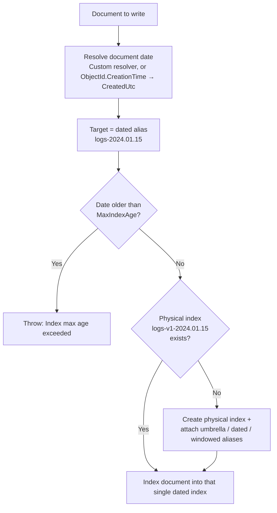
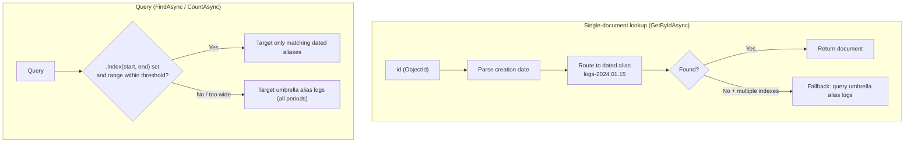
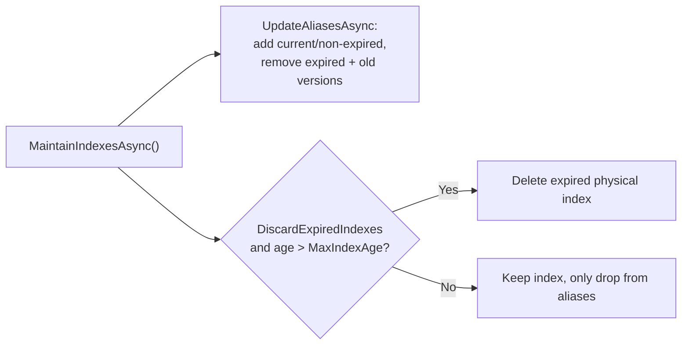
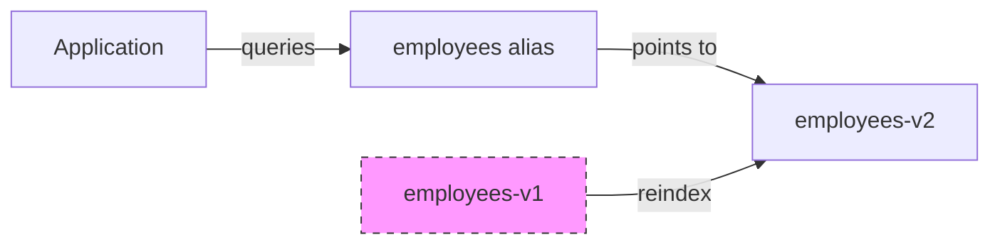
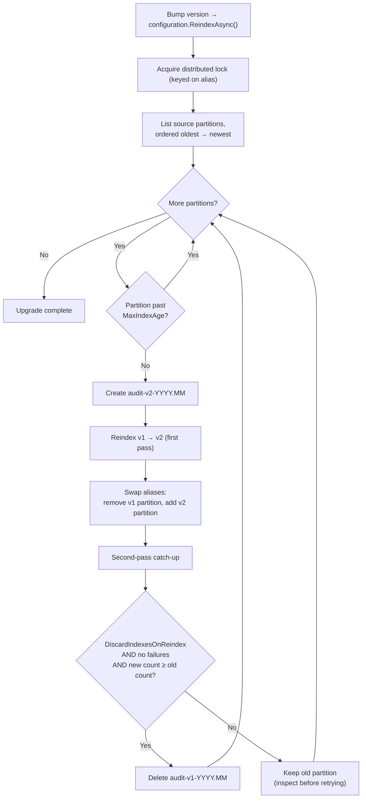
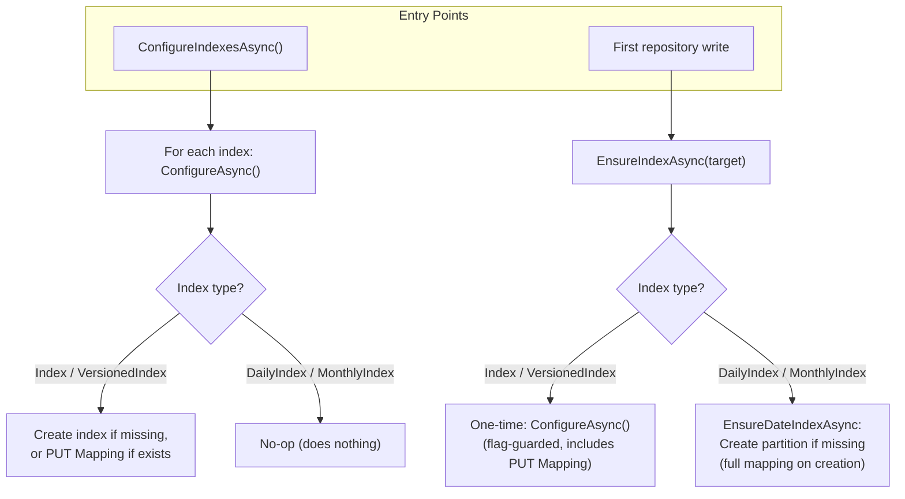

# Index Management

Foundatio.Repositories provides flexible index management strategies for different use cases. This guide covers index types, configuration, and maintenance.

## Index Types

### Index&lt;T&gt;

Basic index for simple entities:

```csharp
public sealed class EmployeeIndex : Index<Employee>
{
    public EmployeeIndex(IElasticConfiguration configuration)
        : base(configuration, "employees") { }

    public override void ConfigureIndexMapping(TypeMappingDescriptor<Employee> map)
    {
        map
            .Dynamic(DynamicMapping.False)
            .Properties(p => p
                .SetupDefaults()
                .Keyword(e => e.CompanyId)
                .Text(e => e.Name, t => t.AddKeywordAndSortFields())
            );
    }
}
```

### VersionedIndex&lt;T&gt;

Index with schema versioning for evolving schemas:

```csharp
public sealed class EmployeeIndex : VersionedIndex<Employee>
{
    public EmployeeIndex(IElasticConfiguration configuration)
        : base(configuration, "employees", version: 2) { }

    public override void ConfigureIndexMapping(TypeMappingDescriptor<Employee> map)
    {
        map
            .Dynamic(DynamicMapping.False)
            .Properties(p => p
                .SetupDefaults()
                .Keyword(e => e.CompanyId)
                .Text(e => e.Name, t => t.AddKeywordAndSortFields())
                .Keyword(e => e.Department)  // Added in v2
            );
    }
}
```

**Index naming:**
- Version 1: `employees-v1`
- Version 2: `employees-v2`
- Alias: `employees` (points to current version)

### DailyIndex&lt;T&gt;

Time-series index with daily partitioning:

```csharp
public sealed class LogEventIndex : DailyIndex<LogEvent>
{
    public LogEventIndex(IElasticConfiguration configuration)
        : base(configuration, "logs", version: 1)
    {
        MaxIndexAge = TimeSpan.FromDays(90);
        DiscardExpiredIndexes = true;
    }

    public override void ConfigureIndexMapping(TypeMappingDescriptor<LogEvent> map)
    {
        map
            .Dynamic(DynamicMapping.False)
            .Properties(p => p
                .SetupDefaults()
                .Keyword(e => e.Level)
                .Text(e => e.Message)
            );
    }
}
```

**Index naming:**
- `logs-v1-2024.01.15`
- `logs-v1-2024.01.16`
- Alias: `logs` (points to all indexes)

### MonthlyIndex&lt;T&gt;

Time-series index with monthly partitioning:

```csharp
public sealed class AuditLogIndex : MonthlyIndex<AuditLog>
{
    public AuditLogIndex(IElasticConfiguration configuration)
        : base(configuration, "audit", version: 1)
    {
        MaxIndexAge = TimeSpan.FromDays(365);
        DiscardExpiredIndexes = true;
    }
}
```

**Index naming:**
- `audit-v1-2024.01`
- `audit-v1-2024.02`

## How Time-Series Indexes Work

`DailyIndex` and `MonthlyIndex` spread documents across many small time-partitioned indexes rather than one large index. Understanding how a document's index is **picked at write time** and **resolved at read time** explains the whole model — including why there is normally exactly **one** active index per time period.

### One index per period, not parallel copies

Time-series indexes normally keep one active physical partition per period. Retained migration artifacts are an important exception:

- **Steady state:** one active physical index exists per time period (per day for `DailyIndex`, per month for `MonthlyIndex`). The umbrella alias unions these partitions so the repository can query them as if they were a single index.
- **Retention:** as periods age past `MaxIndexAge`, their indexes are removed from the aliases and then deleted when `DiscardExpiredIndexes` is enabled (see [Retention Policy](#retention-policy-for-time-series-indexes)).
- **During a schema or compatibility reindex**, the source and destination coexist. Successful cleanup removes the old physical index; disabled cleanup, failures, or ambiguous outcomes can retain both. Do not infer that a second copy is disposable merely from its age or name.

### Three naming layers

Time-series indexes use three principal name layers, plus optional windowed aliases:

| Layer | Example | Points to | Used for |
|---|---|---|---|
| **Physical index** | `logs-v1-2024.01.15` | Actual Lucene index on disk (version encoded) | Where documents physically live |
| **Dated alias** | `logs-2024.01.15` | The current version's physical index for that one day | Routing a single document's read/write |
| **Umbrella alias** | `logs` | All current, non-expired physical indexes | Querying across all periods |
| **Windowed alias** | `logs-last-7-days` | Physical indexes within a rolling window | Fixed-window queries (see [Time-Based Aliases](#time-based-aliases)) |

Because read/write routing targets the **dated alias** (unversioned), the physical version can change underneath (via reindex) without changing how the repository addresses documents.

### Picking the index at write time

When you write a document (`AddAsync`, `SaveAsync`, bulk operations), the library derives the target index from the document's **date** (`DailyIndex.GetIndex` / `_getDocumentDateUtc`). A custom `getDocumentDateUtc` delegate replaces the default resolver. Without a custom delegate:

1. If the document id is an [ObjectId](/guide/crud-operations), its embedded **creation timestamp** is used. `CreateDocumentId` generates an ObjectId that encodes the document date, so the id and its index stay consistent.
2. Otherwise, if the model implements `IHaveCreatedDate`, its `CreatedUtc` value is used.

That date maps to a dated alias (`logs-2024.01.15` for daily, `logs-2024.01` for monthly). Before the write, `EnsureIndexAsync` creates the physical index for that period **if it does not already exist** and attaches its aliases in the same call:

- the **dated alias** (`logs-2024.01.15`),
- the **umbrella alias** (`logs`), and
- any **windowed aliases** whose age window still includes that date.

Writes are grouped by resolved index, so a bulk insert spanning several days fans out into one write per dated index.


```mermaid
flowchart TD
    Doc["Document to write"] --> Date["Resolve document date\nCustom resolver, or ObjectId.CreationTime → CreatedUtc"]
    Date --> Dated["Target = dated alias\nlogs-2024.01.15"]
    Dated --> Age{"Date older than\nMaxIndexAge?"}
    Age -->|Yes| Reject["Throw: Index max age exceeded"]
    Age -->|No| Exists{"Physical index\nlogs-v1-2024.01.15\nexists?"}
    Exists -->|No| Create["Create physical index +\nattach umbrella / dated / windowed aliases"]
    Exists -->|Yes| Write
    Create --> Write["Index document into that single dated index"]
```

::: warning Writing to an already-expired period fails
If a document's date is older than `MaxIndexAge`, `EnsureDateIndexAsync` throws `ArgumentException: Index max age exceeded` rather than silently recreating a period that retention has already reclaimed. See [Preventing Writes to Expired Indexes](#preventing-writes-to-expired-indexes).
:::

### Resolving the index at read time

Reads resolve differently depending on whether you look up a single document or run a query:

- **Single-document lookups** (`GetByIdAsync`, `ExistsAsync`, and id-based `PatchAsync` / `RemoveAsync`) route directly to **one** dated alias by parsing the ObjectId in the id back into its creation date. This avoids scanning every period. If the document is not found there and the index has multiple partitions, the repository falls back to a query across the umbrella alias.
- **Queries** (`FindAsync`, `CountAsync`, `PatchAllAsync`, `RemoveAllAsync`) resolve their target indexes via `GetIndexesByQuery`:
  - `.Index("name")` targets explicit index/alias names.
  - `.Index(start, end)` expands to the list of dated aliases in that range (partition pruning).
  - When neither is set — or the range is too wide (see [Large Range Fallback](#large-range-fallback)) — the query targets the **umbrella alias** covering all periods.


```mermaid
flowchart TD
    subgraph Single["Single-document lookup (GetByIdAsync)"]
        Id["id (ObjectId)"] --> Parse["Parse creation date"]
        Parse --> Route["Route to dated alias\nlogs-2024.01.15"]
        Route --> Found{"Found?"}
        Found -->|Yes| Return["Return document"]
        Found -->|"No + multiple indexes"| Umbrella1["Fallback: query umbrella alias logs"]
    end

    subgraph Query["Query (FindAsync / CountAsync)"]
        Q["Query"] --> HasRange{".Index(start, end) set\nand range within threshold?"}
        HasRange -->|Yes| Prune["Target only matching dated aliases"]
        HasRange -->|"No / too wide"| Umbrella2["Target umbrella alias logs (all periods)"]
    end
```

### Alias management and retention over time

`MaintainIndexesAsync` (run on a schedule via [`MaintainIndexesJob`](/guide/jobs)) keeps aliases in sync with `MaxIndexAge`:

- Current-version, non-expired indexes are **added** to the umbrella and any matching windowed aliases.
- Expired indexes (age past `MaxIndexAge`) and superseded versions are **removed** from all aliases so queries stop hitting them.
- When `DiscardExpiredIndexes` is `true`, expired physical indexes are then **deleted**.


```mermaid
flowchart LR
    Maintain["MaintainIndexesAsync()"] --> Update["UpdateAliasesAsync:\nadd current/non-expired,\nremove expired + old versions"]
    Maintain --> Age{"DiscardExpiredIndexes\nand age &gt; MaxIndexAge?"}
    Age -->|Yes| Delete["Delete expired physical index"]
    Age -->|No| Keep["Keep index, only drop from aliases"]
```

See [Retention Policy for Time-Series Indexes](#retention-policy-for-time-series-indexes) for configuration details.

## Querying Time-Series Indexes

### Index Selection vs. Document Filtering

When working with `DailyIndex` or `MonthlyIndex`, two separate mechanisms control what data is returned:

- **`.Index(start, end)`** — selects which physical index partitions to query. Without this, all partitions are queried via the umbrella alias.
- **`.DateRange(start, end, field)`** — filters documents within the targeted indexes by a date field value.

These must be set independently. `DateRange` alone does not narrow index selection.

```csharp
var start = DateTime.UtcNow.AddDays(-7);
var end = DateTime.UtcNow;

var results = await repository.FindAsync(q => q
    .Index(start, end)                         // target only the relevant partitions
    .DateRange(start, end, e => e.CreatedUtc)  // filter documents within those partitions
);
```

Omitting `.Index()` is correct but less efficient — the query runs against all partitions and relies solely on the `DateRange` filter to narrow results.

### Large Range Fallback

Generating an individual index name for each day or month in a very wide range would produce an excessively long list. To avoid this, `.Index(start, end)` falls back to the umbrella alias (which covers all partitions) when the range is too broad:

| Index type | Threshold | Behavior |
|---|---|---|
| `DailyIndex` | Range >= 3 months, or exceeds `MaxIndexAge` | Falls back to alias (all partitions) |
| `MonthlyIndex` | Range > 1 year, or exceeds `MaxIndexAge` | Falls back to alias (all partitions) |

In the fallback case, Elasticsearch receives the alias name rather than a list of specific index names. The query is still executed correctly, and the `.DateRange()` filter still restricts the returned documents — there is just no partition pruning at the index-routing level.

```csharp
// This range is 4 months — exceeds the DailyIndex threshold of 3 months.
// GetIndexes returns an empty list, so the query targets the "logs" alias instead.
var results = await repository.FindAsync(q => q
    .Index(DateTime.UtcNow.AddMonths(-4), DateTime.UtcNow)
    .DateRange(DateTime.UtcNow.AddMonths(-4), DateTime.UtcNow, e => e.CreatedUtc)
);
```

### Best Practices for Time-Series Queries

1. **Always pair `.Index()` with `.DateRange()`** — `.Index()` prunes partitions, `.DateRange()` filters documents. Both are needed for correct and efficient queries.
2. **Keep ranges within the fallback threshold** — queries within 3 months (daily) or 1 year (monthly) benefit from partition pruning. Wider ranges fall back to alias-level querying.
3. **Use time-based aliases for fixed windows** — for recurring queries like "last 7 days" or "last 30 days", configure named aliases via `AddAlias()` to avoid computing index ranges at query time.

```csharp
// In index configuration
public LogEventIndex(IElasticConfiguration configuration)
    : base(configuration, "logs", version: 1)
{
    MaxIndexAge = TimeSpan.FromDays(90);
    AddAlias("logs-last-7-days", TimeSpan.FromDays(7));
    AddAlias("logs-last-30-days", TimeSpan.FromDays(30));
}

// In queries — use the alias directly instead of computing a range
var results = await repository.FindAsync(q => q.Index("logs-last-7-days"));
```

## Index Configuration

### Index Settings

```csharp
public override void ConfigureIndex(CreateIndexRequestDescriptor idx)
{
    base.ConfigureIndex(idx.Settings(s => s
        .NumberOfShards(3)
        .NumberOfReplicas(1)
        .RefreshInterval(new Duration(TimeSpan.FromSeconds(5)))
        .Analysis(a => a
            .AddSortNormalizer()
        )));
}
```

### Index Mapping

```csharp
public override void ConfigureIndexMapping(TypeMappingDescriptor<Employee> map)
{
    map
        .Dynamic(DynamicMapping.False)  // Disable dynamic mapping
        .Properties(p => p
            .SetupDefaults()  // Configure Id, CreatedUtc, UpdatedUtc, IsDeleted

            // Keyword fields (exact match, aggregations)
            .Keyword(e => e.CompanyId)
            .Keyword(e => e.Status)

            // Text fields with keywords (full-text + exact match)
            .Text(e => e.Name, t => t.AddKeywordAndSortFields())
            .Text(e => e.Email, t => t.AddKeywordAndSortFields())

            // Numeric fields
            .IntegerNumber(e => e.Age)
            .DoubleNumber(e => e.Salary)

            // Date fields
            .Date(e => e.HireDate)

            // Boolean fields
            .Boolean(e => e.IsActive)

            // Nested objects
            .Nested(e => e.Addresses, n => n
                .Properties(ap => ap
                    .Keyword(a => a.City)
                    .Keyword(a => a.Country)
                ))
        );
}
```

### SetupDefaults Extension

The `SetupDefaults()` extension configures common fields:

```csharp
.Properties(p => p.SetupDefaults())
```

This configures:
- `Id` as keyword
- `CreatedUtc` as date
- `UpdatedUtc` as date
- `IsDeleted` as boolean (if `ISupportSoftDeletes`)
- `Version` as keyword (if `IVersioned`)

## Schema Versioning

### How Versioned Indexes Work

When you use `VersionedIndex<T>`, the library manages schema evolution through a versioning system:

1. **Index Naming**: Each version creates a separate index (e.g., `employees-v1`, `employees-v2`)
2. **Alias Management**: An alias (`employees`) always points to the current version
3. **Reindexing**: When you increment the version, data is migrated by a reindex — but that reindex has to be explicitly triggered (see [What actually triggers a reindex](#what-actually-triggers-a-reindex)); nothing runs it for you automatically


```mermaid
graph LR
    A[Application] -->|queries| B[employees alias]
    B -->|points to| C[employees-v2]
    D[employees-v1] -->|reindex| C
    style D fill:#f9f,stroke:#333,stroke-dasharray: 5 5
```

::: tip When to bump the version
Only increment the version when you need to **change an existing field's mapping type** (e.g., `text` to `keyword`) or run a **data transformation** via reindex script. Elasticsearch [does not allow in-place type changes](https://www.elastic.co/docs/manage-data/data-store/mapping/update-mappings-examples) on existing fields.

**Adding a mapping for a brand-new field does NOT require a version bump.** See [Mapping Lifecycle](#mapping-lifecycle) for the full breakdown of how mappings are applied per index type, including important differences for `DailyIndex`/`MonthlyIndex`.
:::

### Version Upgrade Process

::: info Single index vs. time-series
The steps below describe a single-index type (`Index<T>` / `VersionedIndex<T>`), where one physical index is swapped. For `DailyIndex` / `MonthlyIndex`, the same steps run **per dated partition, one at a time** — see [Version Upgrades for Time-Series Indexes](#version-upgrades-for-time-series-indexes-daily-monthly) for exactly when each old partition is dropped.
:::

When an index's version is incremented, the actual upgrade is always these 5 steps. The only variable is *what triggers them* — see [What actually triggers a reindex](#what-actually-triggers-a-reindex) below, because it is **not** simply "calling `ConfigureIndexesAsync()`":

1. **New Index Creation**: Creates `employees-v2` with the new mapping
2. **Reindex Task**: Elasticsearch's reindex API copies data from v1 to v2
3. **Script Execution**: Any reindex scripts transform data during migration
4. **Alias Switch**: The `employees` alias is atomically switched from v1 to v2
5. **Old Index Cleanup**: If `DiscardIndexesOnReindex` is true and the failure/count checks pass, v1 is deleted

```csharp
// Step 1: Increment version and add migration scripts
public sealed class EmployeeIndex : VersionedIndex<Employee>
{
    public EmployeeIndex(IElasticConfiguration configuration)
        : base(configuration, "employees", version: 2)  // Changed from 1 to 2
    {
        // Scripts run during reindex from v1 to v2
        RenameFieldScript(2, "dept", "department");
        RemoveFieldScript(2, "legacyField");
    }
}

// Step 2: Run the reindex directly — deterministic and awaitable.
// ConfigureIndexesAsync()'s default only enqueues a work item; see below.
await configuration.ReindexAsync();
```

::: warning `ConfigureIndexesAsync()` does not reindex inline
`ConfigureIndexesAsync()` (default `beginReindexingOutdated: true`) does **not** run the 5 steps above itself — it only *enqueues* a `ReindexWorkItem`. Something else (a queue worker with `ReindexWorkItemHandler` registered) has to dequeue and actually run it. If you never configured an `IQueue<WorkItemData>` on `ElasticConfiguration`, this throws `InvalidOperationException: Must specify work item queue and lock provider in order to migrate index versions.` the moment it finds an outdated index. See [What actually triggers a reindex](#what-actually-triggers-a-reindex) for the recommended, direct alternative.
:::

### Version Upgrades for Time-Series Indexes (Daily/Monthly)

`DailyIndex` and `MonthlyIndex` store one physical index per time period, so bumping the version migrates the eligible partitions. It does this **one partition at a time**, with conditional cleanup at the end of each partition's reindex. It does not first create replacements for every partition and then bulk-delete the originals.

::: tip Plan disk headroom for retained sources too
With successful per-partition cleanup, peak additional disk usage is roughly one partition. Failed migrations or `DiscardIndexesOnReindex = false` can retain old partitions, so budget for those copies rather than assuming the one-partition bound always holds.
:::

Trigger a time-series version upgrade explicitly with `configuration.ReindexAsync()` (or `auditIndex.ReindexAsync()`). It runs inline (awaitable) and reports progress through the optional callback:

```csharp
// After bumping the index version (e.g. new MonthlyIndex<AuditLog>(configuration, version: 2)):
await configuration.ReindexAsync(progressCallbackAsync: (progress, message) =>
{
    logger.LogInformation("Reindex {Progress:F0}%: {Message}", progress, message);
    return Task.CompletedTask;
});

// Or reindex a single time-series index directly:
await auditIndex.ReindexAsync();
```

::: warning Trigger time-series upgrades with `ReindexAsync()`, not `ConfigureIndexesAsync()`
Unlike a single `VersionedIndex<T>`, a `DailyIndex` / `MonthlyIndex` is **not** migrated by the automatic background reindex that `ConfigureIndexesAsync(beginReindexingOutdated: true)` enqueues — that path targets the unversioned base name (`audit-v1`), which does not match the dated partitions (`audit-v1-2024.01`, …). Always trigger a time-series version upgrade explicitly with `configuration.ReindexAsync()` or `index.ReindexAsync()`, which runs the per-partition loop described below.
:::

`ReindexAsync` then:

1. **Acquires a distributed lock** keyed on the alias (`reindex:audit`) so cooperating runners serialize work. The lock is auto-renewed on progress callbacks.
2. **Lists the source partitions** and orders them **oldest → newest** by index date.
3. **For each partition**, runs the sequence before moving to the next:
   1. Create `audit-v2-2024.01` with the new mapping.
   2. Reindex documents from `audit-v1-2024.01` into it (first pass).
   3. **Swap aliases** — atomically remove `audit-v1-2024.01` from every alias and add `audit-v2-2024.01`. Reads for that month now hit v2.
   4. **Second-pass catch-up** attempts to copy matching documents written during the first pass (see [Second-Pass Catch-Up Strategy](#second-pass-catch-up-strategy)).
   5. **Delete `audit-v1-2024.01`** (conditional — see below).
4. Move on to `audit-v1-2024.02`, then `audit-v1-2024.03`, and so on.

Partitions already past `MaxIndexAge` are **skipped** (left for [retention/maintenance](#retention-policy-for-time-series-indexes) to clean up rather than reindexed).

During the migration the umbrella alias (`audit`) spans both already-migrated (v2) and not-yet-migrated (v1) partitions. This preserves routing, but does not guarantee consistency under concurrent updates or deletes; see the write-cutover limitations below.


```mermaid
flowchart TD
    Start["Bump version → configuration.ReindexAsync()"] --> Lock["Acquire distributed lock (keyed on alias)"]
    Lock --> List["List source partitions,\nordered oldest → newest"]
    List --> Loop{"More partitions?"}
    Loop -->|No| Done["Upgrade complete"]
    Loop -->|Yes| Expired{"Partition past\nMaxIndexAge?"}
    Expired -->|Yes| Loop
    Expired -->|No| Create["Create audit-v2-YYYY.MM"]
    Create --> Reindex["Reindex v1 → v2 (first pass)"]
    Reindex --> Swap["Swap aliases:\nremove v1 partition, add v2 partition"]
    Swap --> Catchup["Second-pass catch-up"]
    Catchup --> Check{"DiscardIndexesOnReindex\nAND no failures\nAND new count ≥ old count?"}
    Check -->|Yes| Delete["Delete audit-v1-YYYY.MM"]
    Check -->|No| Keep["Keep old partition\n(inspect before retrying)"]
    Delete --> Loop
    Keep --> Loop
```

#### When the old partition is deleted

The old index for a period is deleted at the very end of *that period's* reindex (~98–99% progress), and **only** when all of the following hold:

- `DiscardIndexesOnReindex` is `true` (the default).
- Neither the first nor the second reindex pass reported any failures.
- The new partition's document count is **greater than or equal to** the old partition's count.

If a cleanup condition fails after alias promotion, the old partition is retained and the alias may already point at the new partition. Count comparison is a coarse cleanup gate, not proof of a lossless copy: stale values and substituted or resurrected documents can leave counts unchanged. Inspect both indexes before retrying or deleting a retained source.

#### What actually triggers a reindex

No mechanism in the library starts a reindex automatically — there is no background timer, hosted service, or auto-discovered job. A version bump only takes effect once something explicitly calls it. There are three ways to do that:

1. **Call `configuration.ReindexAsync()` / `index.ReindexAsync()` directly.** This is the deterministic, inline, awaitable path described throughout this section — one partition at a time. Run it from a deploy step, an admin endpoint, a one-off console command, or a job you write and schedule yourself. This is the recommended way to run a time-series version upgrade.

2. **The `beginReindexingOutdated: true` default on `ConfigureIndexesAsync()`.** This does **not** perform a reindex itself — it only *enqueues* a `ReindexWorkItem` (see [Configure Indexes](#configure-indexes)). For that work item to actually run, two more things must be true: (a) a real `IQueue<WorkItemData>` was passed into `ElasticConfiguration`'s constructor, and (b) something in the app is dequeuing work items with `ReindexWorkItemHandler` registered to handle `ReindexWorkItem`s. **Neither is wired up by the library.** If no queue is configured and an index turns out to be outdated, `ConfigureIndexesAsync()` throws `InvalidOperationException: Must specify work item queue and lock provider in order to migrate index versions.` — which is why this repo's own [sample app](https://github.com/FoundatioFx/Foundatio.Repositories/blob/main/samples/Foundatio.SampleApp/Server/Repositories/Configuration/ElasticExtensions.cs) calls `ConfigureIndexesAsync(beginReindexingOutdated: false)` instead of relying on the default. Even fully wired up, this path does not migrate time-series partitions — the enqueued work item names the non-dated base index.

3. **`ElasticMigrationJobBase`** (`Jobs/ElasticMigrationJob.cs`) is an abstract helper class for a repeatable "run migrations, then reindex everything outdated" job. It calls `ConfigureIndexesAsync(beginReindexingOutdated: false)` and then `index.ReindexAsync()` for outdated indexes. It is opt-in scaffolding, not something registered or run automatically. Derive from it and register it with your own job runner for a repeatable job; for a one-time upgrade, calling `ReindexAsync()` directly is simpler.

For a manual, one-time upgrade — such as bumping the version on a monthly audit index — call `configuration.ReindexAsync()` or `auditIndex.ReindexAsync()` explicitly when ready to run it. `ConfigureIndexesAsync()`'s default does not perform the upgrade, and no built-in job runs it automatically.

Neither of the following reindexes time-series data: `MaintainIndexesJob` (aliases/retention only), and the `ReindexWorkItemHandler` queue path for daily/monthly indexes (the enqueued work item's name doesn't match any dated partition).

#### Concurrency: within an index, one partition at a time

**Within a single index** a reindex is **strictly sequential** — one partition at a time, with no parallel fan-out:

| Level | Behavior | Where |
|---|---|---|
| **Partitions within an index** | `ReindexAsync` iterates partitions in a single `await`ed `foreach`; the next partition never starts until the current call returns, including its conditional cleanup. | `DailyIndex.ReindexAsync` |
| **The Elasticsearch reindex itself** | Each partition is copied with a **single, unsliced** `_reindex` task. The library does not set `slices`, so there is no parallel sub-task fan-out; it submits the task and polls until it completes. | `ElasticReindexer.InternalReindexAsync` |

**Across different indexes** it depends on how you trigger it: `configuration.ReindexAsync()` processes indexes sequentially, while `ElasticMigrationJob` reindexes them in parallel (`Task.WhenAll`, one task per outdated index). A distributed lock keyed on the alias (`reindex:audit`) serializes cooperating runners while its lease remains valid. The lock is held for 20 minutes and renewed on progress callbacks. It does not terminate an Elasticsearch task whose client died or lost its lease.

::: tip Disk usage per index
With successful cleanup, a single-index migration needs roughly one extra partition of headroom. Parallel multi-index runs need space for one in-flight partition per index, plus any retained old or failed destinations. Monitor actual disk usage and stop before exhausting cluster headroom.
:::

#### Multiple versions and interrupted upgrades

A normal version transition temporarily has an old and a new physical partition. Interrupted migrations or disabled cleanup can retain more copies, and version discovery is not a durable completion record.

Reindex scripts compose across skipped schema versions: going from v1 to v3 applies the v2 and v3 scripts in order. This does not make an interrupted copy automatically safe to repeat. Inspect physical partitions, aliases, task state, and document consistency before retrying; after the final migration, verify the configured version and all expected partitions rather than treating a returned task as a completeness certificate.

#### Recovering from a rolling restart mid-upgrade

A schema reindex can be interrupted by a deploy, process crash, or lost lease. Do not assume that re-running `configuration.ReindexAsync()` or `index.ReindexAsync()` recovers every stage:

- **The server task can outlive the lock holder.** The 20-minute lease expires after its last renewal, but an asynchronous `_reindex` task may continue in Elasticsearch. Establish its outcome before starting a competing copy.
- **A resume watermark is not proof of completeness.** The first pass can narrow its source query using the newest document already in the destination. An interrupted copy can still be missing older documents below that watermark.
- **Alias promotion is not completion.** The normal schema path switches aliases before catch-up and cleanup. A subsequent version check can skip unfinished work once the alias points at the configured version.

Keep both physical indexes until their consistency and task outcomes are understood. The explicit compatibility inspection/recovery APIs below use a separate, evidence-based protocol; they do not recover ordinary schema migrations.

#### When do writes flip to the new partition — and is there a gap?

Writes for a period target the unversioned dated alias (e.g. `audit-2024.01`):

1. During the first pass, writes through that alias land in v1.
2. When aliases move together in `UpdateAliases`, subsequent writes through them land in v2.
3. The second-pass catch-up then copies matching source documents into v2.

An atomic alias update avoids an **alias-routing gap**, not every **data-consistency gap**. The normal schema path promotes before catch-up: a later copy can overwrite a newer destination value or resurrect a destination delete, and ObjectId creation-time ranges cannot discover in-place updates to older documents. Counts alone do not detect these cases.

Stop writers when strict consistency is required. Timestamp-based or ObjectId-based catch-up is best effort; it is not a substitute for a write fence and verified reconciliation. The offline compatibility workflow described below uses different cutover gates.

#### Why partitions are processed oldest → newest

Partitions are migrated in ascending date order (`DateUtc`). In append-heavy time-series workloads, older partitions usually have less write contention; migrating them first also reclaims disk progressively when cleanup succeeds. Historical updates can still occur, and deterministic ordering does not by itself make interrupted work resumable or idempotent.

### Field Operations During Reindex

`RenameFieldScript` and `RemoveFieldScript` generate Painless scripts that automatically handle field names with special characters. Standard identifiers use dot-notation (e.g. `ctx._source.data.field`), while field names containing hyphens, `@`, spaces, or other non-identifier characters automatically use bracket notation (e.g. `ctx._source['@timestamp']`). Field paths cannot contain single quotes (`'`), backslashes (`\`), or control characters (such as newlines), since these would break Painless string literals.

#### Rename a Field

Use `RenameFieldScript` to rename a field during reindex:

```csharp
public EmployeeIndex(IElasticConfiguration configuration)
    : base(configuration, "employees", version: 2)
{
    // Rename 'dept' to 'department' in version 2
    RenameFieldScript(2, "dept", "department");

    // By default, the original field is removed
    // To keep both fields:
    RenameFieldScript(2, "oldName", "newName", removeOriginal: false);
}
```

The generated Painless script:
```javascript
if (ctx._source.containsKey('dept')) {
    ctx._source.department = ctx._source.dept;
}
if (ctx._source.containsKey('dept')) {
    ctx._source.remove('dept');
}
```

#### Rename a Nested Field

`RenameFieldScript` supports dotted paths for nested properties:

```csharp
public EmployeeIndex(IElasticConfiguration configuration)
    : base(configuration, "employees", version: 2)
{
    RenameFieldScript(2, "data.oldField", "data.newField");

    // Deeply nested paths are also supported:
    RenameFieldScript(2, "metadata.author.name", "metadata.author.displayName");
}
```

The generated Painless script for nested paths includes null-safety guards:
```javascript
if (ctx._source.data != null && ctx._source.data.containsKey('oldField')) {
    if (ctx._source.data == null) { ctx._source.data = [:]; }
    ctx._source.data.newField = ctx._source.data.oldField;
}
if (ctx._source.data != null && ctx._source.data.containsKey('oldField')) {
    ctx._source.data.remove('oldField');
}
```

#### Remove a Field

Use `RemoveFieldScript` to remove a field:

```csharp
public EmployeeIndex(IElasticConfiguration configuration)
    : base(configuration, "employees", version: 3)
{
    RemoveFieldScript(3, "deprecatedField");
}
```

#### Remove a Nested Field

`RemoveFieldScript` also supports dotted paths:

```csharp
public EmployeeIndex(IElasticConfiguration configuration)
    : base(configuration, "employees", version: 3)
{
    RemoveFieldScript(3, "data.legacyField");
}
```

#### Custom Transformation

Use `AddReindexScript` for complex transformations:

```csharp
public EmployeeIndex(IElasticConfiguration configuration)
    : base(configuration, "employees", version: 4)
{
    // Custom Painless script for complex transformation
    AddReindexScript(4, @"
        // Combine first and last name
        if (ctx._source.containsKey('firstName') && ctx._source.containsKey('lastName')) {
            ctx._source.fullName = ctx._source.firstName + ' ' + ctx._source.lastName;
        }

        // Convert status string to boolean
        if (ctx._source.containsKey('status')) {
            ctx._source.isActive = ctx._source.status == 'active';
            ctx._source.remove('status');
        }

        // Set default values
        if (!ctx._source.containsKey('createdUtc')) {
            ctx._source.createdUtc = '2024-01-01T00:00:00Z';
        }
    ");
}
```

### Multi-Version Migration

Scripts are applied incrementally. When upgrading, only scripts with a version greater than the current index version (and less than or equal to the target version) are applied. If upgrading from v1 to v3, both v2 and v3 scripts run:

```csharp
public EmployeeIndex(IElasticConfiguration configuration)
    : base(configuration, "employees", version: 3)
{
    // v2 scripts (run when upgrading from v1)
    RenameFieldScript(2, "dept", "department");

    // v3 scripts (run when upgrading from v1 or v2)
    AddReindexScript(3, "ctx._source.version = 3;");
}
```

When a single script applies, it is sent directly to Elasticsearch. When multiple scripts apply, they are each wrapped in a named function and called sequentially:

```javascript
void f000(def ctx) { /* v2 rename script */ }
void f001(def ctx) { /* v2 remove script */ }
void f002(def ctx) { /* v3 custom script */ }
f000(ctx); f001(ctx); f002(ctx);
```

Note that `RenameFieldScript` with `removeOriginal: true` (the default) generates **two** scripts at the same version number — one to copy the value and one to remove the original field. Both are included in the combined script.

#### Skipping Over Multiple Versions

If an index is multiple versions behind (e.g., v1 upgrading to v5), all intermediate scripts run in order:

```csharp
public EmployeeIndex(IElasticConfiguration configuration)
    : base(configuration, "employees", version: 5)
{
    RenameFieldScript(2, "dept", "department");           // v2
    RemoveFieldScript(3, "data.legacyField");             // v3
    RenameFieldScript(4, "data.oldField", "data.newField"); // v4
    AddReindexScript(5, "ctx._source.migrated = true;");  // v5
}
```

When upgrading from v1 to v5, scripts for v2 through v5 all apply. When upgrading from v3 to v5, only v4 and v5 scripts apply. Scripts for versions at or below the current version are always skipped.

#### Moving Fields Between Objects

You can rename fields across different parent objects:

```csharp
RenameFieldScript(2, "data.oldField", "meta.newField");  // Move between parents
RenameFieldScript(3, "data.name", "displayName");         // Promote nested to top-level
RenameFieldScript(4, "companyName", "data.company");      // Demote top-level to nested
```

### Controlling Old Index Deletion

```csharp
public EmployeeIndex(IElasticConfiguration configuration)
    : base(configuration, "employees", version: 2)
{
    // Delete old index after successful reindex (default: true)
    DiscardIndexesOnReindex = true;

    // Retain the old index for inspection; it does not receive post-cutover writes.
    // DiscardIndexesOnReindex = false;
}
```

Even with `DiscardIndexesOnReindex = true`, the old index is only deleted when the reindex reported **no failures** and the new index's document count is **greater than or equal to** the old index's count. If either check fails, the old index is kept so you can inspect it before retrying. For time-series indexes this evaluation happens independently per dated partition — see [When the old partition is deleted](#when-the-old-partition-is-deleted). Retaining a source does not provide automatic rollback: writes accepted after cutover must be reconciled before routing back to it.

### Reindex Progress Monitoring

Monitor reindex progress with a callback:

```csharp
await configuration.ReindexAsync(progressCallbackAsync: async (progress, message) =>
{
    _logger.LogInformation("Reindex {Progress}%: {Message}", progress, message);

    // Update UI or metrics
    await UpdateProgressAsync(progress, message);
});
```

### Throttling Reindex Load

Internally, reindexing uses Elasticsearch's `_reindex` API, which reads and writes documents in bulk batches (default 1000 documents per batch, unlimited throughput). For indexes with large documents, the default batch size can produce bulk sub-requests large enough to exceed a node's [indexing pressure](https://www.elastic.co/docs/reference/elasticsearch/configuration-reference/indexing-pressure-settings) memory limit (10% of heap by default), causing Elasticsearch to reject the request with an `es_rejected_execution_exception` (`rejected execution of coordinating operation`). See [Troubleshooting: Reindex Rejected Due to Indexing Pressure](./troubleshooting.md#reindex-rejected-due-to-indexing-pressure) for how to recognize this error.

Set `ReindexBatchSize` and/or `ReindexRequestsPerSecond` on the index to reduce the size and rate of these internal batches:

```csharp
public EmployeeIndex(IElasticConfiguration configuration)
    : base(configuration, "employees", version: 2)
{
    // Read/write at most 200 documents per internal bulk batch (default: 1000)
    ReindexBatchSize = 200;

    // Throttle to ~500 documents/second (default: unlimited)
    ReindexRequestsPerSecond = 500;
}
```

Both properties are `null` by default, which preserves the current Elasticsearch defaults. They apply to `Index<T>`, `VersionedIndex<T>`, `DailyIndex<T>`, and `MonthlyIndex<T>` since all of them build on the same reindex work item. Lower `ReindexBatchSize` first if you're seeing indexing pressure rejections; add `ReindexRequestsPerSecond` on top of that if the cluster is still under load from other traffic during the reindex.

Both values must be greater than zero when set - `ReindexAsync` throws `ArgumentOutOfRangeException` immediately for a zero, negative, infinite, or `NaN` value rather than sending an invalid request to Elasticsearch.

A low `ReindexRequestsPerSecond` makes Elasticsearch pause longer between internal batches (roughly `ReindexBatchSize` ÷ `ReindexRequestsPerSecond`) to honor the throttle. Reindex progress is monitored by polling for status, and a reindex that reports no progress for too long is treated as stalled and abandoned - the threshold defaults to 10 minutes but automatically extends (with a 3x safety margin) when a configured throttle would otherwise make that inter-batch pause exceed it, so a slow but healthy, intentionally throttled reindex isn't cancelled by mistake.

### Error Handling During Reindex

Failed documents are stored in an error index (`employees-v2-error`):

```csharp
// Query failed documents
var errorIndex = "employees-v2-error";
var failures = await _client.SearchAsync<object>(s => s.Index(errorIndex));

foreach (var failure in failures.Documents)
{
    // Handle failed document
    _logger.LogError("Failed to reindex: {Document}", failure);
}
```

## Mapping Lifecycle

Understanding how and when Elasticsearch field mappings are applied is critical to avoiding silent query failures. The behavior differs significantly by index type, and `DailyIndex`/`MonthlyIndex` require special attention.

### How Mappings Are Applied by Index Type

| Index type | `ConfigureIndexesAsync` behavior | First write (without explicit configure) | How to apply a new field mapping to existing data |
|---|---|---|---|
| `Index<T>` | Creates index if missing; calls PUT Mapping on existing index | `EnsureIndexAsync` triggers create-or-update (one-time, flag-guarded) | Automatic — `ConfigureIndexesAsync` or first write applies it |
| `VersionedIndex<T>` | Same as `Index<T>`, targets the concrete versioned index (e.g., `employees-v2`) | Same one-time `EnsureIndexAsync` path | Automatic — same as `Index<T>` |
| `DailyIndex<T>` | **No-op** — `ConfigureAsync` does nothing. Existing partitions are never updated. | Creates a new dated partition (with full mapping) only if one doesn't exist for that date | **Manual** — you must apply the mapping to existing partitions yourself (see below) |
| `MonthlyIndex<T>` | Same as `DailyIndex<T>` | Same as `DailyIndex<T>` | Same as `DailyIndex<T>` |

::: warning DailyIndex and MonthlyIndex do not update existing partitions
`DailyIndex.ConfigureAsync()` is intentionally a no-op. Neither `ConfigureIndexesAsync` nor the lazy `EnsureIndexAsync` path will ever call PUT Mapping on an already-created daily or monthly partition. Only **new** partitions created after you add the field mapping will have it.
:::

### What Happens Without Calling `ConfigureIndexesAsync`

You are not required to call `ConfigureIndexesAsync` explicitly. Repository **write** operations (`AddAsync`, `SaveAsync`, `PatchAsync`, `RemoveAsync`, `PatchAllAsync`, `BatchProcessAsync`) call `EnsureIndexAsync` internally before mutating data.

However, **read** operations (`FindAsync`, `GetByIdAsync`, `CountAsync`) do **not** call `EnsureIndexAsync`. If you query before any write has occurred, the index may not exist yet.


```mermaid
flowchart TD
  subgraph entryPoints [Entry Points]
    ConfigureIndexesAsync["ConfigureIndexesAsync()"]
    FirstWrite["First repository write"]
  end

  ConfigureIndexesAsync --> PerIndex["For each index: ConfigureAsync()"]
  FirstWrite --> EnsureIndex["EnsureIndexAsync(target)"]

  PerIndex --> IndexT{"Index type?"}
  EnsureIndex --> IndexT2{"Index type?"}

  IndexT -->|"Index / VersionedIndex"| UpdateOrCreate["Create index if missing,\nor PUT Mapping if exists"]
  IndexT -->|"DailyIndex / MonthlyIndex"| NoOp["No-op (does nothing)"]

  IndexT2 -->|"Index / VersionedIndex"| OnceGuard["One-time: ConfigureAsync()\n(flag-guarded, includes PUT Mapping)"]
  IndexT2 -->|"DailyIndex / MonthlyIndex"| EnsureDate["EnsureDateIndexAsync:\nCreate partition if missing\n(full mapping on creation)"]
```

**For `Index<T>` / `VersionedIndex<T>`**: The first write auto-configures the index (create or update settings + mappings). It is safe to skip `ConfigureIndexesAsync` in development — the first mutation handles it. In production, calling `ConfigureIndexesAsync` on startup is still recommended to surface mapping errors early.

**For `DailyIndex<T>` / `MonthlyIndex<T>`**: The first write to a new date creates that partition with the full current mapping. Writes to dates whose partitions already exist do nothing to the mapping. If you add a new field and only write to existing dates, the mapping is never applied anywhere.

### Updating Existing Daily/Monthly Partitions

When you add a new field to `ConfigureIndexMapping` on a `DailyIndex` or `MonthlyIndex`, you have several options for existing partitions:

| Strategy | Cost | When to use |
|----------|------|-------------|
| **Roll forward** (do nothing to old partitions) | Zero cost; new partitions pick up the mapping on creation | Feature can wait until enough data has naturally accumulated (e.g., after 7/30/90 days of retention). Best for non-critical analytics fields or gradual rollouts. |
| **PutMapping + update-by-query on all partitions** | High I/O cost proportional to total data volume; re-indexes every document in every partition | Need the field searchable across all historical data immediately. Can saturate cluster I/O for hours. |
| **Targeted backfill** (PutMapping + update-by-query on recent partitions only) | Moderate cost; only touches last N days/months | Need the field on recent data but older data will age out via retention anyway. |
| **Bump version** (full reindex to new partitions) | Roughly the same I/O cost as a full copy, plus disk for each replacement and any retained source | Need a type change on an existing field, or a clean destination. |

::: tip Plan ahead to avoid backfill costs
Add field mappings to `ConfigureIndexMapping` **early** — even before you write data to them. There is no cost to mapping a field you don't populate yet. This ensures all future partitions are ready when you start writing the field.
:::

#### Practical Recommendations

1. **Roll forward by default.** For most analytics and reporting fields, add the mapping and wait. Once `MaxIndexAge` worth of partitions have been created with the new mapping, all queryable data will have it.

2. **Gate features on data availability.** If a UI feature depends on a new field, gate it on "created after deploy date" or gracefully handle missing data in older results.

3. **Factor retention into the decision.** If `MaxIndexAge` is 30 days and you can wait 30 days, you get full coverage for free without any backfill.

4. **Compare full backfills carefully.** Both update-by-query and a version bump can touch the entire retained dataset. Update-by-query avoids a separate destination but still pays the I/O cost; a version bump gives a clean destination and requires additional disk, especially when old partitions are retained.

5. **Targeted backfill as a middle ground.** Apply PutMapping + update-by-query to only the last N days rather than full history. Example:

```bash
# Apply mapping to all existing daily partitions
PUT /logs-v1-*/_mapping
{
  "properties": {
    "newField": { "type": "keyword" }
  }
}

# Re-index _source into the inverted index (no script needed)
POST /logs-v1-2025.05.*/_update_by_query?conflicts=proceed
```

### Mapping Resolver Cache (Query-Time Mapping Awareness)

The repository framework does **not** cache the PUT Mapping request/response (that's purely server-side). However, the **query parser** uses an `ElasticMappingResolver` that caches field-to-type resolution for building queries, sorting, and aggregations. This resolver combines two sources:

1. **Code mapping** — derived from your `ConfigureIndexMapping` method at startup (immutable for the process lifetime)
2. **Server mapping** — fetched from the Elasticsearch GET Mapping API, cached in memory and **automatically refreshed at most once per minute**

#### What this means after a manual PUT Mapping

If you manually apply a mapping change (e.g., `PUT /index/_mapping` via the Elasticsearch API or a script), the `ElasticMappingResolver` will automatically pick it up within ~60 seconds on the next field resolution. You typically do not need to do anything in application code.

If you need immediate recognition (e.g., in tests or a migration script that queries the new field right after applying the mapping), call:

```csharp
index.MappingResolver.RefreshMapping();
```

This clears the cached server mapping and forces the next `GetMapping()` call to re-fetch from the cluster.

#### Cache lifetime summary

| Cache layer | Lifetime | How to invalidate |
|---|---|---|
| `ElasticMappingResolver` field cache | Auto-refreshes from server every ~60 seconds | `index.MappingResolver.RefreshMapping()` |
| `_isEnsured` flag (`Index<T>` / `VersionedIndex<T>`) | Process lifetime (one-time flag) | Deleting the index resets it; otherwise persists until app restart |
| `_ensuredDates` (`DailyIndex<T>`) | Process lifetime per-date | Cleared on `DeleteAsync(name)` or `Dispose()`; otherwise persists until app restart |
| `ConfigureIndexesAsync` cache marker | 5 minutes (distributed via `ICacheClient`) | Automatically expires; pass explicit indexes to bypass it, coordinating callers because that path also bypasses the configuration lock |

#### No cluster-side action needed

Elasticsearch itself has no mapping cache you need to invalidate — once a PUT Mapping succeeds, the mapping is immediately active for new indexing and queries. The only caching is in-process within the .NET application:

- **For queries**: The `ElasticMappingResolver` auto-refreshes. If you need it sooner, call `RefreshMapping()`.
- **For writes**: The `_isEnsured` / `_ensuredDates` flags only control whether `ConfigureAsync` runs again. They don't prevent writes to the index — they just skip redundant index creation/mapping calls. Manual PUT Mapping changes are orthogonal to these flags.

### In-Place Analysis Updates (analyzers, tokenizers, filters)

For `Index<T>` and `VersionedIndex<T>`, adding new analysis components (analyzers, tokenizers, token filters, normalizers, char filters) to an existing index does **not** require a new index version. When `ConfigureIndexesAsync` re-runs against an existing index, the dynamic settings — including the `Analysis` block — are applied in place via a `PutSettings` call with `Reopen()`. The reopen briefly closes and reopens the index so the new components become active.

This is unlike changing an existing **field mapping** type (which does require a new version on a `VersionedIndex`). Existing documents are not reindexed by an in-place analysis update, so a newly added analyzer only affects documents indexed (and queries run) after the upgrade.

Before applying, the library diffs the desired analysis components against the live index and logs a `requires close/reopen` warning for each genuinely **new** component (see the table below). Components that already exist are not re-warned.

::: info Where Elasticsearch stores analysis settings: `Settings.Index.Analysis` vs root `Settings.Analysis`
Elasticsearch exposes index analysis settings in two different shapes depending on direction:

- **Reading** via the Get Settings API returns analysis nested under the `index` key — `Settings.Index.Analysis`. This is the canonical location for the **current** live state of an index. The root `Settings.Analysis` is **not** populated on reads.
- **Writing** via a create/update request uses the root `Settings.Analysis` shape — the same shape your `ConfigureIndex(...).Analysis(...)` builder produces for the **desired** state.

The in-place upgrade therefore compares the desired root `Settings.Analysis` (from `ConfigureIndex`) against the current `Settings.Index.Analysis` (from the Get Settings response). Reading the current set from the root `Settings.Analysis` would always return nothing, making every existing component look new and falsely warning on every upgrade.
:::

### Failure Log Messages

When mapping or settings updates fail, the following log messages are emitted:

| Level | Message | Meaning |
|-------|---------|---------|
| Error | `Error updating index ({name}) settings` | Index settings PUT failed |
| Error | `Error updating index ({name}) mappings.` | PUT Mapping failed on `Index<T>` |
| Error | `Error updating index ({name}) mappings. Changing existing fields requires a new index version.` | PUT Mapping rejected on `VersionedIndex<T>` — you tried to change an existing field's type |
| Warning | `Adding new analyzer {AnalyzerKey} to existing index (requires close/reopen)` | New analyzer detected in settings; requires index close/reopen to take effect |
| Warning | `Adding new tokenizer {TokenizerKey} to existing index (requires close/reopen)` | Same for tokenizers |
| Warning | `Adding new token filter {TokenFilterKey} to existing index (requires close/reopen)` | Same for token filters |
| Warning | `Adding new normalizer {NormalizerKey} to existing index (requires close/reopen)` | Same for normalizers |
| Warning | `Adding new char filter {CharFilterKey} to existing index (requires close/reopen)` | Same for char filters |

::: info DailyIndex never emits mapping errors
Since `DailyIndex.ConfigureAsync()` is a no-op, you will never see mapping error logs from the built-in configuration path for daily/monthly indexes. If a mapping is incompatible with an existing partition, you will only discover it when manually calling the PUT Mapping API.
:::

## Retention Policy for Time-Series Indexes

### Configuring Retention

For `DailyIndex` and `MonthlyIndex`, configure retention with `MaxIndexAge`:

```csharp
public sealed class LogEventIndex : DailyIndex<LogEvent>
{
    public LogEventIndex(IElasticConfiguration configuration)
        : base(configuration, "logs", version: 1)
    {
        // Keep indexes for 90 days
        MaxIndexAge = TimeSpan.FromDays(90);

        // Automatically delete expired indexes during maintenance
        DiscardExpiredIndexes = true;
    }
}
```

### How Retention Works

1. **Index Expiration**: Each index has an expiration date based on its date + `MaxIndexAge`
2. **Maintenance Job**: `MaintainIndexesAsync()` checks for expired indexes
3. **Automatic Deletion**: If `DiscardExpiredIndexes` is true, expired indexes are deleted

```csharp
// Index: logs-v1-2024.01.15
// MaxIndexAge: 90 days
// Expiration: 2024.01.15 + 90 days = 2024.04.15

// After 2024.04.15, this index is eligible for deletion
```

### Running Maintenance

Call `MaintainIndexesAsync()` regularly (e.g., via a scheduled job):

```csharp
// In a background job
public class IndexMaintenanceJob : IJob
{
    private readonly MyElasticConfiguration _configuration;

    public async Task RunAsync(CancellationToken cancellationToken)
    {
        // This will:
        // 1. Update aliases for time-series indexes
        // 2. Delete expired indexes (if DiscardExpiredIndexes = true)
        await _configuration.MaintainIndexesAsync();
    }
}
```

Or use the built-in `MaintainIndexesJob`:

```csharp
services.AddJob<MaintainIndexesJob>(o => o.ApplyDefaults<MaintainIndexesJob>());
```

### Preventing Writes to Expired Indexes

The library prevents writing to indexes that have exceeded `MaxIndexAge`:

```csharp
// If MaxIndexAge is 90 days and you try to write a document
// with a date older than 90 days, an ArgumentException is thrown
var oldDocument = new LogEvent
{
    CreatedUtc = DateTime.UtcNow.AddDays(-100)  // Older than MaxIndexAge
};

// This will throw: "Index max age exceeded"
await repository.AddAsync(oldDocument);
```

### Time-Based Aliases

Create aliases that automatically include only recent indexes:

```csharp
public LogEventIndex(IElasticConfiguration configuration)
    : base(configuration, "logs", version: 1)
{
    MaxIndexAge = TimeSpan.FromDays(90);
    DiscardExpiredIndexes = true;

    // Create aliases for recent data windows
    AddAlias("logs-last-7-days", TimeSpan.FromDays(7));
    AddAlias("logs-last-30-days", TimeSpan.FromDays(30));
    AddAlias("logs-last-90-days", TimeSpan.FromDays(90));
}
```

These aliases are automatically updated during maintenance:
- `logs-last-7-days` only includes indexes from the last 7 days
- Older indexes are removed from the alias but not deleted (until they exceed `MaxIndexAge`)

### Monthly Index Retention

For `MonthlyIndex`, retention works the same way but with monthly granularity:

```csharp
public sealed class AuditLogIndex : MonthlyIndex<AuditLog>
{
    public AuditLogIndex(IElasticConfiguration configuration)
        : base(configuration, "audit", version: 1)
    {
        // Keep audit logs for 1 year
        MaxIndexAge = TimeSpan.FromDays(365);
        DiscardExpiredIndexes = true;
    }
}

// Index naming: audit-v1-2024.01, audit-v1-2024.02, etc.
// Expiration: End of month + 365 days
```

### Retention Best Practices

1. **Set appropriate retention**: Balance storage costs with data retention requirements
2. **Run maintenance regularly**: Schedule `MaintainIndexesAsync()` daily or more frequently
3. **Monitor disk usage**: Track index sizes and adjust retention as needed
4. **Use aliases for queries**: Query against aliases like `logs-last-30-days` for better performance
5. **Consider compliance**: Ensure retention meets regulatory requirements

```csharp
// Example: Different retention for different data types
public class LogsIndex : DailyIndex<LogEvent>
{
    public LogsIndex(IElasticConfiguration config) : base(config, "logs")
    {
        MaxIndexAge = TimeSpan.FromDays(30);  // Short retention for logs
    }
}

public class AuditIndex : MonthlyIndex<AuditEvent>
{
    public AuditIndex(IElasticConfiguration config) : base(config, "audit")
    {
        MaxIndexAge = TimeSpan.FromDays(365 * 7);  // 7 years for compliance
    }
}
```

## Index Operations

### Configure Indexes

Create indexes and update mappings:

```csharp
await configuration.ConfigureIndexesAsync();
```

Options:
- Creates indexes that don't exist
- Updates mappings for existing indexes (if compatible)
- Creates aliases
- With the default `beginReindexingOutdated: true`, **enqueues** (does not run) a reindex work item for each outdated index — see [What actually triggers a reindex](#what-actually-triggers-a-reindex) for why you usually want `configuration.ReindexAsync()` instead

#### Concurrency Protection

When multiple distributed processes (pods, workers, migration runners) call `ConfigureIndexesAsync` on startup, a distributed lock and cache marker prevent redundant Elasticsearch admin API calls:

1. **Cache check**: If a configuration marker exists in the distributed cache, the call returns immediately with zero Elasticsearch calls and zero lock overhead.
2. **Distributed lock**: A distributed lock serializes concurrent callers so only one process runs the full configure pass at a time.
3. **Double-check**: After acquiring the lock, the cache is checked again in case another process finished while waiting.
4. **Configure**: The full configure and maintain pass runs on all indexes in parallel.
5. **Set cache marker**: A 5-minute TTL marker is set in the distributed cache so subsequent callers skip.

The cache marker key includes a stable hash of all index names and versions, so deploying a new configuration (adding indexes, changing versions) automatically bypasses stale markers from a previous configuration. Old markers expire naturally after 5 minutes.

The marker is explicitly cleared by `DeleteIndexesAsync` and after a nonempty `ReindexAsync` pass. `MaintainIndexesAsync` does not clear it. There is no `force` parameter: passing explicit indexes bypasses both the marker and configuration lock, so callers must coordinate that path themselves.

```csharp
// First call configures and sets the marker
await configuration.ConfigureIndexesAsync();

// Subsequent calls within 5 minutes skip (fast path)
await configuration.ConfigureIndexesAsync();

// Passing explicit indexes bypasses the lock and cache marker.
// This example configures without enqueuing a schema migration.
await configuration.ConfigureIndexesAsync([myIndex], beginReindexingOutdated: false);
```

### Maintain Indexes

Run maintenance tasks:

```csharp
await configuration.MaintainIndexesAsync();
```

Tasks:
- Update aliases for time-series indexes
- Delete expired indexes
- Ensure index consistency

### Delete Indexes

```csharp
// Delete all indexes
await configuration.DeleteIndexesAsync();

// Delete specific index
await index.DeleteAsync();
```

### Reindex

```csharp
// Reindex all indexes
await configuration.ReindexAsync();

// Reindex with progress callback
await configuration.ReindexAsync(progressCallbackAsync: (progress, message) =>
{
    Console.WriteLine($"{progress}%: {message}");
    return Task.CompletedTask;
});

// Reindex specific index
await index.ReindexAsync();
```

### Explicit Index Compatibility Upgrades

Elasticsearch supports indexes created by the immediately previous major version, but those indexes must be reindexed before the following major upgrade. Foundatio.Repositories provides an explicit compatibility preflight and maintenance operation, independent of schema versioning (`VersionedIndex.Version`). It intentionally does **not** run from `ConfigureIndexesAsync` or `ElasticMigrationJobBase`.

**How detection works:**

1. `GetIndexCompatibilityAsync()` reads the connected server version and issues one settings-and-aliases request per index. Plain indexes resolve their configured name plus the generated `{name}-error` partition; versioned, daily, and monthly indexes scan every structurally valid physical partition, including hidden indexes, `-error` twins, and expired-but-undeleted partitions.
2. The response's `index.version.created` on each concrete backing index drives alias resolution, physical-name discovery, and compatibility detection in that single request. A `reindexed-v{major}-...` physical name is recognized only when its expected canonical alias is attached; registered sibling indexes reject ambiguous structural claims.
3. `IndexCompatibilityState` distinguishes `Current`, `RequiresReindex` (exactly one major behind), and `Unsupported` (more than one major behind, or otherwise inconsistent).
4. An index that skipped a sequential major reindex is rejected with snapshot/restore guidance; this workflow never claims to repair a 7-created index directly on Elasticsearch 9.

Normal index configuration, schema discovery, and wildcard deletion issue **zero** compatibility-check requests; this feature only runs when an operator explicitly calls it. Each per-index preflight adds one server-info and one settings-and-aliases request, revalidated after the distributed lock is acquired and again after cutover. This is a Foundatio-owned index preflight, not a cluster-upgrade certificate — it does not discover unmanaged indexes, data streams, system indexes, or every ILM/CCR topology. Run Elastic's Upgrade Assistant and deprecation checks for cluster readiness even when every Foundatio result is `Current`.

**How explicit remediation works**, informed by Elasticsearch Upgrade Assistant's naming and `_create_from` usage, but recovered independently of both Kibana and normal schema reindexing:

1. Validate the complete requested batch — registered identity, throttle, source/destination, reserved names, duplicate lineage, and schema precedence — before the first mutation, and again after acquiring `reindex:{logical-name}`. Closed, data-stream, system, ILM, CCR, non-standard-mode, `_source`-disabled/filtered, and already-blocked indexes are all rejected, so a pre-existing write block can never be confused with Foundatio recovery evidence.
2. Add the reserved hidden workflow marker, then call Elasticsearch's dedicated add-index-block API, proceeding only when cluster, shard, and exact-source `blocked` acknowledgements are all true. Unlike ordinary `PutSettings`, Elasticsearch's [block verification](https://github.com/elastic/elasticsearch/blob/v8.19.1/server/src/main/java/org/elasticsearch/action/admin/indices/readonly/TransportVerifyShardIndexBlockAction.java#L40-L45) acquires every shard's operation permits before responding. Refresh the source and reject partial shard failures.
3. Create `reindexed-v{serverMajor}-{canonicalSourceName}` with [`_create_from`](https://www.elastic.co/docs/api/doc/elasticsearch/operation/operation-indices-create-from), introduced in 8.18, which copies settings and mappings without reconstructing them from application configuration. Check the API documentation for the deployed server version. A failed or lost create response is treated as unknown; Foundatio never guesses that a partial destination is safe to delete.
4. Mark the target, preserve `.foundatio-reindex-error` when migrating an error index, and verify the cloned mapping and settings. `_create_from` temporarily zeroes replicas and the refresh interval and disables both pipelines. Reindex with `op_type=create`, conflict abort, one unsliced task, and destination pipeline `_none`.
5. Tag `_reindex` with a deterministic `X-Opaque-Id` and require a clean typed task result. Immediately after it finishes, write-block the target before refresh or counting, then require zero failed shards and exact source/task/target document counts, restore the temporarily-changed settings exactly, and wait for primary shards.
6. Re-read the source's aliases and explicit settings immediately before cutover and fail before deletion if either changed — Elasticsearch has no compare-and-swap token for the final read-to-swap interval, so alias/index-management processes must stay stopped.
7. Atomically delete the exact source and add every original alias plus one canonical old physical-name alias to the destination, keeping the workflow marker through cutover. Generated compatibility prefixes from earlier majors are replaced, not accumulated as aliases.
8. Reconcile cutover with an independent bounded token even if the caller was canceled — full alias definitions, not only names, must match. Remove the destination write block, then the workflow marker, then refresh the mapping resolver.

**An uncreated registration still reserves its names.** For example, upgrading `events` on Elasticsearch 9 must reject a separately registered `reindexed-v9-events`, even when that sibling does not yet exist or is excluded from the requested batch. Every other registration reserves its logical name; built-in index subclasses also reserve native physical names (including custom naming hooks and error-index suffixes) and configured or dated daily/monthly aliases. Any native claim is enough to reject, even if several custom registrations overlap. Reservations are checked during planning and again for candidates refreshed under the reindex lock, before blocking writes or creating destinations. Resolve a conflict through a planned naming migration; do not evade the check by temporarily dropping a registration.

If an interrupted attempt leaves evidence behind, the next run stops. Use `InspectIndexCompatibilityUpgradeAsync()` with the original pre-upgrade concrete source from preflight to get one operator-facing action:

| Action | Observed evidence | Automatic behavior |
| --- | --- | --- |
| `None` | No interrupted workflow, or a clean completed cutover | No mutation |
| `Wait` | Both marked indexes exist and the exact reindex task is active | Wait and inspect again |
| `Finish` | Source is gone; marked target has the canonical source alias; no exact task is active | Unblock the target and remove its marker last |
| `ManualIntervention` | Evidence is unmarked, foreign, incomplete, or contradictory (partial/duplicate/unrelated tasks, source-only markers, multi-target aliases, prior-major destinations, uncertain lineage) | No mutation |

`RecoverIndexCompatibilityUpgradeAsync()` acquires the same distributed lock and applies only `Finish` — a complete, empty task listing is a snapshot, not proof a timed-out submission or cutover request cannot still arrive. After a restart or ambiguous request, both marked pre-cutover indexes therefore require `ManualIntervention`: keep maintenance mode enabled, reconcile outstanding requests and exact task IDs, and verify the intact source before manually deleting a partial target or changing write blocks.

::: warning
The public API has no force-unblock or reset operation.
:::

```csharp
public interface IIndexCompatibility : IIndex
{
    Task<IReadOnlyCollection<IndexCompatibilityInfo>> GetIndexCompatibilityAsync(
        CancellationToken cancellationToken = default);
}

public interface IElasticConfigurationCompatibility : IElasticConfiguration
{
    Task<IndexCompatibilityUpgradeStatus> InspectIndexCompatibilityUpgradeAsync(
        IIndex index,
        string sourceIndex,
        CancellationToken cancellationToken = default);

    Task<IndexCompatibilityUpgradeStatus> RecoverIndexCompatibilityUpgradeAsync(
        IIndex index,
        string sourceIndex,
        CancellationToken cancellationToken = default);

    Task UpgradeIndexCompatibilityAsync(
        IEnumerable<IIndex>? indexes = null,
        Func<int, string?, Task>? progressCallbackAsync = null,
        CancellationToken cancellationToken = default);
}
```

- **`IIndexCompatibility`** is implemented by the built-in `Index` hierarchy, separate from `IIndex` so custom implementations do not gain new required members. Subclasses using custom physical names must override both `GetCompatibilityIndexPattern()` and `IsNativeIndexName(ReadOnlySpan<char>)`, matching the complete unwrapped native name, not a wildcard.
- **`IElasticConfigurationCompatibility`** is implemented by `ElasticConfiguration`, separate from `IElasticConfiguration` so custom configurations remain source-compatible. `InspectIndexCompatibilityUpgradeAsync` is read-only; `RecoverIndexCompatibilityUpgradeAsync` mutates only exact, marked evidence and never chooses between two aliased indexes.

Use the compatibility API as an operator-controlled preflight, then run the upgrade only after the rollback window has closed:

```csharp
var compatibility = await myIndex.GetIndexCompatibilityAsync();
if (compatibility.Any(c => c.State == IndexCompatibilityState.Unsupported))
    throw new InvalidOperationException("Restore a supported snapshot and upgrade one major at a time.");

if (compatibility.Any(c => c.State == IndexCompatibilityState.RequiresReindex) &&
    configuration is IElasticConfigurationCompatibility compatibilityConfiguration)
{
    // upgrade manually, on your own schedule
    await compatibilityConfiguration.UpgradeIndexCompatibilityAsync(new[] { myIndex });
}
```

`UpgradeIndexCompatibilityAsync(indexes, progressCallbackAsync, cancellationToken)` upgrades the given indexes (or all configured indexes when `indexes` is `null`), acquiring the same per-index reindex lock used for schema-version upgrades and verifying no incompatible physical indexes remain before returning.

#### Maintenance-window contract

Task copy results are validated independently of application serializer naming policy. Counters must be nonnegative integers; booleans, numeric strings, fractional values, and overflow are rejected rather than coerced. A completed task with `timed_out: true` is not accepted as a successful copy, even when its counters appear complete.

Progress callbacks report 0–100 percent separately for each physical index and are awaited. Ordinary callback exceptions are logged without interrupting the compatibility upgrade; `OperationCanceledException` and lock-renewal failures still propagate through evidence-based handling. The batch is not transactional — an error or cancellation does not undo indexes already upgraded, and cancellation can be reported by final verification after a cutover commits. Inspect the original physical source before retrying rather than assuming an exception means nothing changed.

::: warning
This operation causes a write outage for each physical index while it is copied. Stop application writers, queue consumers, maintenance jobs, and alias/index-management processes before starting it, and restart or drain application instances afterward — the server write block cannot invalidate document versions or sequence-number/primary-term values already held in memory or distributed caches.
:::

Every mutation in the workflow is fail-closed. The running attempt may clean up acknowledged setup before a copy was dispatched, or after positively confirming termination of its exact task through an authoritative task read. A task listing or task HTTP 404 is not proof of termination: an unavailable owner node or missing stored result can also produce 404. Cleanup requires a successful task response explicitly reporting `completed: true`, and cleanup safety is never inferred after a restart. Both workflow markers, the intact blocked source, and no unexpected target aliases must also be verified. A lost or invalid `_create_from` response is uncertain — the source stays marked and blocked until the outcome is reconciled. Once the atomic alias/delete action is dispatched, automatic reset is permanently disabled for that attempt: a marked committed target can be finished, a clean completed target is accepted as success, and every contradictory state stays manual. Cancellation cannot roll a completed cutover back.

Compatibility discovery does not add `reindexed-v*` to normal mapping, maintenance, cleanup, or deletion patterns — upgraded physical indexes are found through their canonical aliases in the existing native lookup, so one daily index can contain upgraded and unupgraded partitions. Ordinary concrete deletion keeps the existing one-request `DELETE /{index}` fast path; an alias rejection or missing-index response invokes Foundatio's compatibility resolver.

#### Safe major-version rollout and rollback boundary

[Elasticsearch does not support downgrading upgraded nodes](https://www.elastic.co/docs/deploy-manage/upgrade/deployment-or-cluster/elasticsearch). A compatibility reindex creates indexes under the new server major and deletes the older physical indexes, so running it removes any possibility of using the old data path without a snapshot taken before the upgrade.

Recommended sequence:

1. Upgrade to the latest patch of the current Elasticsearch major and run Elastic's Upgrade Assistant.
2. Deploy and validate the compatible application/client separately when practical — [REST API compatibility spans only one major version](https://www.elastic.co/docs/reference/elasticsearch/rest-apis/compatibility) and is a migration bridge, not a permanent guarantee.
3. Take a current snapshot and verify it is restorable before changing the Elasticsearch major.
4. Upgrade Elasticsearch one supported major step and validate reads, writes, aliases, jobs, and deprecation logs.
5. If rollback is required, rebuild the older cluster and restore the pre-upgrade snapshot.
6. After the rollback window closes, stop all writers and index-management processes, run `GetIndexCompatibilityAsync()` as the preflight, and call `UpgradeIndexCompatibilityAsync()` while monitoring disk, task progress, document counts, and aliases.
7. Take and verify a new snapshot before planning the next Elasticsearch major upgrade.

::: warning
Do not run `UpgradeIndexCompatibilityAsync()` during the rollback window (steps 4–5) — repeat the full sequence one major at a time; direct multi-major remediation (e.g. 7→9) is rejected.
:::

Physical names change because Elasticsearch cannot reindex in place; repository-facing aliases remain stable:

| Index type | Before | After explicit compatibility reindex | Stable aliases |
| --- | --- | --- | --- |
| `Index<T>` | physical `employees` | physical `reindexed-v9-employees` | `employees` |
| `VersionedIndex<T>` | physical `employees-v2` | physical `reindexed-v9-employees-v2` | `employees`, canonical `employees-v2` |
| `DailyIndex<T>` | physical `logs-v1-2024.01.15` | physical `reindexed-v9-logs-v1-2024.01.15` | `logs`, canonical `logs-v1-2024.01.15`, `logs-2024.01.15`, windowed aliases |
| Later server major | physical `reindexed-v9-employees` | physical `reindexed-v10-employees` | unchanged |

On the next major, the generated prefix is replaced, not accumulated, so aliases do not grow once per major. Alias topology alone does not prove data freshness, which is why task completion, refresh results, document counts, and the write fence are separate cutover gates.

#### Kibana coexistence

Foundatio intentionally uses Kibana Upgrade Assistant's `reindexed-v{major}-{canonical-name}` namespace and the same `_create_from` API for supported non-dot indexes — compatibility evidence, not a claim the workflows are identical. A completed Kibana migration can be discovered by Foundatio through its canonical alias, but Foundatio cannot resume Kibana's own Saved Object workflow and never deletes an unmarked Kibana or foreign destination.

Kibana preserves a leading dot when naming a migrated system index (`.foo` becomes `.reindexed-v{major}-foo`); Foundatio rejects dot-prefixed/system indexes before mutation and does not recover that variant — leave those indexes with Kibana or Elastic's system-index tooling. Natural configured names such as `reindexed-v8-events` or `orders-error` are not treated as generated state by substring; the complete prefix/version/native-name structure and canonical alias or error marker must match.

::: warning
Never run Kibana and Foundatio reindexing against the same source concurrently — they can choose the same deterministic destination name, and a collision stops before mutation or reports `ManualIntervention`.
:::

See Kibana's pinned [reindex service](https://github.com/elastic/kibana/blob/a4d5d2e4c54d92b50081662de56fef462d720ad2/x-pack/platform/plugins/private/reindex_service/server/src/lib/reindex_service.ts) and [destination naming implementation](https://github.com/elastic/kibana/blob/a4d5d2e4c54d92b50081662de56fef462d720ad2/x-pack/platform/plugins/private/upgrade_assistant/public/application/components/es_deprecations/deprecation_types/indices/index_settings.ts).

#### Running and monitoring maintenance

Run this from a dedicated maintenance command or migration process before an ASP.NET Core instance becomes ready — do not hide a potentially long write outage inside ordinary startup configuration. Wire `progressCallbackAsync` to structured logs or your operation status store; during the source block, writes fail with an Elasticsearch `cluster_block_exception` while reads can continue until cutover.

The compatibility reindex request carries a deterministic `X-Opaque-Id`; operators can inspect Elasticsearch tasks with `GET /_tasks?actions=*reindex&detailed=true` (Foundatio recovery trusts only the exact opaque header, not a description substring). Application health checks should report maintenance/not-ready while writers are intentionally stopped, and readiness should resume only after the operation returns, aliases are verified, clients are restarted or drained, and a post-upgrade write/read smoke test passes.

## Index Properties

### IIndex Interface

```csharp
public interface IIndex : IDisposable
{
    string Name { get; }
    bool HasMultipleIndexes { get; }
    IElasticQueryBuilder QueryBuilder { get; }
    ElasticMappingResolver MappingResolver { get; }
    ElasticQueryParser QueryParser { get; }
    IElasticConfiguration Configuration { get; }

    Task ConfigureAsync();
    Task EnsureIndexAsync(object target);
    Task MaintainAsync(bool includeOptionalTasks = true);
    Task DeleteAsync();
    Task ReindexAsync(Func<int, string, Task> progressCallbackAsync = null);
    string CreateDocumentId(object document);
    string[] GetIndexesByQuery(IRepositoryQuery query);
    string GetIndex(object target);
}
```

### Index Properties

```csharp
public class Index<T>
{
    public string Name { get; }
    public bool HasMultipleIndexes { get; }
    public int BulkBatchSize { get; set; } = 1000;
    public int? ReindexBatchSize { get; set; }
    public float? ReindexRequestsPerSecond { get; set; }

    // Query field restrictions
    public ISet<string> AllowedQueryFields { get; }
    public ISet<string> AllowedAggregationFields { get; }
    public ISet<string> AllowedSortFields { get; }
}
```

### VersionedIndex Properties

```csharp
public class VersionedIndex<T>
{
    public int Version { get; }
    public string VersionedName { get; }  // e.g., "employees-v2"
    public bool DiscardIndexesOnReindex { get; set; }
}
```

### DailyIndex Properties

```csharp
public class DailyIndex<T>
{
    public TimeSpan? MaxIndexAge { get; set; }
    public bool DiscardExpiredIndexes { get; set; }
}
```

## Best Practices

### 1. Use Versioned Indexes for Evolving Schemas

```csharp
// Start with version 1
public EmployeeIndex(...) : base(configuration, "employees", version: 1) { }

// Increment when schema changes
public EmployeeIndex(...) : base(configuration, "employees", version: 2) { }
```

### 2. Use Time-Series Indexes for Log Data

```csharp
// Daily for high-volume, short retention
public class LogIndex : DailyIndex<Log> { }

// Monthly for lower-volume, longer retention
public class AuditIndex : MonthlyIndex<Audit> { }
```

### 3. Configure Appropriate Retention

```csharp
MaxIndexAge = TimeSpan.FromDays(90);
DiscardExpiredIndexes = true;
```

### 4. Use Aliases to Keep Application Names Stable

```csharp
// Applications use an alias, not a physical versioned index name.
// Stable routing does not guarantee a zero-downtime, lossless migration.
```

### 5. Test Reindex Scripts

```csharp
// Test scripts in development before production
AddReindexScript(2, @"
    // Validate script works correctly
    ctx._source.newField = ctx._source.oldField;
");
```

## Next Steps

- [Migrations](/guide/migrations) - Document migrations
- [Jobs](/guide/jobs) - Index maintenance jobs
- [Elasticsearch Setup](/guide/elasticsearch-setup) - Connection configuration

## Concurrency Safety

Reindexing uses a distributed lock keyed on the logical index alias to serialize cooperating runners while the lease remains valid. A lease is not a cluster-side fence against a task left running by a dead client.

### Lock Strategy

- **Lock key**: `reindex:{alias}` (e.g., `reindex:employees`)
- **Lock TTL**: 20 minutes, auto-renewed during long-running operations
- Both direct (`VersionedIndex.ReindexAsync`) and work-item (`ReindexWorkItemHandler`) paths use the same lock
- Cooperating runners serialize transitions for the same logical index; after a crash or lease loss, inspect surviving server tasks before retrying

### Why Alias-Only Keys

Using the alias as the lock key coordinates sequential version transitions (v1→v2, then v2→v3). If v2→v3 started before v1→v2 completed, v3 could contain incomplete data from v2. Successful lock acquisition after a crashed holder is not proof its server task has terminated.

### Lock Renewal for Long-Running Reindexes

The lock is renewed on progress callbacks during long-running copies. Keep callbacks responsive and monitor renewal failures; a stalled client or network interruption can still lose its lease while Elasticsearch continues working.

### Crash Recovery

If an instance crashes mid-reindex, the lock expires after its last renewal, but the server-side task may continue running. Schema reindexing can resume copying with timestamp-based or ID-based range queries; it is not a durable crash-recovery protocol. Once aliases point to the configured schema version, a retry can skip unfinished catch-up or source deletion. Inspect tasks, physical indexes, aliases, and document consistency before retrying or deleting a retained source. Explicit compatibility upgrades use the separate inspection and recovery APIs described above.

### Second-Pass Catch-Up Strategy

The normal schema path performs catch-up after alias promotion. The strategy depends on the index configuration:

1. **TimestampField available** (e.g., `IHaveDates` models): uses a timestamp-based range query starting from the reindex start time.
2. **No TimestampField, ObjectId-format IDs**: falls back to ObjectId creation-time ranges on the document `id` field. This cannot detect in-place updates to older ids.
3. **No TimestampField, non-ObjectId IDs**: cannot perform a range-based second pass and logs a warning. Stop writers when a complete copy is required.
4. **Empty source sampled before cutover**: a schema migration to a different physical index runs a full post-cutover catch-up pass rather than assuming no writes can arrive.

These strategies do not reconcile every concurrent update or delete. The offline compatibility workflow does not use this best-effort catch-up strategy: it blocks the source before copying and verifies the destination before moving aliases.

### Unique Index Names

`ElasticConfiguration.AddIndex()` enforces unique logical index names (case-insensitive). That alone does not reserve every generated physical name. Explicit compatibility planning additionally rejects destinations claimed by another registration's logical/native/error names or time-series aliases, including uncreated registrations outside the requested batch.


### Compatibility durability and uncertain ownership

Compatibility cutover now waits for the specific destination to become green after its original replica settings are restored. Yellow is not sufficient: unassigned replicas cannot replace the redundancy of a source about to be deleted. `Index.CompatibilityUpgradeHealthTimeout` defaults to 30 minutes and must be positive. Bounded health polls renew the lease while waiting. Green with zero configured replicas still provides no redundancy; the migration preserves the configured policy rather than creating one.

Compatibility asynchronous copy submission and cutover disable client transport retries. Proxies must not retry these non-idempotent operations either. `X-Opaque-Id` correlates task lineage, not an idempotency key. Unknown submissions and task 404s retain uncertainty. A failed lease renewal forbids automatic reset, recovery and unblocking; the source and target remain for inspection. The Foundatio dependency must also surface a failed compare-and-renew: a heartbeat is not a storage-enforced fencing token, and cannot revoke requests already dispatched.

The supported Elastic transport does not honor a request-local `MaxRetries(0)` on its own. Non-idempotent compatibility submissions are pinned to one node selected through the pool, which also makes the effective retry count zero. A multi-node regression asserts only one submission occurs despite a globally retrying client. This does not control retries by external proxies.

Migration leases now renew on an independent 30-second heartbeat with bounded renewal attempts, not solely on progress callbacks. Renewal failure cancels the linked operation and forbids further guarded work. This requires providers to report loss correctly (Foundatio #573); it is not a fencing token and cannot revoke already-dispatched Elasticsearch requests. Underlying lease release remains owned by the acquisition scope.
