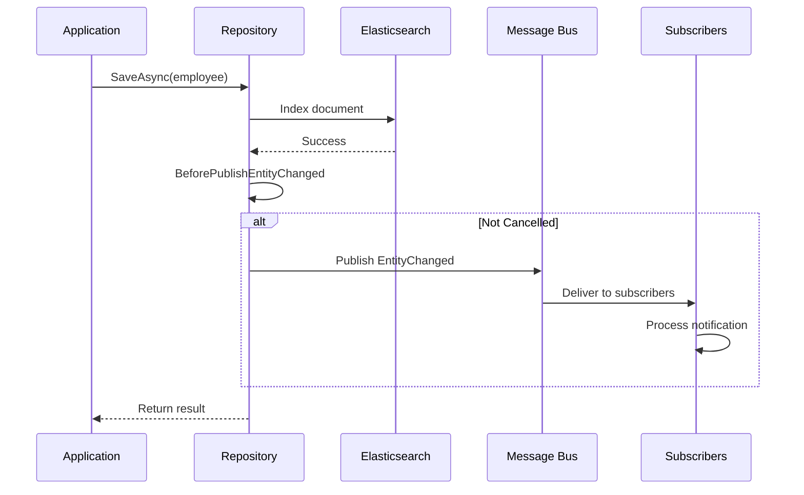

# Message Bus

Foundatio.Repositories integrates with Foundatio's message bus to publish entity change notifications. This enables real-time updates, event-driven architectures, and distributed cache invalidation.

## Overview

When documents are added, saved, or removed, the repository publishes `EntityChanged` messages to the message bus. Other parts of your system can subscribe to these messages to react to changes.

## Configuration

### Enable Message Bus

Provide an `IMessageBus` to your Elasticsearch configuration:

```csharp
using Foundatio.Messaging;

public class MyElasticConfiguration : ElasticConfiguration
{
    public MyElasticConfiguration(
        ICacheClient cache,
        IMessageBus messageBus,
        ILoggerFactory loggerFactory) 
        : base(cache: cache, messageBus: messageBus, loggerFactory: loggerFactory)
    {
        AddIndex(Employees = new EmployeeIndex(this));
    }
    
    public EmployeeIndex Employees { get; }
}
```

### Message Bus Implementations

```csharp
// In-memory (for development/testing)
services.AddSingleton<IMessageBus>(new InMemoryMessageBus());

// Redis
services.AddSingleton<IMessageBus>(sp => 
    new RedisMessageBus(new RedisConnection("localhost:6379")));

// RabbitMQ
services.AddSingleton<IMessageBus>(sp => 
    new RabbitMQMessageBus(new RabbitMQOptions { ConnectionString = "amqp://localhost" }));
```

## EntityChanged Message

### Message Structure

```csharp
public class EntityChanged : IHaveData
{
    public string Type { get; set; }      // Entity type name (e.g., "Employee")
    public string Id { get; set; }        // Document ID
    public ChangeType ChangeType { get; set; }  // Added, Saved, or Removed
    public IDictionary<string, object> Data { get; set; }  // Custom data
}

public enum ChangeType : byte
{
    Added = 0,
    Saved = 1,
    Removed = 2
}
```

### When Each ChangeType Is Used

| ChangeType | Triggered By |
|------------|--------------|
| `Added` | `AddAsync` - New document created |
| `Saved` | `SaveAsync` - Document updated |
| `Saved` | `PatchAsync` - Document patched |
| `Removed` | `RemoveAsync` - Document deleted |
| `Removed` | Soft delete transition (`IsDeleted: false → true`) |

### Soft Delete Notification Logic

When a document supports soft deletes (`ISupportSoftDeletes`), the notification system intelligently determines the `ChangeType`:

```csharp
// If IsDeleted transitions from false to true:
// ChangeType = Removed (not Saved)

// This requires OriginalsEnabled = true to detect the transition
public class EmployeeRepository : ElasticRepositoryBase<Employee>
{
    public EmployeeRepository(EmployeeIndex index) : base(index)
    {
        OriginalsEnabled = true;  // Required for soft delete detection
    }
}
```

**Example:**

```csharp
var employee = await repository.GetByIdAsync(id);
employee.IsDeleted = true;
await repository.SaveAsync(employee);

// EntityChanged message:
// - Type: "Employee"
// - Id: employee.Id
// - ChangeType: Removed (not Saved!)
```

## Subscribing to Notifications

### Basic Subscription

```csharp
await messageBus.SubscribeAsync<EntityChanged>(async (msg, ct) =>
{
    Console.WriteLine($"{msg.Type} {msg.ChangeType}: {msg.Id}");
});
```

### Filter by Entity Type

```csharp
await messageBus.SubscribeAsync<EntityChanged>(async (msg, ct) =>
{
    if (msg.Type == nameof(Employee))
    {
        switch (msg.ChangeType)
        {
            case ChangeType.Added:
                await OnEmployeeAdded(msg.Id);
                break;
            case ChangeType.Saved:
                await OnEmployeeUpdated(msg.Id);
                break;
            case ChangeType.Removed:
                await OnEmployeeRemoved(msg.Id);
                break;
        }
    }
});
```

### Real-Time UI Updates

```csharp
public class EmployeeHub : Hub
{
    private readonly IMessageBus _messageBus;

    public EmployeeHub(IMessageBus messageBus)
    {
        _messageBus = messageBus;
    }

    public override async Task OnConnectedAsync()
    {
        await _messageBus.SubscribeAsync<EntityChanged>(async (msg, ct) =>
        {
            if (msg.Type == nameof(Employee))
            {
                await Clients.All.SendAsync("EmployeeChanged", new
                {
                    Id = msg.Id,
                    ChangeType = msg.ChangeType.ToString()
                });
            }
        });
        
        await base.OnConnectedAsync();
    }
}
```

## Repository Configuration

### NotificationsEnabled

Enable or disable notifications at the repository level:

```csharp
public class EmployeeRepository : ElasticRepositoryBase<Employee>
{
    public EmployeeRepository(EmployeeIndex index) : base(index)
    {
        NotificationsEnabled = true;  // Default: true if message bus configured
    }
}
```

### NotificationDeliveryDelay

Delay notification delivery to allow Elasticsearch indexing to complete:

```csharp
public class EmployeeRepository : ElasticRepositoryBase<Employee>
{
    public EmployeeRepository(EmployeeIndex index) : base(index)
    {
        NotificationDeliveryDelay = TimeSpan.FromSeconds(2);
    }
}
```

::: warning
Only set a delay if your message bus implementation supports delayed delivery. Message buses that don't support delayed delivery may silently drop messages. The in-memory message bus supports delayed delivery.
:::

### BatchNotifications

Batch multiple notifications together:

```csharp
public class EmployeeRepository : ElasticRepositoryBase<Employee>
{
    public EmployeeRepository(EmployeeIndex index) : base(index)
    {
        BatchNotifications = true;
    }
}
```

### Per-Operation Control

Disable notifications for specific operations:

```csharp
// Disable notifications for bulk import
await repository.AddAsync(employees, o => o.Notifications(false));

// Disable notifications for internal updates
await repository.SaveAsync(employee, o => o.Notifications(false));
```

## BeforePublishEntityChanged Event

Intercept and modify notifications before they're published.

### Event Arguments

```csharp
public class BeforePublishEntityChangedEventArgs<T> : CancelEventArgs
{
    public EntityChanged Message { get; }
    public IReadOnlyRepository<T> Repository { get; }
    // Inherited: bool Cancel { get; set; }
}
```

### Intercepting Notifications

```csharp
public class EmployeeRepository : ElasticRepositoryBase<Employee>
{
    public EmployeeRepository(EmployeeIndex index) : base(index)
    {
        BeforePublishEntityChanged.AddHandler(OnBeforePublish);
    }

    private Task OnBeforePublish(object sender, BeforePublishEntityChangedEventArgs<Employee> args)
    {
        // Add custom data to the notification
        args.Message.Data["TenantId"] = _tenantId;
        args.Message.Data["ModifiedBy"] = _currentUserId;
        
        return Task.CompletedTask;
    }
}
```

### Canceling Notifications

```csharp
BeforePublishEntityChanged.AddHandler((sender, args) =>
{
    // Don't publish notifications for internal system changes
    if (args.Message.Data.ContainsKey("internal"))
    {
        args.Cancel = true;
    }
    
    // Don't publish for certain entity states
    // (Note: You'd need to fetch the document to check this)
    
    return Task.CompletedTask;
});
```

### Adding Custom Data

```csharp
BeforePublishEntityChanged.AddHandler((sender, args) =>
{
    // Add metadata to all notifications
    args.Message.Data["Timestamp"] = DateTime.UtcNow;
    args.Message.Data["Source"] = Environment.MachineName;
    
    return Task.CompletedTask;
});
```

## In-Process Events vs Message Bus

Foundatio.Repositories provides two notification mechanisms:

### In-Process Events

Synchronous events fired within the same process:

```csharp
repository.DocumentsChanged.AddHandler(async (sender, args) =>
{
    // Runs in the same process, same transaction context
    foreach (var doc in args.Documents)
    {
        await UpdateRelatedDataAsync(doc.Value);
    }
});
```

**Use for:**
- Cache invalidation
- Validation
- Local side effects
- Audit logging within the same service

### Message Bus Notifications

Distributed messages published to `IMessageBus`:

```csharp
await messageBus.SubscribeAsync<EntityChanged>(async (msg, ct) =>
{
    // Runs in any subscribed process
    await RefreshCacheAsync(msg.Id);
});
```

**Use for:**
- Cross-service communication
- Real-time UI updates
- Event-driven architectures
- Distributed cache invalidation

### Comparison

| Aspect | In-Process Events | Message Bus |
|--------|-------------------|-------------|
| Scope | Same process | Distributed |
| Timing | Synchronous | Asynchronous |
| Reliability | Guaranteed | Depends on bus |
| Use Case | Local side effects | Cross-service |
| Access to Document | Full document | ID only |

## Distributed Cache Invalidation

Use message bus notifications to invalidate cache across instances:

```csharp
public class CacheInvalidationService : IHostedService
{
    private readonly IMessageBus _messageBus;
    private readonly IEmployeeRepository _repository;

    public CacheInvalidationService(IMessageBus messageBus, IEmployeeRepository repository)
    {
        _messageBus = messageBus;
        _repository = repository;
    }

    public async Task StartAsync(CancellationToken cancellationToken)
    {
        await _messageBus.SubscribeAsync<EntityChanged>(async (msg, ct) =>
        {
            if (msg.Type == nameof(Employee))
            {
                // Invalidate local cache when other instances make changes
                await _repository.InvalidateCacheAsync(msg.Id);
            }
        }, cancellationToken);
    }

    public Task StopAsync(CancellationToken cancellationToken) => Task.CompletedTask;
}
```

## Event Sourcing Pattern

Use notifications to build event-sourced systems:

```csharp
public class EmployeeEventStore
{
    private readonly IMessageBus _messageBus;
    private readonly IEventRepository _eventRepository;

    public EmployeeEventStore(IMessageBus messageBus, IEventRepository eventRepository)
    {
        _messageBus = messageBus;
        _eventRepository = eventRepository;
    }

    public async Task StartAsync()
    {
        await _messageBus.SubscribeAsync<EntityChanged>(async (msg, ct) =>
        {
            if (msg.Type == nameof(Employee))
            {
                await _eventRepository.AddAsync(new EmployeeEvent
                {
                    EmployeeId = msg.Id,
                    EventType = msg.ChangeType.ToString(),
                    Timestamp = DateTime.UtcNow,
                    Data = msg.Data
                });
            }
        });
    }
}
```

## Notification Flow Diagram



## Best Practices

### 1. Use OriginalsEnabled for Soft Delete Detection

```csharp
OriginalsEnabled = true;  // Detect IsDeleted transitions
```

### 2. Add Custom Data for Context

```csharp
BeforePublishEntityChanged.AddHandler((sender, args) =>
{
    args.Message.Data["UserId"] = _currentUserId;
    args.Message.Data["TenantId"] = _tenantId;
    return Task.CompletedTask;
});
```

### 3. Handle Notification Failures Gracefully

```csharp
await messageBus.SubscribeAsync<EntityChanged>(async (msg, ct) =>
{
    try
    {
        await ProcessNotificationAsync(msg);
    }
    catch (Exception ex)
    {
        _logger.LogError(ex, "Failed to process notification for {Type} {Id}", 
            msg.Type, msg.Id);
        // Don't rethrow - allow other subscribers to process
    }
});
```

### 4. Use NotificationDeliveryDelay for Eventual Consistency

```csharp
NotificationDeliveryDelay = TimeSpan.FromSeconds(1);
```

## Next Steps

- [Caching](/guide/caching) - Distributed cache invalidation
- [Configuration](/guide/configuration) - Notification configuration
- [Repository Pattern](/guide/repository-pattern) - In-process events
