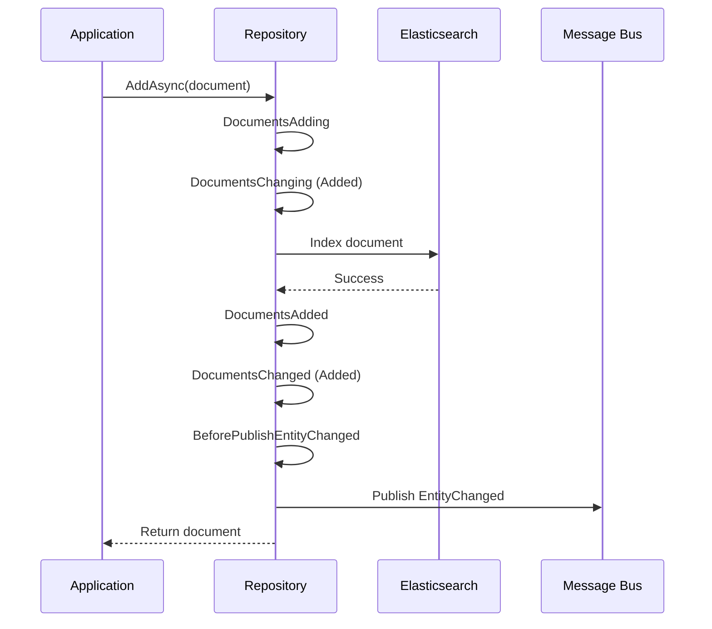

# Repository Pattern

Foundatio.Repositories provides a clean abstraction over data access through a hierarchy of interfaces. This guide covers the core interfaces, their methods, and the powerful event system for extending repository behavior.

## Core Interfaces

### IReadOnlyRepository&lt;T&gt;

The base interface for read-only operations:

```csharp
public interface IReadOnlyRepository<T> where T : class, new()
{
    // Read operations
    Task<T> GetByIdAsync(Id id, ICommandOptions options = null);
    Task<IReadOnlyCollection<T>> GetByIdsAsync(Ids ids, ICommandOptions options = null);
    Task<FindResults<T>> GetAllAsync(ICommandOptions options = null);
    Task<bool> ExistsAsync(Id id, ICommandOptions options = null);
    Task<CountResult> CountAsync(ICommandOptions options = null);

    // Cache invalidation
    Task InvalidateCacheAsync(T document);
    Task InvalidateCacheAsync(IEnumerable<T> documents);
    Task InvalidateCacheAsync(string cacheKey);
    Task InvalidateCacheAsync(IEnumerable<string> cacheKeys);

    // Events
    AsyncEvent<BeforeQueryEventArgs<T>> BeforeQuery { get; }
}
```

### IRepository&lt;T&gt;

Extends `IReadOnlyRepository<T>` with write operations:

```csharp
public interface IRepository<T> : IReadOnlyRepository<T> where T : class, IIdentity, new()
{
    // Write operations
    Task<T> AddAsync(T document, ICommandOptions options = null);
    Task AddAsync(IEnumerable<T> documents, ICommandOptions options = null);
    Task<T> SaveAsync(T document, ICommandOptions options = null);
    Task SaveAsync(IEnumerable<T> documents, ICommandOptions options = null);
    Task PatchAsync(Id id, IPatchOperation operation, ICommandOptions options = null);
    Task PatchAsync(Ids ids, IPatchOperation operation, ICommandOptions options = null);
    Task RemoveAsync(Id id, ICommandOptions options = null);
    Task RemoveAsync(T document, ICommandOptions options = null);
    Task RemoveAsync(IEnumerable<T> documents, ICommandOptions options = null);
    Task<long> RemoveAllAsync(ICommandOptions options = null);

    // Events
    AsyncEvent<DocumentsEventArgs<T>> DocumentsAdding { get; }
    AsyncEvent<DocumentsEventArgs<T>> DocumentsAdded { get; }
    AsyncEvent<ModifiedDocumentsEventArgs<T>> DocumentsSaving { get; }
    AsyncEvent<ModifiedDocumentsEventArgs<T>> DocumentsSaved { get; }
    AsyncEvent<DocumentsEventArgs<T>> DocumentsRemoving { get; }
    AsyncEvent<DocumentsEventArgs<T>> DocumentsRemoved { get; }
    AsyncEvent<DocumentsChangeEventArgs<T>> DocumentsChanging { get; }
    AsyncEvent<DocumentsChangeEventArgs<T>> DocumentsChanged { get; }
}
```

### ISearchableRepository&lt;T&gt;

Extends `IRepository<T>` with query capabilities:

```csharp
public interface ISearchableRepository<T> : IRepository<T>, ISearchableReadOnlyRepository<T>
    where T : class, IIdentity, new()
{
    Task<long> PatchAllAsync(IRepositoryQuery query, IPatchOperation operation, 
        ICommandOptions options = null);
    Task<long> RemoveAllAsync(IRepositoryQuery query, ICommandOptions options = null);
    Task<long> BatchProcessAsync(IRepositoryQuery query, 
        Func<FindResults<T>, Task<bool>> processFunc, ICommandOptions options = null);
}
```

### ISearchableReadOnlyRepository&lt;T&gt;

Query operations without write access:

```csharp
public interface ISearchableReadOnlyRepository<T> : IReadOnlyRepository<T>
    where T : class, new()
{
    Task<FindResults<T>> FindAsync(IRepositoryQuery query, ICommandOptions options = null);
    Task<FindResults<TResult>> FindAsAsync<TResult>(IRepositoryQuery query, 
        ICommandOptions options = null) where TResult : class, new();
    Task<FindHit<T>> FindOneAsync(IRepositoryQuery query, ICommandOptions options = null);
    Task<CountResult> CountAsync(IRepositoryQuery query, ICommandOptions options = null);
    Task<bool> ExistsAsync(IRepositoryQuery query, ICommandOptions options = null);
}
```

## Event System

The repository provides a comprehensive event system that allows you to hook into the document lifecycle. Events are fired at various stages of CRUD operations.

### Event Types

| Event | When Fired | Use Cases |
|-------|------------|-----------|
| `DocumentsAdding` | Before documents are added | Set defaults, validate, generate IDs |
| `DocumentsAdded` | After documents are added | Trigger notifications, audit logging |
| `DocumentsSaving` | Before documents are saved | Track changes, validate updates |
| `DocumentsSaved` | After documents are saved | Trigger notifications, audit logging |
| `DocumentsRemoving` | Before documents are removed | Cascade deletes, archive data |
| `DocumentsRemoved` | After documents are removed | Clean up related resources |
| `DocumentsChanging` | Before any change | Universal change tracking |
| `DocumentsChanged` | After any change | Universal change tracking |
| `BeforeQuery` | Before query execution | Add filters, track metrics |
| `BeforePublishEntityChanged` | Before notification publish | Modify or cancel notifications |

### Event Argument Types

#### DocumentsEventArgs&lt;T&gt;

Used for `DocumentsAdding`, `DocumentsAdded`, `DocumentsRemoving`, `DocumentsRemoved`:

```csharp
public class DocumentsEventArgs<T> : EventArgs
{
    public IReadOnlyCollection<T> Documents { get; }
    public IRepository<T> Repository { get; }
    public ICommandOptions Options { get; }
}
```

#### ModifiedDocumentsEventArgs&lt;T&gt;

Used for `DocumentsSaving`, `DocumentsSaved` - includes original document state:

```csharp
public class ModifiedDocumentsEventArgs<T> : EventArgs
{
    public IReadOnlyCollection<ModifiedDocument<T>> Documents { get; }
    public IRepository<T> Repository { get; }
    public ICommandOptions Options { get; }
}

public class ModifiedDocument<T>
{
    public T Value { get; set; }      // Current/modified document
    public T Original { get; }        // Original document before changes
}
```

#### DocumentsChangeEventArgs&lt;T&gt;

Used for `DocumentsChanging`, `DocumentsChanged`:

```csharp
public class DocumentsChangeEventArgs<T> : EventArgs
{
    public ChangeType ChangeType { get; }  // Added, Saved, or Removed
    public IReadOnlyCollection<ModifiedDocument<T>> Documents { get; }
    public IRepository<T> Repository { get; }
    public ICommandOptions Options { get; }
}

public enum ChangeType : byte
{
    Added = 0,
    Saved = 1,
    Removed = 2
}
```

#### BeforeQueryEventArgs&lt;T&gt;

Used for `BeforeQuery`:

```csharp
public class BeforeQueryEventArgs<T> : EventArgs
{
    public Type ResultType { get; }
    public IRepositoryQuery Query { get; }      // Modifiable
    public ICommandOptions Options { get; }     // Modifiable
    public IReadOnlyRepository<T> Repository { get; }
}
```

#### BeforePublishEntityChangedEventArgs&lt;T&gt;

Used for `BeforePublishEntityChanged` - supports cancellation:

```csharp
public class BeforePublishEntityChangedEventArgs<T> : CancelEventArgs
{
    public EntityChanged Message { get; }
    public IReadOnlyRepository<T> Repository { get; }
    // Inherited: bool Cancel { get; set; }
}
```

### Subscribing to Events

#### Async Handlers

Use `AddHandler` for async event handlers:

```csharp
public class EmployeeRepository : ElasticRepositoryBase<Employee>
{
    public EmployeeRepository(EmployeeIndex index) : base(index)
    {
        DocumentsAdding.AddHandler(OnDocumentsAdding);
        DocumentsSaving.AddHandler(OnDocumentsSaving);
        BeforeQuery.AddHandler(OnBeforeQuery);
    }

    private Task OnDocumentsAdding(object sender, DocumentsEventArgs<Employee> args)
    {
        foreach (var employee in args.Documents)
        {
            // Set default values
            if (string.IsNullOrEmpty(employee.Department))
                employee.Department = "General";
        }
        return Task.CompletedTask;
    }

    private Task OnDocumentsSaving(object sender, ModifiedDocumentsEventArgs<Employee> args)
    {
        foreach (var modified in args.Documents)
        {
            var original = modified.Original;
            var current = modified.Value;
            
            // Detect salary changes
            if (original?.Salary != current.Salary)
            {
                _logger.LogInformation(
                    "Salary changed for {Id}: {Old} -> {New}",
                    current.Id, original?.Salary, current.Salary);
            }
        }
        return Task.CompletedTask;
    }

    private Task OnBeforeQuery(object sender, BeforeQueryEventArgs<Employee> args)
    {
        // Add tenant filter to all queries using typed expression
        args.Query.FieldEquals(e => e.TenantId, _currentTenantId);
        return Task.CompletedTask;
    }
}
```

#### Sync Handlers

Use `AddSyncHandler` for synchronous handlers. Returns an `IDisposable` for cleanup:

```csharp
// Subscribe
var subscription = repository.DocumentsAdded.AddSyncHandler((sender, args) =>
{
    Console.WriteLine($"Added {args.Documents.Count} documents");
});

// Unsubscribe when done
subscription.Dispose();
```

#### Removing Handlers

For async handlers:

```csharp
repository.DocumentsAdding.AddHandler(OnDocumentsAdding);
// Later...
repository.DocumentsAdding.RemoveHandler(OnDocumentsAdding);
```

### Event Execution Order

Events fire in a specific order during operations:



**Add Operation:**
1. `DocumentsAdding`
2. `DocumentsChanging` (ChangeType.Added)
3. *Document indexed*
4. `DocumentsAdded`
5. `DocumentsChanged` (ChangeType.Added)
6. `BeforePublishEntityChanged`
7. *EntityChanged published*

**Save Operation:**
1. `DocumentsSaving`
2. `DocumentsChanging` (ChangeType.Saved)
3. *Document indexed*
4. `DocumentsSaved`
5. `DocumentsChanged` (ChangeType.Saved)
6. `BeforePublishEntityChanged`
7. *EntityChanged published*

**Remove Operation:**
1. `DocumentsRemoving`
2. `DocumentsChanging` (ChangeType.Removed)
3. *Document deleted*
4. `DocumentsRemoved`
5. `DocumentsChanged` (ChangeType.Removed)
6. `BeforePublishEntityChanged`
7. *EntityChanged published*

### Modifying Documents in Handlers

Documents can be modified directly in event handlers:

```csharp
private Task OnDocumentsAdding(object sender, DocumentsEventArgs<Employee> args)
{
    foreach (var employee in args.Documents)
    {
        // Set audit fields
        employee.CreatedBy = _currentUserId;
        employee.CreatedAt = DateTime.UtcNow;
    }
    return Task.CompletedTask;
}

private Task OnDocumentsSaving(object sender, ModifiedDocumentsEventArgs<Employee> args)
{
    foreach (var modified in args.Documents)
    {
        // Modify the Value property, not Original
        modified.Value.ModifiedBy = _currentUserId;
        modified.Value.ModifiedAt = DateTime.UtcNow;
    }
    return Task.CompletedTask;
}
```

### Canceling Operations

#### Throwing Exceptions

To cancel an operation, throw an exception:

```csharp
private Task OnDocumentsAdding(object sender, DocumentsEventArgs<Employee> args)
{
    foreach (var employee in args.Documents)
    {
        if (string.IsNullOrEmpty(employee.Email))
            throw new DocumentValidationException("Email is required");
    }
    return Task.CompletedTask;
}
```

#### Canceling Notifications

Only `BeforePublishEntityChanged` supports cancellation:

```csharp
BeforePublishEntityChanged.AddHandler((sender, args) =>
{
    // Don't publish notifications for internal changes
    if (args.Message.Data.ContainsKey("internal"))
    {
        args.Cancel = true;
    }
    return Task.CompletedTask;
});
```

### Common Event Patterns

#### Audit Logging

```csharp
DocumentsChanged.AddHandler(async (sender, args) =>
{
    foreach (var doc in args.Documents)
    {
        await _auditLog.LogAsync(new AuditEntry
        {
            EntityType = typeof(Employee).Name,
            EntityId = doc.Value.Id,
            Action = args.ChangeType.ToString(),
            UserId = _currentUserId,
            Timestamp = DateTime.UtcNow,
            OldValue = doc.Original,
            NewValue = doc.Value
        });
    }
});
```

#### Cascade Operations

```csharp
DocumentsRemoving.AddHandler(async (sender, args) =>
{
    foreach (var project in args.Documents)
    {
        // Delete all tasks when project is deleted
        await _taskRepository.RemoveAllAsync(
            q => q.FieldEquals(t => t.ProjectId, project.Id));
    }
});
```

#### Query Filtering

```csharp
BeforeQuery.AddHandler((sender, args) =>
{
    // Always filter by tenant using typed expression
    args.Query.FieldEquals(e => e.TenantId, _tenantId);
    
    // Exclude archived by default
    args.Query.FieldEquals(e => e.IsArchived, false);
    
    return Task.CompletedTask;
});
```

## Next Steps

- [Elasticsearch Setup](/guide/elasticsearch-setup) - Configure your Elasticsearch connection
- [CRUD Operations](/guide/crud-operations) - Detailed guide to data operations
- [Configuration](/guide/configuration) - Repository configuration options
- [Message Bus](/guide/message-bus) - Entity change notifications
