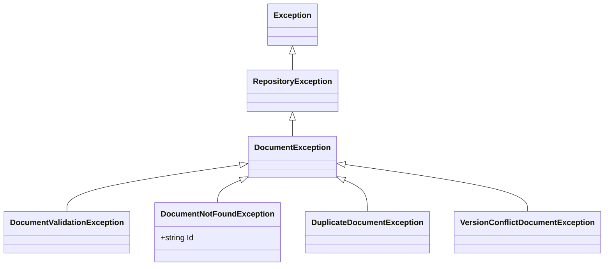

# Validation

Foundatio.Repositories provides a validation system for ensuring document integrity before persistence. This guide covers implementing validation, handling exceptions, and validation patterns.

## Document Validation

### ValidateAndThrowAsync

Override `ValidateAndThrowAsync` in your repository to implement custom validation:

```csharp
public class EmployeeRepository : ElasticRepositoryBase<Employee>
{
    public EmployeeRepository(EmployeeIndex index) : base(index) { }

    protected override Task ValidateAndThrowAsync(Employee document)
    {
        if (string.IsNullOrEmpty(document.Name))
            throw new DocumentValidationException("Name is required");
        
        if (string.IsNullOrEmpty(document.Email))
            throw new DocumentValidationException("Email is required");
        
        if (!IsValidEmail(document.Email))
            throw new DocumentValidationException("Email format is invalid");
        
        if (document.Age < 0 || document.Age > 150)
            throw new DocumentValidationException("Age must be between 0 and 150");
        
        return Task.CompletedTask;
    }

    private bool IsValidEmail(string email)
    {
        return email.Contains('@') && email.Contains('.');
    }
}
```

### When Validation Runs

Validation is called automatically during:
- `AddAsync` - Before adding new documents
- `SaveAsync` - Before saving/updating documents

Validation is **not** called during:
- `PatchAsync` / `PatchAllAsync` - Partial updates bypass validation
- `RemoveAsync` / `RemoveAllAsync` - Deletions don't require validation

### Async Validation

For validation that requires async operations (e.g., checking uniqueness):

```csharp
protected override async Task ValidateAndThrowAsync(Employee document)
{
    // Basic validation
    if (string.IsNullOrEmpty(document.Email))
        throw new DocumentValidationException("Email is required");
    
    // Check for duplicate email
    var existing = await FindOneAsync(q => q
        .FieldEquals(e => e.Email, document.Email)
        .ExcludedId(document.Id));
    
    if (existing != null)
        throw new DuplicateDocumentException($"Email {document.Email} is already in use");
}
```

## Exception Hierarchy

Foundatio.Repositories provides a hierarchy of exceptions for different error scenarios:



### DocumentValidationException

Thrown when document validation fails:

```csharp
public class DocumentValidationException : DocumentException
{
    public DocumentValidationException() { }
    public DocumentValidationException(string message) : base(message) { }
}
```

**Usage:**

```csharp
throw new DocumentValidationException("Name is required");
throw new DocumentValidationException($"Age {age} is out of valid range");
```

### DocumentNotFoundException

Thrown when a document is not found:

```csharp
public class DocumentNotFoundException : DocumentException
{
    public string Id { get; }
    
    public DocumentNotFoundException(string id) : base($"Document \"{id}\" could not be found")
    {
        Id = id;
    }
}
```

**When thrown:**
- `PatchAsync` when document doesn't exist
- `SaveAsync` when updating a non-existent document (in some cases)
- `RemoveAsync` when deleting a non-existent document

### DuplicateDocumentException

Thrown when attempting to create a duplicate document:

```csharp
public class DuplicateDocumentException : DocumentException
{
    public DuplicateDocumentException(string message) : base(message) { }
}
```

**Usage:**

```csharp
throw new DuplicateDocumentException($"Document with email {email} already exists");
```

### VersionConflictDocumentException

Thrown when optimistic concurrency check fails:

```csharp
public class VersionConflictDocumentException : DocumentException
{
    public VersionConflictDocumentException() { }
    public VersionConflictDocumentException(string message) : base(message) { }
    public VersionConflictDocumentException(string message, Exception inner) : base(message, inner) { }
}
```

**When thrown:**
- `SaveAsync` when the document version doesn't match (if `IVersioned`)

## Skipping Validation

### Per-Operation

Skip validation for specific operations:

```csharp
// Skip validation for trusted data
await repository.AddAsync(trustedEntity, o => o.SkipValidation());

// Explicitly control validation
await repository.SaveAsync(entity, o => o.Validation(false));
```

### Use Cases for Skipping Validation

- **Bulk imports** - Trusted data from verified sources
- **System operations** - Internal updates that bypass business rules
- **Migrations** - Data transformations during schema changes

::: warning
Only skip validation when you're certain the data is valid. Invalid data can cause issues downstream.
:::

## Validation Patterns

### Fluent Validation Integration

Integrate with FluentValidation for complex validation rules:

```csharp
public class EmployeeValidator : AbstractValidator<Employee>
{
    public EmployeeValidator()
    {
        RuleFor(e => e.Name)
            .NotEmpty().WithMessage("Name is required")
            .MaximumLength(100).WithMessage("Name cannot exceed 100 characters");
        
        RuleFor(e => e.Email)
            .NotEmpty().WithMessage("Email is required")
            .EmailAddress().WithMessage("Invalid email format");
        
        RuleFor(e => e.Age)
            .InclusiveBetween(18, 100).WithMessage("Age must be between 18 and 100");
    }
}

public class EmployeeRepository : ElasticRepositoryBase<Employee>
{
    private readonly IValidator<Employee> _validator;

    public EmployeeRepository(EmployeeIndex index, IValidator<Employee> validator) 
        : base(index)
    {
        _validator = validator;
    }

    protected override async Task ValidateAndThrowAsync(Employee document)
    {
        var result = await _validator.ValidateAsync(document);
        if (!result.IsValid)
        {
            var errors = string.Join("; ", result.Errors.Select(e => e.ErrorMessage));
            throw new DocumentValidationException(errors);
        }
    }
}
```

### Validation in Event Handlers

Validate in event handlers for cross-cutting concerns:

```csharp
public class EmployeeRepository : ElasticRepositoryBase<Employee>
{
    public EmployeeRepository(EmployeeIndex index) : base(index)
    {
        DocumentsAdding.AddHandler(ValidateNewEmployee);
        DocumentsSaving.AddHandler(ValidateEmployeeUpdate);
    }

    private Task ValidateNewEmployee(object sender, DocumentsEventArgs<Employee> args)
    {
        foreach (var employee in args.Documents)
        {
            // Validate new employee specific rules
            if (employee.StartDate < DateTime.UtcNow.Date)
                throw new DocumentValidationException("Start date cannot be in the past");
        }
        return Task.CompletedTask;
    }

    private Task ValidateEmployeeUpdate(object sender, ModifiedDocumentsEventArgs<Employee> args)
    {
        foreach (var modified in args.Documents)
        {
            var original = modified.Original;
            var current = modified.Value;
            
            // Prevent certain changes
            if (original != null && original.EmployeeId != current.EmployeeId)
                throw new DocumentValidationException("Employee ID cannot be changed");
        }
        return Task.CompletedTask;
    }
}
```

### Conditional Validation

Apply different validation rules based on context:

```csharp
protected override Task ValidateAndThrowAsync(Employee document)
{
    // Always validate required fields
    if (string.IsNullOrEmpty(document.Name))
        throw new DocumentValidationException("Name is required");
    
    // Additional validation for active employees
    if (document.Status == EmployeeStatus.Active)
    {
        if (string.IsNullOrEmpty(document.Department))
            throw new DocumentValidationException("Active employees must have a department");
        
        if (document.ManagerId == null)
            throw new DocumentValidationException("Active employees must have a manager");
    }
    
    return Task.CompletedTask;
}
```

## Error Handling

### Catching Validation Errors

```csharp
try
{
    await repository.AddAsync(employee);
}
catch (DocumentValidationException ex)
{
    _logger.LogWarning("Validation failed: {Message}", ex.Message);
    return BadRequest(ex.Message);
}
catch (DuplicateDocumentException ex)
{
    _logger.LogWarning("Duplicate document: {Message}", ex.Message);
    return Conflict(ex.Message);
}
```

### Comprehensive Error Handling

```csharp
try
{
    await repository.SaveAsync(employee);
}
catch (DocumentValidationException ex)
{
    // Validation failed
    return BadRequest(new { error = "Validation failed", message = ex.Message });
}
catch (DocumentNotFoundException ex)
{
    // Document doesn't exist
    return NotFound(new { error = "Not found", id = ex.Id });
}
catch (VersionConflictDocumentException ex)
{
    // Concurrent modification
    return Conflict(new { error = "Version conflict", message = ex.Message });
}
catch (DuplicateDocumentException ex)
{
    // Duplicate document
    return Conflict(new { error = "Duplicate", message = ex.Message });
}
catch (RepositoryException ex)
{
    // Other repository errors
    _logger.LogError(ex, "Repository error");
    return StatusCode(500, new { error = "Internal error" });
}
```

### Validation Result Pattern

For APIs that need to return validation errors without exceptions:

```csharp
public class ValidationResult
{
    public bool IsValid { get; set; }
    public List<string> Errors { get; set; } = new();
}

public class EmployeeService
{
    private readonly IEmployeeRepository _repository;

    public async Task<(Employee Employee, ValidationResult Validation)> CreateEmployeeAsync(
        Employee employee)
    {
        var validation = ValidateEmployee(employee);
        if (!validation.IsValid)
            return (null, validation);
        
        try
        {
            var result = await _repository.AddAsync(employee);
            return (result, validation);
        }
        catch (DocumentValidationException ex)
        {
            validation.IsValid = false;
            validation.Errors.Add(ex.Message);
            return (null, validation);
        }
    }

    private ValidationResult ValidateEmployee(Employee employee)
    {
        var result = new ValidationResult { IsValid = true };
        
        if (string.IsNullOrEmpty(employee.Name))
            result.Errors.Add("Name is required");
        
        if (string.IsNullOrEmpty(employee.Email))
            result.Errors.Add("Email is required");
        
        result.IsValid = result.Errors.Count == 0;
        return result;
    }
}
```

## Next Steps

- [Configuration](/guide/configuration) - Validation configuration options
- [Repository Pattern](/guide/repository-pattern) - Event handlers for validation
- [CRUD Operations](/guide/crud-operations) - Error handling in operations
