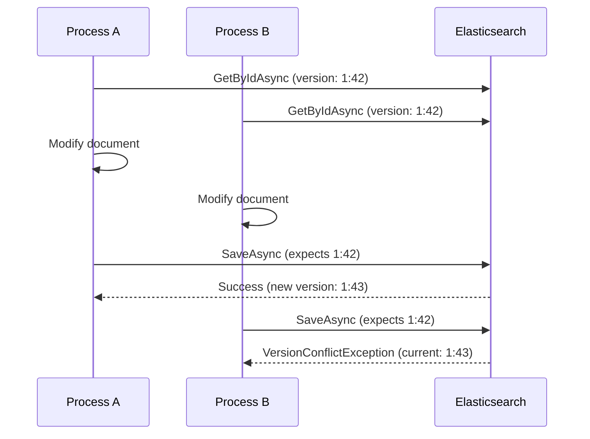

# Versioning

Foundatio.Repositories provides optimistic concurrency control through document versioning. This guide covers how versioning works and how to handle conflicts.

## Overview

Versioning prevents lost updates when multiple processes modify the same document simultaneously. When enabled, the repository checks that the document version matches before saving.

## Enabling Versioning

Implement `IVersioned` on your entity:

```csharp
using Foundatio.Repositories.Models;

public class Employee : IIdentity, IHaveDates, IVersioned
{
    public string Id { get; set; } = string.Empty;
    public string Name { get; set; } = string.Empty;
    public DateTime CreatedUtc { get; set; }
    public DateTime UpdatedUtc { get; set; }
    public string Version { get; set; } = string.Empty;  // Required by IVersioned
}
```

## How Versioning Works

### Version Format

The version is stored as `"primaryTerm:sequenceNumber"` using Elasticsearch's sequence numbers:

```csharp
// Example version: "1:42"
// - primaryTerm: 1
// - sequenceNumber: 42
```

### Read-Modify-Write Cycle

```csharp
// 1. Read document (version is populated)
var employee = await repository.GetByIdAsync(id);
Console.WriteLine($"Version: {employee.Version}");  // e.g., "1:42"

// 2. Modify document
employee.Name = "John Smith";

// 3. Save document (version is checked)
await repository.SaveAsync(employee);
// If version matches: Save succeeds, version updated to "1:43"
// If version doesn't match: VersionConflictDocumentException thrown
```

### Conflict Detection



## Handling Version Conflicts

### Basic Error Handling

```csharp
try
{
    await repository.SaveAsync(employee);
}
catch (VersionConflictDocumentException ex)
{
    Console.WriteLine($"Version conflict: {ex.Message}");
    // Handle conflict...
}
```

### Retry Pattern

```csharp
public async Task UpdateEmployeeWithRetry(string id, Action<Employee> update, int maxRetries = 3)
{
    int retries = maxRetries;
    
    while (retries > 0)
    {
        try
        {
            var employee = await repository.GetByIdAsync(id);
            if (employee == null)
                throw new DocumentNotFoundException(id);
            
            update(employee);
            await repository.SaveAsync(employee);
            return;  // Success
        }
        catch (VersionConflictDocumentException)
        {
            retries--;
            if (retries == 0)
                throw;
            
            // Wait before retry (exponential backoff)
            await Task.Delay(TimeSpan.FromMilliseconds(100 * (maxRetries - retries)));
        }
    }
}

// Usage
await UpdateEmployeeWithRetry(id, emp => emp.Name = "John Smith");
```

### Merge Strategy

```csharp
public async Task<Employee> UpdateEmployeeWithMerge(string id, Action<Employee> update)
{
    while (true)
    {
        try
        {
            var employee = await repository.GetByIdAsync(id);
            if (employee == null)
                throw new DocumentNotFoundException(id);
            
            update(employee);
            return await repository.SaveAsync(employee);
        }
        catch (VersionConflictDocumentException)
        {
            // Refresh and retry - the update action will be applied to fresh data
            continue;
        }
    }
}
```

### Last-Write-Wins

Skip version checking when you want the last write to win:

```csharp
await repository.SaveAsync(employee, o => o.SkipVersionCheck());
```

## Skipping Version Check

### Per-Operation

```csharp
// Skip version check for this operation
await repository.SaveAsync(employee, o => o.SkipVersionCheck());

// Explicitly control version checking
await repository.SaveAsync(employee, o => o.VersionCheck(false));
```

### Use Cases for Skipping

- **Bulk imports** - Trusted data from verified sources
- **System updates** - Internal updates that should always succeed
- **Migrations** - Data transformations during schema changes
- **Last-write-wins scenarios** - When conflicts don't matter

::: warning
Only skip version checking when you're certain that lost updates are acceptable.
:::

## Version in Patch Operations

Patch operations also support version checking:

```csharp
// Patch with version check (default)
await repository.PatchAsync(id, patch);

// Patch without version check
await repository.PatchAsync(id, patch, o => o.SkipVersionCheck());
```

## Atomic Operations

For truly atomic operations, use `ScriptPatch`:

```csharp
// Atomic increment - no version conflict possible
await repository.PatchAsync(id, new ScriptPatch("ctx._source.counter++"));

// Atomic conditional update
await repository.PatchAsync(id, new ScriptPatch(@"
    if (ctx._source.status == 'pending') {
        ctx._source.status = 'approved';
    }
"));
```

## Version in Find Results

When querying, versions are available in the hits:

```csharp
var results = await repository.FindAsync(query);

foreach (var hit in results.Hits)
{
    Console.WriteLine($"ID: {hit.Id}, Version: {hit.Version}");
    Console.WriteLine($"Document Version: {hit.Document.Version}");
}
```

## Common Patterns

### Optimistic Locking Service

```csharp
public class OptimisticLockingService<T> where T : class, IIdentity, IVersioned, new()
{
    private readonly IRepository<T> _repository;
    private readonly int _maxRetries;

    public OptimisticLockingService(IRepository<T> repository, int maxRetries = 3)
    {
        _repository = repository;
        _maxRetries = maxRetries;
    }

    public async Task<T> UpdateAsync(string id, Func<T, Task> updateAction)
    {
        int retries = _maxRetries;
        
        while (true)
        {
            var document = await _repository.GetByIdAsync(id);
            if (document == null)
                throw new DocumentNotFoundException(id);
            
            await updateAction(document);
            
            try
            {
                return await _repository.SaveAsync(document);
            }
            catch (VersionConflictDocumentException)
            {
                retries--;
                if (retries == 0)
                    throw;
                
                await Task.Delay(TimeSpan.FromMilliseconds(50 * (_maxRetries - retries)));
            }
        }
    }
}

// Usage
var service = new OptimisticLockingService<Employee>(repository);
var updated = await service.UpdateAsync(id, async emp =>
{
    emp.Name = "John Smith";
    emp.UpdatedBy = currentUserId;
});
```

### Compare-and-Swap

```csharp
public async Task<bool> CompareAndSwapAsync(string id, string expectedValue, string newValue)
{
    try
    {
        var employee = await repository.GetByIdAsync(id);
        if (employee == null || employee.Status != expectedValue)
            return false;
        
        employee.Status = newValue;
        await repository.SaveAsync(employee);
        return true;
    }
    catch (VersionConflictDocumentException)
    {
        return false;
    }
}

// Usage
bool success = await CompareAndSwapAsync(id, "pending", "approved");
```

### Conditional Update

```csharp
public async Task<(bool Success, T Document)> ConditionalUpdateAsync<T>(
    string id,
    Func<T, bool> condition,
    Action<T> update) where T : class, IIdentity, IVersioned, new()
{
    var document = await repository.GetByIdAsync(id);
    if (document == null)
        return (false, null);
    
    if (!condition(document))
        return (false, document);
    
    update(document);
    
    try
    {
        var saved = await repository.SaveAsync(document);
        return (true, saved);
    }
    catch (VersionConflictDocumentException)
    {
        return (false, document);
    }
}

// Usage
var (success, employee) = await ConditionalUpdateAsync<Employee>(
    id,
    emp => emp.Status == "pending",
    emp => emp.Status = "approved");
```

## Best Practices

### 1. Always Handle Version Conflicts

```csharp
try
{
    await repository.SaveAsync(employee);
}
catch (VersionConflictDocumentException)
{
    _logger.LogWarning("Version conflict for {Id}, retrying...", employee.Id);
    // Implement retry logic
}
```

### 2. Use Atomic Operations When Possible

```csharp
// Prefer atomic script over read-modify-write
await repository.PatchAsync(id, new ScriptPatch("ctx._source.counter++"));
```

### 3. Keep Retry Counts Reasonable

```csharp
// 3-5 retries is usually sufficient
const int MaxRetries = 3;
```

### 4. Use Exponential Backoff

```csharp
await Task.Delay(TimeSpan.FromMilliseconds(100 * Math.Pow(2, attempt)));
```

### 5. Log Conflicts for Monitoring

```csharp
catch (VersionConflictDocumentException)
{
    _metrics.IncrementCounter("version_conflicts", new { entity = typeof(T).Name });
    _logger.LogWarning("Version conflict for {Type}", typeof(T).Name);
}
```

## Next Steps

- [CRUD Operations](/guide/crud-operations) - Save operations with versioning
- [Patch Operations](/guide/patch-operations) - Atomic updates
- [Configuration](/guide/configuration) - Version check configuration
