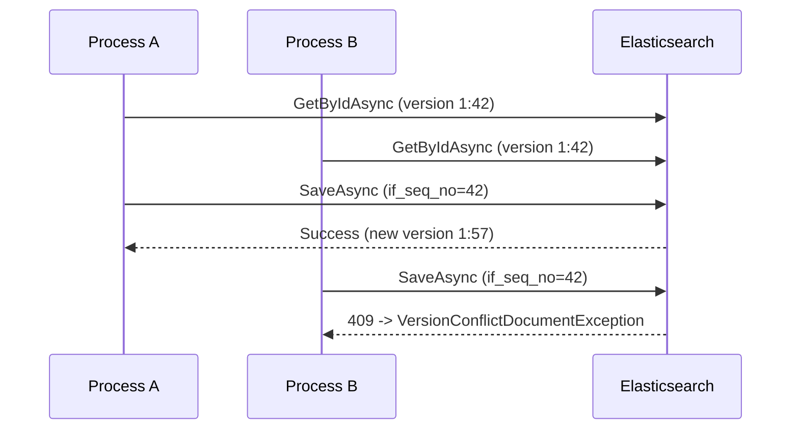
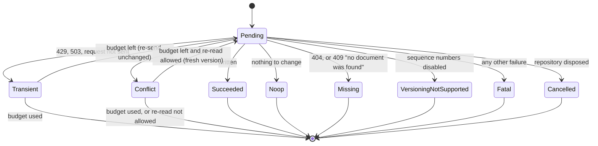

# Versioning

Foundatio.Repositories provides optimistic concurrency control (OCC) for documents that implement `IVersioned`. This guide explains what the version is, which operations check it, how retries work, and the limits Elasticsearch puts on version checks.

::: tip Upgrading
Several behaviors changed in this release. See [Upgrading](#upgrading-breaking-changes) at the end of this page.
:::

## Enabling Versioning

Implement `IVersioned` on your entity:

```csharp
using Foundatio.Repositories.Models;

public class Employee : IIdentity, IHaveDates, IVersioned
{
    public string Id { get; set; } = string.Empty;
    public string Name { get; set; } = string.Empty;
    public DateTime CreatedUtc { get; set; }
    public DateTime UpdatedUtc { get; set; }
    public string? Version { get; set; }  // Set by the repository; null until the document is stored
}
```

## What the Version Is

`Version` is an `ElasticDocumentVersion` serialized as `"primaryTerm:sequenceNumber"`, e.g. `"1:42"`. Both numbers come from Elasticsearch **hit metadata**, never from the document body:

| Field | Meaning |
| --- | --- |
| `_seq_no` | Increases with **every operation on the shard**, not per document. Two consecutive writes to the same document can go from `1:42` to `1:57` if other documents on that shard were written in between. |
| `_primary_term` | Increases each time a new primary takes over the shard (failover). |

Versions are ordered by primary term first, then by sequence number. They're only comparable for the **same document in the same index**.

An `ElasticDocumentVersion` is **empty** when the primary term is not positive or the sequence number is negative. That covers a missing version, `"0:0"`, and the `-2`/`0` sentinels returned by indexes with sequence numbers disabled. Empty versions are equal to each other, sort first, and are never sent to Elasticsearch as `if_seq_no`/`if_primary_term`. `ToVersionString()` and the implicit `string` conversion both return `null` for an empty version (only `ToString()` returns `"0:0"`), and reads set `Version` to `null` when there is no version.

::: tip `_version` is something else
Elasticsearch also has `_version`, a per-document write counter. Since Elasticsearch 7.0 it can't be used for optimistic concurrency, because it isn't safe across primary failover. The supported mechanism is `if_seq_no` + `if_primary_term` ([Elasticsearch docs](https://www.elastic.co/docs/reference/elasticsearch/rest-apis/optimistic-concurrency-control)). That's what this library uses. External versioning (`version_type=external`) isn't used: it's meant for a system where another store owns the version, it can't be combined with `if_seq_no`, and the Update API doesn't support it.
:::

## Read-Modify-Write Cycle

```csharp
// 1. Read document (Version is populated from hit metadata)
var employee = await repository.GetByIdAsync(id);
Console.WriteLine(employee.Version);  // e.g., "1:42"

// 2. Modify document
employee.Name = "John Smith";

// 3. Save document. Elasticsearch receives if_seq_no=42 & if_primary_term=1.
await repository.SaveAsync(employee);
// Success: employee.Version is updated from the write response (e.g., "1:57")
// Mismatch: VersionConflictDocumentException (HTTP 409)
```


```mermaid
sequenceDiagram
    participant A as Process A
    participant B as Process B
    participant ES as Elasticsearch

    A->>ES: GetByIdAsync (version 1:42)
    B->>ES: GetByIdAsync (version 1:42)
    A->>ES: SaveAsync (if_seq_no=42)
    ES-->>A: Success (new version 1:57)
    B->>ES: SaveAsync (if_seq_no=42)
    ES-->>B: 409 -> VersionConflictDocumentException
```

### Documents without a version

An `IVersioned` document whose `Version` is empty has never been read from Elasticsearch, so it can't be checked against a stored copy:

- **`SaveAsync`** writes it with `op_type=create`. If a document with that id already exists, the save fails with `DuplicateDocumentException` (the same exception `AddAsync` throws), and the stored document is left unchanged. This applies to single and bulk saves.
- **`RemoveAsync(T)`** throws a `DocumentException` ("has no version") before anything is deleted, because a delete has no create fallback.
- **`SkipVersionCheck()`** makes both unconditional: the save indexes (overwrites) the document and the remove deletes it.

## Where the Version Comes From

The version is metadata. It is **not stored in `_source`**: the Elasticsearch source serializer leaves `IVersioned.Version` out of the document, and ignores a `version` value already stored there by older releases.

| Read | How `Version` is set |
| --- | --- |
| `GetByIdAsync` / `GetByIdsAsync` | From GET/mget metadata. `null` when missing. A multi-get item error (for example an unavailable shard) throws `DocumentException`; it's never treated as "not found". |
| `FindAsync` / `FindOneAsync` / `SearchAsync` | From hit metadata (`seq_no_primary_term=true` is requested automatically). |
| Cache hit | From the cached `FindHit.Version`, which was taken from metadata when the entry was cached. |
| `FindAsAsync<TResult>` | A `TResult` that implements `IVersioned` gets `Version` from hit metadata. Otherwise only `hit.Version` carries it. |
| `top_hits` aggregations | Built from `_source` only, so they carry no version. |

`hit.Version` (on `FindHit<T>`) and `hit.Document.Version` always agree for repository reads.

- The version is removed only from **root document types**: the document type of every index and repository in an `ElasticConfiguration`, and types derived from them. Each configuration keeps its own set of types, so two configurations never affect each other.
- Only the document itself loses the field. A root document type that appears **nested** inside another document (or in a list) keeps its `version` there, and a nested object that implements `IVersioned` (for example a metadata object with its own business version) keeps its `version` field. Don't reuse `IVersioned` for business counters on the root document.
- A proxy property such as `public string? Version { get => MetaData.Version; set => MetaData.Version = value; }` still writes `metaData.version`, because the nested object is serialized normally.
- If you replace the Elasticsearch source serializer, call `options.ExcludeDocumentVersionFromSource(documentTypes)` on its `JsonSerializerOptions`, or override `ElasticConfiguration.ConfigureSourceSerializerOptions` and call the base method. Never add `[JsonIgnore]` to `Version`: the cache serializer needs it.
- Documents written by older releases keep a stale `version` field in `_source` until their next full write (`SaveAsync`, JSON/action patches). Script and partial patches merge into the stored document and leave the old field in place. It is ignored on reads. To remove it, run an update-by-query with `ctx._source.remove('version')`.
- A JSON patch operation whose path is `/version` is rejected with `ArgumentException`. The version isn't part of the document, so such a patch could never have an effect; use `IfVersion` to require a version instead.

### Debugging versions

Query metadata directly instead of `_source`:

```http
GET employees/_doc/123
GET employees/_search?seq_no_primary_term=true
{ "query": { "ids": { "values": ["123"] } } }
```

In Kibana Discover, add the `_seq_no` and `_primary_term` columns. Range queries and sorts on `_seq_no` work on indexes with sequence numbers enabled.

### Versions after reindex

Reindexing (schema migrations via `VersionedIndex`, `ReindexAsync`, moving documents between daily or monthly indexes) writes documents into a new index with fresh sequence numbers. Elasticsearch does **not** preserve `_seq_no`/`_primary_term`. A version captured before the reindex is **not guaranteed** to cause a 409 on the next save: it's rejected only if the new index happens to assign a different pair. The new index can assign the same pair (sequence numbers restart in the new index, so a document updated only a few times before the reindex can easily land on the same numbers), and then the stale copy passes the check and overwrites the migrated document. Always re-read documents after a reindex instead of reusing versions captured before it.

### Caching and versions

Cached reads return the version from when the entry was cached. If the document changed since, saving the cached copy fails with `VersionConflictDocumentException`, which is the safe outcome. Re-read with `o.Cache(false)` and retry. Script and partial patches only invalidate the cache, since the new version isn't known client-side. The cache population race (stale data cached after invalidation) is tracked in [#323](https://github.com/FoundatioFx/Foundatio.Repositories/issues/323).

## Concurrency Model per Operation

"Checks your `Version`" means the write is rejected when the stored document changed after the version you hold. "Never loses a concurrent change" means a write that loses a race is re-applied on the latest document instead of overwriting it.

::: warning Entities that don't implement `IVersioned`
The version checks below only exist for `IVersioned` entities, except `IfVersion`, which works for any entity. For any other entity, `SaveAsync` and the read-modify-write patches (JSON, action and pipeline partial patches, single or batch) write without a check, so a change made by someone else between the read and the write is **silently overwritten**. Script and partial patches through the Update API are still applied server-side to the latest document.
:::

| Operation | Mechanism | Checks your `Version`? | Retries (`Retry(n)`, default 10) |
| --- | --- | --- | --- |
| `AddAsync` | `op_type=create` | No (duplicate id: `DuplicateDocumentException`) | 429/503 and unsent requests |
| `SaveAsync` | index with `if_seq_no`/`if_primary_term`; `op_type=create` when `Version` is empty | **Yes**, unless `SkipVersionCheck()` | 429/503 and unsent requests. 409 is never retried |
| `RemoveAsync(T)` | delete with `if_seq_no`/`if_primary_term` | **Yes**, unless `SkipVersionCheck()`. Empty `Version` throws | 429/503 and unsent requests |
| `RemoveAsync(ids)` | loads documents, deletes without a check | No | 429/503 and unsent requests |
| `PatchAsync(id)` ScriptPatch / PartialPatch | Update API with `retry_on_conflict` | Only with `IfVersion(v)` (then no `retry_on_conflict`) | Server-side conflict retries + transient retries |
| `PatchAsync(id)` JsonPatch / ActionPatch / pipeline PartialPatch | GET, apply, index with `if_seq_no` from the GET | Only with `IfVersion(v)` (fails instead of re-reading) | Re-read and re-apply on conflict |
| `PatchAsync(id)` ScriptPatch with a default pipeline | update-by-query on the id | No (`IfVersion` not supported) | Re-run on conflict |
| `PatchAsync(ids)` / `PatchAllAsync` JsonPatch / ActionPatch / pipeline PartialPatch | bulk index with `if_seq_no` from the read, grouped retry rounds | No; `SkipVersionCheck()` writes without a check | Grouped rounds: one mget + one bulk per round |
| `PatchAsync(ids)` / `PatchAllAsync` ScriptPatch / PartialPatch | bulk Update API with `retry_on_conflict` | No | Server-side conflict retries + transient rounds |
| `PatchAsync(ids)` / `PatchAllAsync` ScriptPatch with a default pipeline | update-by-query **per document id** (the Update API can't run pipelines) | No | Re-run on conflict. One request per document; the batch is refreshed once at the end, not per document |
| `PatchAllAsync` ScriptPatch with `UseUpdateByQuery()` (cache disabled) | one update-by-query task, `conflicts=proceed` | Snapshot only | None. Throws on conflicts unless `ProceedOnQueryConflicts()` |
| `RemoveAllAsync` (no listeners, no cache) | delete-by-query, `conflicts=proceed` | Snapshot only | Up to n more passes with backoff. Throws on leftovers unless `ProceedOnQueryConflicts()` |
| `RemoveAllAsync` (listeners or cache) | batched `RemoveAsync` without a check | No | 429/503 and unsent requests |

For `IVersioned` entities, patches never lose a concurrent change: a patch that loses a race is re-applied to the latest document. That makes patches last-write-wins **per field you change**, not for your whole copy of the document. Use `IfVersion` when the patch must only apply to the version you read. Script and partial patches through the Update API behave this way for every entity; JSON, action and pipeline partial patches on entities that don't implement `IVersioned` have **no conflict protection** and overwrite concurrent changes.

### Expected-version patches (`IfVersion`)

```csharp
var employee = await repository.GetByIdAsync(id);
// ... show the document to a user, who edits one field ...
await repository.PatchAsync(id, new PartialPatch(new { Name = "New" }), o => o.IfVersion(employee.Version));
// Throws VersionConflictDocumentException if anyone changed the document since it was read.
```

- Every write sends the expected version as `if_seq_no`/`if_primary_term`, including writes re-sent after a transient failure. The document is never re-read to pick up a newer version, so a concurrent change always fails the patch.
- Script and partial patches send it to the Update API. Elasticsearch rejects it together with `retry_on_conflict`, so there are no server-side conflict retries.
- JSON and action patches read the document, compare its version with the expected one, and write with the expected version.
- `IfVersion` works for entities that don't implement `IVersioned` too: the check is enforced by Elasticsearch, not by the entity.
- `IfVersion` can't be combined with `SkipVersionCheck()` (`ArgumentException`), and isn't supported for script patches with a default pipeline.
- `IfVersion` is only supported by `PatchAsync(id)`. `PatchAsync(ids)` (with any number of ids, including one) and `PatchAllAsync` throw `ArgumentException`, because one expected version can't apply to several documents. Patch each document by id instead.

### Grouped conflict retries

For JSON, action and pipeline partial patches on many documents, a bulk write can return 409 (changed since read) or 429/503 for some items. Conflicting documents are re-read **together** with one multi-get, the patch is re-applied in memory (an action patch that no longer changes the document is not written), and they are re-sent in one bulk request with their fresh versions. Transient failures are re-sent unchanged. This repeats for up to `Retry(n)` rounds with exponential backoff (50 ms doubling, capped at 2 s) and jitter.

- Documents deleted in the meantime are skipped.
- Cache invalidation, notifications and the `UpdateCallback` fire once per document, after its batch completes.
- Documents still failing after the last round are reported in one exception with counts and up to 10 ids, **after** the successes are invalidated and notified (see [Failure handling](#failure-handling)).

`benchmarks/Foundatio.Repositories.Benchmarks` measures this through `PatchAllAsync` on a repository, with every document changed by a concurrent writer right before the first bulk write. The per-id baseline is the previous behavior: write the batch once, then patch each conflicting document again with `PatchAsync(id)`. Short job, Elasticsearch 9.5 on a laptop:

| Conflicting documents | Per-id | Grouped | Allocated (per-id / grouped) |
| --- | --- | --- | --- |
| 10 | 49 ms | 80 ms | 501 KB / 233 KB |
| 100 | 276 ms | 76 ms | 4.2 MB / 1.4 MB |
| 500 | 2,569 ms | 103 ms | 20.8 MB / 6.3 MB |

For a handful of documents the grouped round is slower, because it waits for the retry backoff before re-reading; from about 30 conflicting documents on, one multi-get and one bulk request per round win by a wide margin.

### Query-based writes check against a snapshot

Update-by-query and delete-by-query take a snapshot of matching documents, then write each one with a sequence-number check against **that snapshot**. A concurrent change is never overwritten, but the document is skipped and counted as a version conflict. Elasticsearch scripts can't read `_seq_no`, so a script can't compare against a caller-supplied version, and update-by-query doesn't return which ids conflicted.

- `PatchAllAsync` with `ScriptPatch` therefore uses the bulk Update API by default, which re-runs the script on the latest document per id. Update-by-query is an explicit opt-in (`o.UseUpdateByQuery()`, ignored when caching is enabled) for large data sets; it throws when any document was skipped unless you set `o.ProceedOnQueryConflicts()`. If its task can't be found while the repository waits for it, a `DocumentException` is thrown: the number of patched documents is unknown, so it is never reported as zero.
- Re-running a whole query to pick up skipped documents is unsafe for non-idempotent scripts (`ctx._source.count++`), because documents that already succeeded get the script again. Prefer idempotent scripts (`ctx._source.count = params.count`) for any operation that may be retried or run in parallel.
- Delete-by-query is idempotent, so `RemoveAllAsync` re-runs it up to `Retry(n)` more times with backoff and a refresh until no conflicts remain.
- Running two query-based writes in parallel on overlapping documents is safe but each may skip documents the other changed. Documents that start matching after the operation begins are not included.

## Write State Machines

Every write runs through the same round runner. Each document (or, for delete-by-query, the whole query) is an item, identified by its index **and** id, so the same id in two indexes is two items.


```mermaid
stateDiagram-v2
    [*] --> Pending
    Pending --> Succeeded: written
    Pending --> Noop: nothing to change
    Pending --> Missing: 404, or 409 "no document was found"
    Pending --> VersioningNotSupported: sequence numbers disabled
    Pending --> Fatal: any other failure
    Pending --> Transient: 429, 503, request not sent
    Pending --> Conflict: 409
    Transient --> Pending: budget left (re-send unchanged)
    Conflict --> Pending: budget left and re-read allowed (fresh version)
    Pending --> Cancelled: repository disposed
    Transient --> [*]: budget used
    Conflict --> [*]: budget used, or re-read not allowed
    Succeeded --> [*]
    Noop --> [*]
    Missing --> [*]
    VersioningNotSupported --> [*]
    Fatal --> [*]
    Cancelled --> [*]
```

- **Rounds and budget.** A round sends every pending item once. `Retry(n)` allows n more rounds (n + 1 total), separated by exponential backoff (50 ms doubling, capped at 2 s) with ±25% jitter. Items still `Transient` or `Conflict` after the last round keep that as their outcome.
- **Who re-reads a conflict.** Client-side patches re-read conflicting documents with one multi-get and re-apply the patch (unless `IfVersion` is set). Pipeline script patches re-run update-by-query on the id. Delete-by-query refreshes and runs the query again. Saves, removes and Update API patches never re-read: a 409 is terminal (Update API patches have already used `retry_on_conflict`).
- **Re-read results.** A document that's gone ends `Missing`; a multi-get item error, a patch that throws, or a failed multi-get ends `Fatal`. A transient multi-get failure re-sends the stale items, which conflict again and are re-read in the next round.
- **No item is dropped.** When the repository is disposed, every pending item ends `Cancelled`; when sending fails with an exception, every pending item ends `Fatal` with it.

### Transient vs. reported failures

Only failures where Elasticsearch definitely did **not** apply the write are retried:

| Failure | Outcome |
| --- | --- |
| HTTP 429 (Too Many Requests), HTTP 503 (Service Unavailable) | Retried |
| Connection refused, DNS failure, TLS handshake failure, no node attempted (the request was never sent) | Retried |
| HTTP 502, HTTP 504 (a proxy or gateway may already have forwarded the write) | Reported |
| Timeouts, connection reset, or any failure without a status after the request was sent | Reported |
| HTTP 409 | Conflict (see above), never retried by the transport |

A reported failure may or may not have been applied. Re-read the document before retrying it yourself.

### Failure handling

After the runner finishes, the repository invalidates the cache, raises events and sends notifications for every item that succeeded, and only then throws **one** exception for the items that didn't. The exception is chosen with a single precedence:

1. `OperationCanceledException` when any item was cancelled.
2. `DocumentVersioningNotSupportedException` when the index has sequence numbers disabled.
3. `DuplicateDocumentException` when every conflict was a create (`AddAsync`, or `SaveAsync` without a version); otherwise `VersionConflictDocumentException`. For saves, a document deleted since it was read also counts as a conflict.
4. `DocumentNotFoundException` for patches by id whose document doesn't exist.
5. `DocumentException` for everything else, with the first error reason.

Messages include the number of failed and succeeded documents and up to 10 ids. A document that is already gone counts as removed for `RemoveAsync`, and is skipped by `PatchAllAsync`.

## Retry Options

`o.Retry(n)` means **n retries after the first attempt** on every path. The default is 10. `Retry(0)` makes a single attempt and fails fast.

| Path | What a retry is |
| --- | --- |
| Script / partial patches (Update API) | `retry_on_conflict = n` (server-side), plus up to n rounds for transient failures |
| JSON / action / pipeline partial patches | Re-read and re-apply, up to n rounds (grouped per round for batches), plus transient failures |
| Pipeline script patches | Re-run update-by-query on the id, up to n rounds |
| `AddAsync` / `SaveAsync` / `RemoveAsync` | Up to n retries of transient failures. Version conflicts are not retried |
| Delete-by-query | Up to n more passes while conflicts remain |

Writes use these retries instead of the repository's `IResiliencePolicy`, because a policy can't tell a write that was never sent from one that may already be applied. Configuring a custom policy is still honored for reads and other operations; the repository logs a warning that it isn't used for document writes.

## Handling Version Conflicts

```csharp
try
{
    await repository.SaveAsync(employee);
}
catch (VersionConflictDocumentException)
{
    // Someone else changed the document. Re-read and decide what to do.
}
```

Map `VersionConflictDocumentException` to HTTP 409 in APIs. It derives from `DocumentException`, so a generic handler returns 500 unless you catch it first.

### Retry pattern

Re-read **without the cache** on each attempt, so you don't keep retrying with the same stale version:

```csharp
public async Task<Employee> UpdateWithRetryAsync(string id, Action<Employee> update, int maxAttempts = 5)
{
    for (int attempt = 1; ; attempt++)
    {
        var employee = await repository.GetByIdAsync(id, o => o.Cache(false))
            ?? throw new DocumentNotFoundException(id);

        update(employee);

        try
        {
            return await repository.SaveAsync(employee);
        }
        catch (VersionConflictDocumentException) when (attempt < maxAttempts)
        {
            await Task.Delay(TimeSpan.FromMilliseconds(50 * Math.Pow(2, attempt) + Random.Shared.Next(25)));
        }
    }
}
```

When the change doesn't depend on values you read, a patch does this for you:

```csharp
await repository.PatchAsync(id, new ActionPatch<Employee>(e => e.Name = "John Smith"));
await repository.PatchAsync(id, new ScriptPatch("ctx._source.counter++"));
```

## Skipping the Version Check

```csharp
await repository.SaveAsync(employee, o => o.SkipVersionCheck());
await repository.SaveAsync(employee, o => o.VersionCheck(false)); // same thing
```

`SkipVersionCheck()` (or `VersionCheck(false)`) applies to `SaveAsync`, `RemoveAsync(T)`, and the JSON, action and pipeline partial patches on one or many documents. Skip the check only when lost updates are acceptable: trusted imports, migrations, or genuine last-write-wins data.

## Bulk Operations and Partial Failures

When saving several versioned documents in one call, some may succeed while others conflict:

1. **Successful documents** are fully processed: versions updated, events fired, cache populated, notifications sent.
2. **Conflicting documents** are left untouched in Elasticsearch and in the cache.
3. One exception is thrown after the successes are processed (see [Failure handling](#failure-handling)). The message includes the counts and ids.

## Indexes Without Sequence Numbers (Elasticsearch 9.4+)

Elasticsearch 9.4 disables sequence numbers by default (`index.disable_sequence_numbers=true`, a final setting) for new **time_series data stream backing indexes**. Indexes can also be created with the setting. On those indexes:

- Responses carry the sentinel values `_seq_no: -2, _primary_term: 0`. The repository treats them as an empty version, so `Version` is `null`, and never sends them back as `if_seq_no`.
- Writes with `if_seq_no` fail with HTTP 400 (`o_c_c_not_supported_exception`) and the Update API with HTTP 400 (`update_not_supported_exception`). Both are reported as `DocumentVersioningNotSupportedException` with an explanation, for single and batch writes alike. A client-side patch that reads a document without a version reports the same exception instead of writing unchecked.
- Saving a document read from such an index tries to create it (its version is empty) and fails with `DuplicateDocumentException`; removing it throws. Use `SkipVersionCheck()`.
- Update-by-query and delete-by-query run with no conflict detection.

**`IVersioned` repositories aren't supported on such indexes.** Either don't implement `IVersioned` for time-series data, or set `index.disable_sequence_numbers: false` in the index template. `SkipVersionCheck()` saves and removes, and JSON/action patches with `SkipVersionCheck()`, still work. Standard and logsdb indexes keep sequence numbers, and may use `index.seq_no.index_options=doc_values_only` (9.1+), where OCC still works but `_seq_no` range queries are slower.

## Logging

Conflicts and retries are logged with structured fields and never include document bodies:

- **Warning** per conflict: operation, index, document id, attempt and budget, expected version, current version (parsed from the 409 reason) and outcome (`Retrying`/`Failed`).
- **Information** summary per retry round.
- **Error** when a retry budget is exhausted.
- **Warning** once per repository when a custom `IResiliencePolicy` is configured, because writes don't use it.

## Upgrading (Breaking Changes)

- **`IVersioned.Version` is `string?`.** It's `null` when a document has no version (never stored, or stored in an index with sequence numbers disabled). Implementations must declare `public string? Version { get; set; }`; `string Version` with `= null!` compiles with a nullability warning and should be changed.
- **`ElasticDocumentVersion` is a `readonly struct` with a `static readonly Empty`.** The implicit `string` conversion now returns `null` for an empty version, the same as `ToVersionString()`; it used to return `"0:0"`. Two empty versions are equal.
- **`SaveAsync` without a version creates.** Saving an `IVersioned` document whose `Version` is empty uses `op_type=create` and throws `DuplicateDocumentException` if the id exists. Before, it overwrote the document. Use `SkipVersionCheck()` to overwrite.
- **`RemoveAsync(T)` checks the version.** Removing an `IVersioned` document whose copy is stale throws `VersionConflictDocumentException`, and removing one without a version throws `DocumentException`. Use `SkipVersionCheck()` to delete regardless, or `RemoveAsync(id)`, which loads the document and deletes it without a check.
- **`VersionCheck(bool)` is fixed.** `VersionCheck(false)` now skips the check and `VersionCheck(true)` checks; they were inverted. Code that called `VersionCheck(true)` to skip the check must change to `SkipVersionCheck()`.
- **`IfVersion`** is new. It's rejected by `PatchAsync(ids)` for any number of ids and by `PatchAllAsync`, and can't be combined with `SkipVersionCheck()`.
- **JSON patches on `/version` are rejected** with `ArgumentException`.
- **`PatchAllAsync` with `ScriptPatch` uses the bulk Update API by default** instead of update-by-query when caching is disabled. Results are the same, but every matching document is patched even under concurrent writes. Opt back in with `o.UseUpdateByQuery()`; it now throws `VersionConflictDocumentException` when documents were skipped unless `o.ProceedOnQueryConflicts()` is set.
- **`RemoveAllAsync` delete-by-query throws on leftover conflicts** after the retry budget, instead of only logging. Use `o.ProceedOnQueryConflicts()` to restore logging only.
- **`Version` is no longer stored in `_source`.** The `"primaryTerm:sequenceNumber"` format is unchanged. Raw Elasticsearch clients must request `seq_no_primary_term=true` instead of reading `version` from `_source`. Queries, sorts or aggregations on `version` will stop matching new documents. `DocumentVersionSourceExclusion.RegisterDocumentType` and the parameterless `ExcludeDocumentVersionFromSource()` were replaced by `ExcludeDocumentVersionFromSource(documentTypes)`; `ElasticConfiguration` registers its document types itself.
- **`Retry(n)` means n retries everywhere.** Patch paths that used the resilience policy made n attempts before; they now make n + 1. Single-document `AddAsync`/`SaveAsync`/`RemoveAsync` now retry 429/503 and unsent requests. HTTP 502, 504 and timeouts are no longer retried anywhere.
- **Writes don't use the repository's `IResiliencePolicy`.** Retries are governed by `Retry(n)` and the transient classification above.
- **Failures and cancellation are no longer silent.** Batch operations process every batch and throw at the end; disposing the repository during a write throws `OperationCanceledException` after completed documents are notified, instead of returning a partial count; an update-by-query task that disappears throws instead of reporting zero; a multi-get item error throws instead of being treated as a missing document.

## Best Practices

1. Handle `VersionConflictDocumentException` wherever you call `SaveAsync`, `RemoveAsync(T)` or `IfVersion` patches on an `IVersioned` type. Map it to HTTP 409 in APIs.
2. Retry by **re-reading** (bypass the cache) and re-applying the change. Use exponential backoff with jitter and a small attempt budget.
3. Prefer patches for changes that don't depend on a value you read, and `IfVersion` patches when they do.
4. Make scripts idempotent when an operation may be retried or run in parallel.
5. Treat `Version` as an opaque string. Compare versions with `ElasticDocumentVersion` only for the same document in the same index.

## Next Steps

- [CRUD Operations](/guide/crud-operations) - Save operations with versioning
- [Patch Operations](/guide/patch-operations) - Patch concurrency behavior
- [Caching](/guide/caching) - Cache interaction
- [Troubleshooting](/guide/troubleshooting) - Diagnosing conflicts
