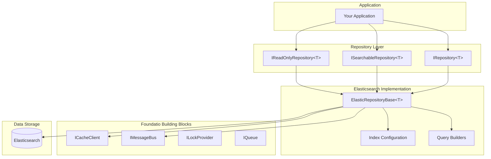

# What is Foundatio.Repositories?

Foundatio.Repositories is a production-grade repository pattern library for .NET that provides a clean abstraction over data access with powerful features like caching, messaging, soft deletes, and versioning. It's built on top of [Foundatio](https://github.com/FoundatioFx/Foundatio) building blocks and currently provides a full-featured Elasticsearch implementation.

## Why Use Foundatio.Repositories?

Building robust data access layers requires handling many cross-cutting concerns:

- **Caching** - How do you cache entities and invalidate them when they change?
- **Notifications** - How do you notify other parts of your system when data changes?
- **Soft Deletes** - How do you implement soft deletes consistently across all queries?
- **Versioning** - How do you handle optimistic concurrency?
- **Querying** - How do you build dynamic, user-facing queries safely?

Foundatio.Repositories solves all of these problems with a cohesive, well-tested implementation.

## Architecture Overview

## Key Features

### Repository Pattern

Clean interfaces that abstract data access:

- **`IReadOnlyRepository<T>`** - Read operations (Get, Find, Count, Exists)
- **`IRepository<T>`** - Write operations (Add, Save, Remove, Patch)
- **`ISearchableRepository<T>`** - Dynamic querying with filters, sorting, and aggregations

### Elasticsearch Implementation

Full-featured Elasticsearch support:

- Index configuration with schema versioning
- Daily and monthly index strategies for time-series data
- Parent-child document relationships
- Custom field mappings and analyzers

### Built on Foundatio

Leverages Foundatio's battle-tested building blocks:

- **Caching** - Distributed cache with automatic invalidation
- **Messaging** - Entity change notifications via message bus
- **Locking** - Distributed locks for coordination
- **Queues** - Background job processing

### Developer Experience

- Async/await throughout
- Strongly-typed queries with lambda expressions
- Comprehensive event system for extensibility
- Detailed logging and diagnostics

## Use Cases

Foundatio.Repositories is ideal for:

- **Multi-tenant SaaS applications** - Soft deletes, custom fields, tenant isolation
- **Event-driven architectures** - Real-time notifications via message bus
- **Search-heavy applications** - Full Elasticsearch query capabilities
- **High-traffic systems** - Built-in caching and performance optimizations

## Related Projects

- [Foundatio](https://github.com/FoundatioFx/Foundatio) - Core building blocks (caching, messaging, queues, jobs)
- [Foundatio.Parsers](https://github.com/FoundatioFx/Foundatio.Parsers) - Query parsing for dynamic filtering

## Next Steps

- [Getting Started](/guide/getting-started) - Install and create your first repository
- [Repository Pattern](/guide/repository-pattern) - Understand the core interfaces
- [Elasticsearch Setup](/guide/elasticsearch-setup) - Configure your Elasticsearch connection
